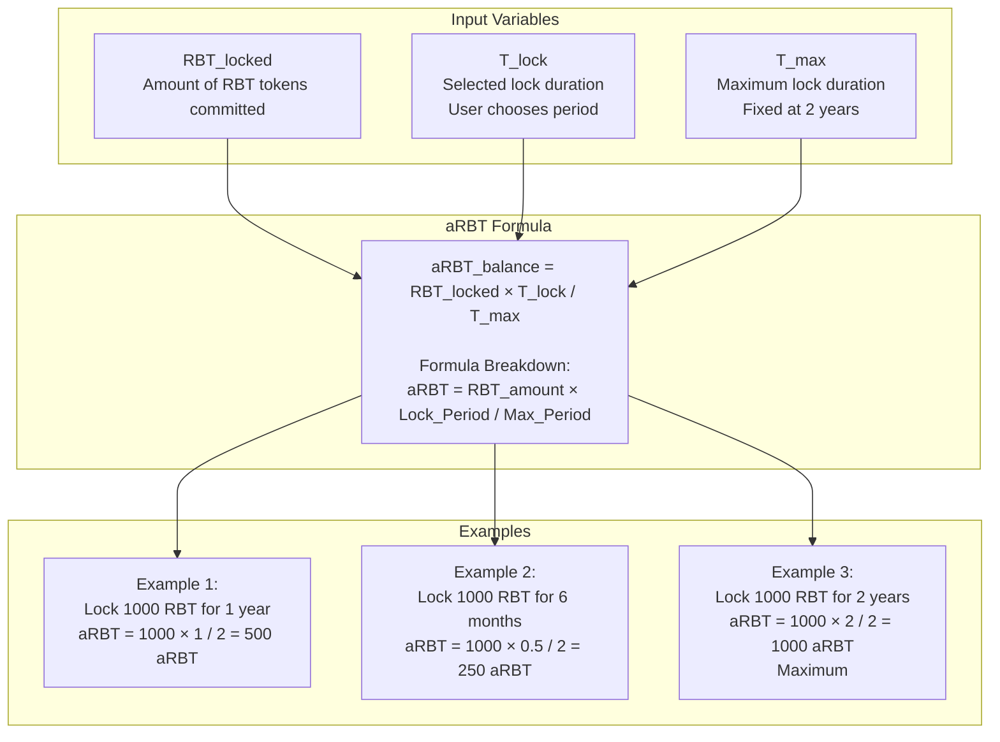
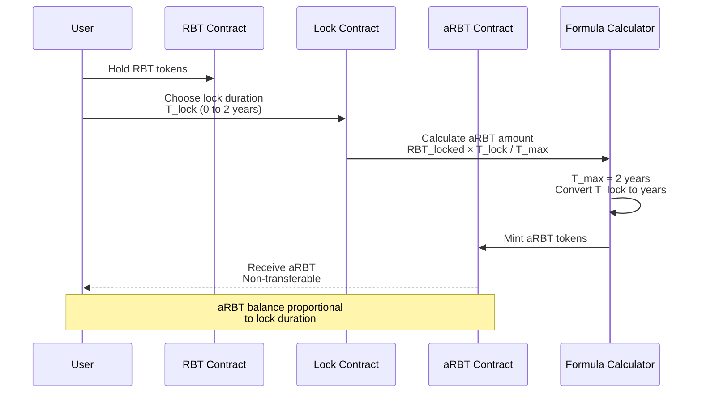
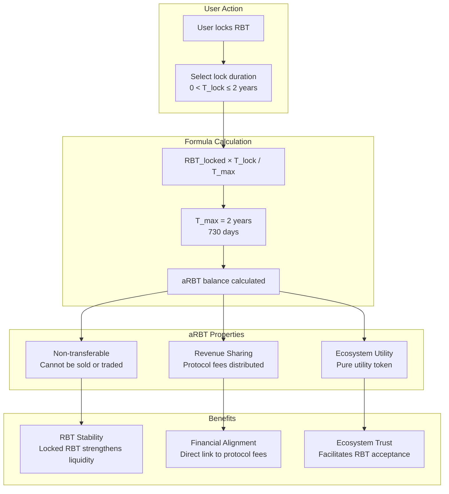
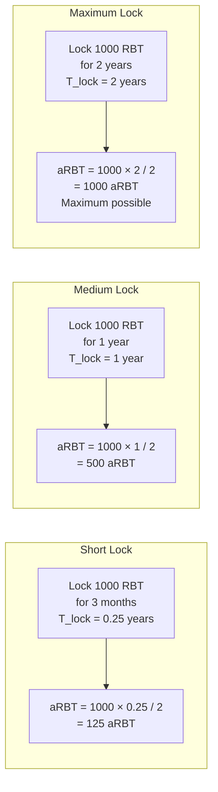
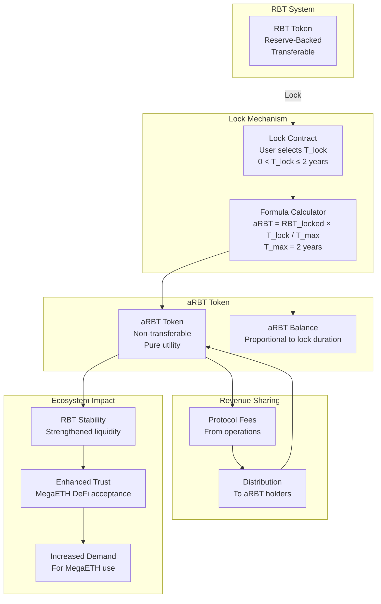

# aRBT (Aligned RBT) Formula and Mechanism

## aRBT Formula Visualization



## aRBT Creation Flow



## aRBT Value Chain

```mermaid
graph LR
    subgraph "Step 1: Lock RBT"
        LOCK[Lock RBT<br/>Choose duration<br/>T_lock]
    end
    
    subgraph "Step 2: Create aRBT"
        CREATE[Create aRBT<br/>Formula Applied<br/>aRBT = RBT × T_lock / T_max]
    end
    
    subgraph "Step 3: Stability"
        STABILITY[aRBT/Stability<br/>Locked RBT strengthens<br/>token liquidity]
    end
    
    subgraph "Step 4: Demand"
        DEMAND[Demand<br/>Enhanced trust<br/>Community alignment]
    end
    
    subgraph "Step 5: MegaETH Use"
        USE[MegaETH Use<br/>RBT accepted as<br/>core asset]
    end
    
    LOCK --> CREATE
    CREATE --> STABILITY
    STABILITY --> DEMAND
    DEMAND --> USE
    
    Note over LOCK,USE: Lock RBT → creates → aRBT/Stability → leads to → Demand → for → MegaETH Use
```

## aRBT Benefits and Mechanism



## aRBT Lock Duration Examples



## Complete aRBT System



---

## Formula Explanation

**aRBT Balance Formula:**
```
aRBT_balance = RBT_locked × (T_lock / T_max)
```

**Where:**
- `RBT_locked`: Amount of RBT tokens committed to lock
- `T_lock`: Selected lock duration (in years, 0 < T_lock ≤ 2)
- `T_max`: Maximum lock duration, fixed at 2 years

**Key Properties:**
- Non-transferable: aRBT cannot be sold or traded
- Proportional: Longer lock = more aRBT
- Maximum: Locking for 2 years gives 1:1 ratio (1000 RBT = 1000 aRBT)
- Utility: Pure utility token, no governance rights

**Value Chain:**
```
Lock RBT → creates → aRBT/Stability → leads to → Demand → for → MegaETH Use
```

---

*Visual representation of aRBT formula and mechanism based on official Blackhaven documentation*

