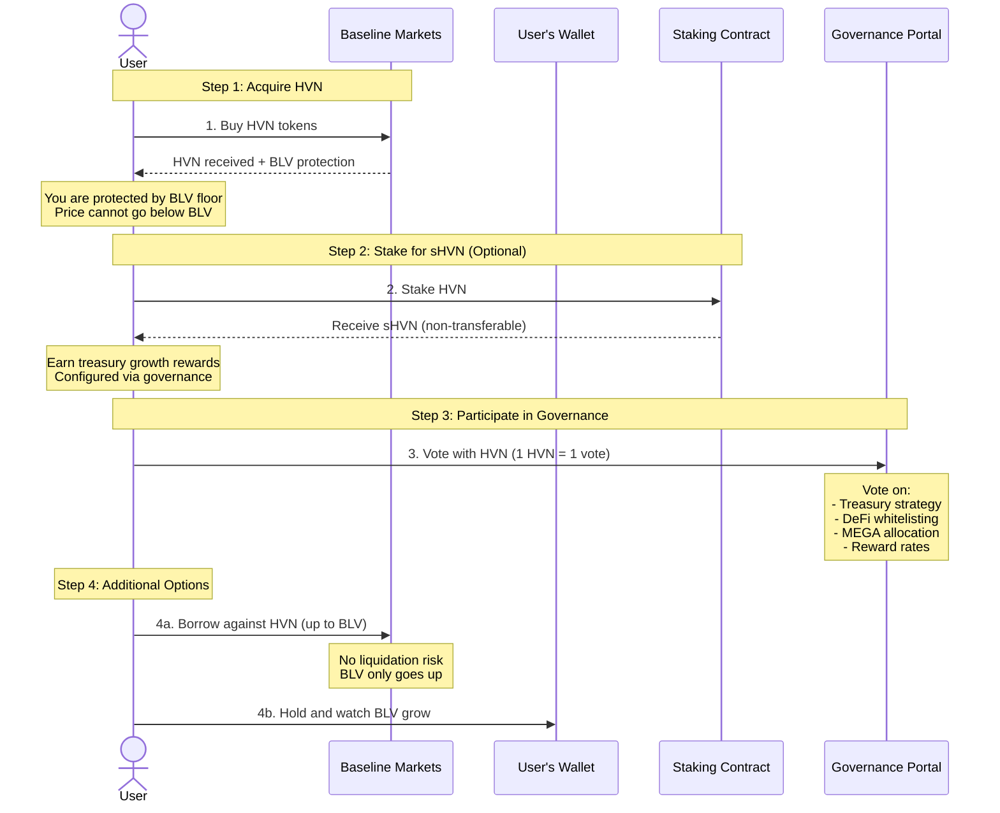
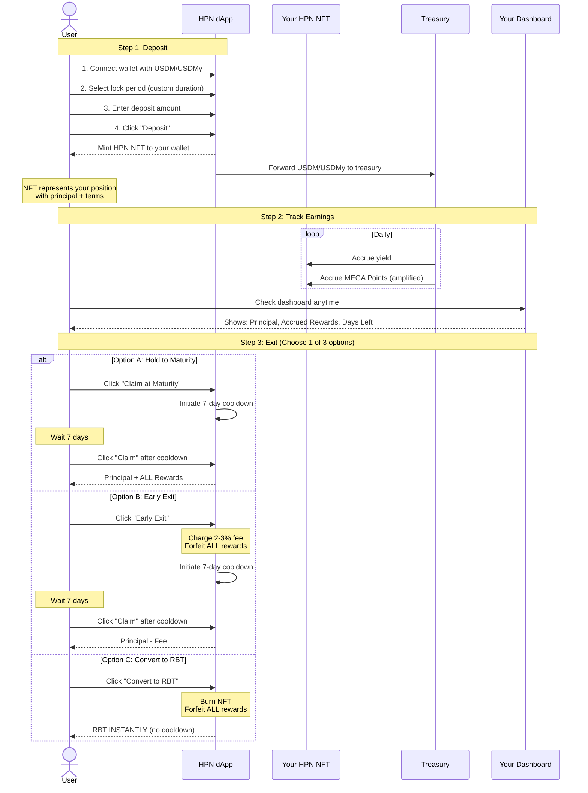
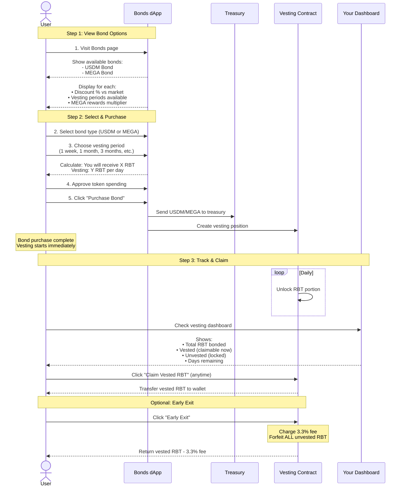
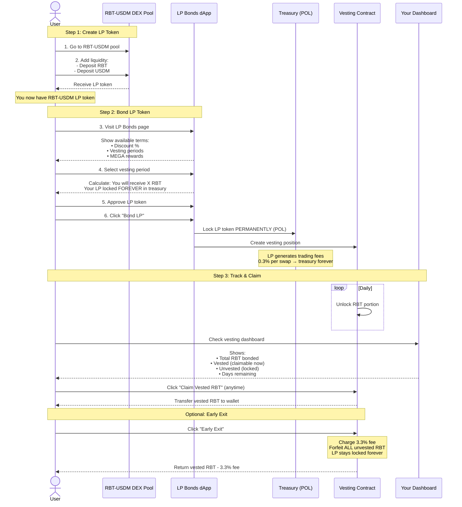
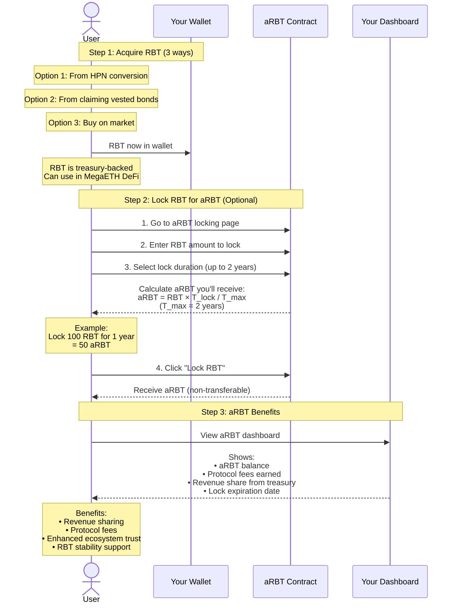
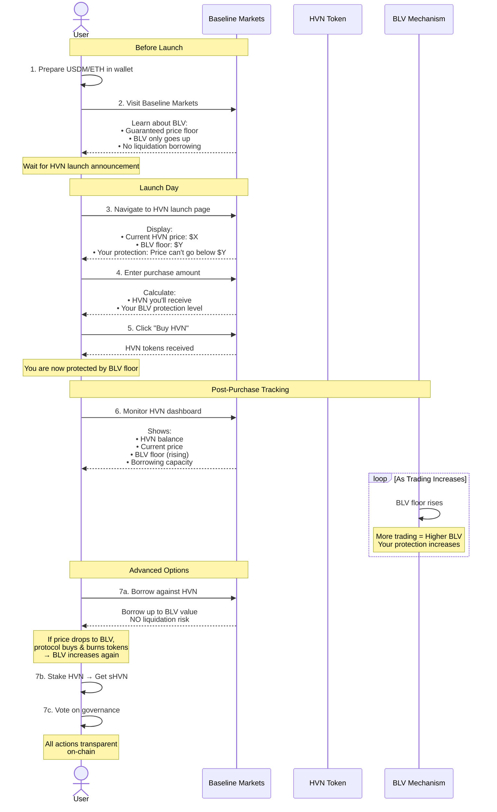

# Blackhaven Protocol - User Flows

## 1. HVN Token Flow

## 2. Haven Protected Notes (HPN) Flow

## 3. Regular Bonds Flow (USDM/MEGA)

## 4. LP Bonds Flow (Aligned Bonds)

## 5. RBT & aRBT Flow

## 6. Complete User Dashboard

```mermaid
graph TB
    DASHBOARD[BLACKHAVEN DASHBOARD]
    
    subgraph "Portfolio Summary"
        TOTAL[Total Portfolio Value: $X]
        HVN_VALUE[HVN Holdings: $Y]
        HPN_VALUE[Active HPNs: $Z]
        BONDS_VALUE[Active Bonds: $W]
        RBT_VALUE[RBT Balance: $V]
    end
    
    subgraph "HVN & sHVN"
        HVN_BAL[HVN: 1000 tokens]
        SHVN_BAL[sHVN: 500 tokens]
        REWARDS[Claimable Rewards: 50 tokens]
        BLV_INFO[BLV Floor: $0.85]
        HVN_BTN1[Button: Stake HVN]
        HVN_BTN2[Button: Vote on Proposals]
        HVN_BTN3[Button: Claim Rewards]
    end
    
    subgraph "Haven Protected Notes"
        HPN_TITLE[Your HPNs: 2 active]
        HPN1[HPN #1234<br/>Principal: 1000 USDM<br/>Accrued: 50 USDM + 100 Points<br/>Days left: 15]
        HPN2[HPN #5678<br/>Principal: 5000 USDMy<br/>Accrued: 200 USDMy + 500 Points<br/>Matured - Ready to claim]
        HPN_BTN1[Button: Convert to RBT]
        HPN_BTN2[Button: Early Exit]
        HPN_BTN3[Button: Claim at Maturity]
    end
    
    subgraph "Bonds"
        BONDS_TITLE[Your Bonds: 3 active]
        BOND1[USDM Bond<br/>Total: 1000 RBT<br/>Vested: 400 RBT<br/>Unvested: 600 RBT<br/>Days left: 20]
        BOND2[LP Bond<br/>Total: 5000 RBT<br/>Vested: 2000 RBT<br/>Unvested: 3000 RBT<br/>Days left: 45]
        BONDS_BTN1[Button: Claim Vested RBT]
        BONDS_BTN2[Button: Early Exit]
    end
    
    subgraph "RBT & aRBT"
        RBT_BAL[RBT Balance: 500 tokens]
        ARBT_BAL[aRBT Balance: 250 tokens<br/>Locked until: Jan 2026<br/>Revenue earned: 25 tokens]
        RBT_BTN1[Button: Lock for aRBT]
        RBT_BTN2[Button: Use in DeFi]
    end
    
    subgraph "Quick Actions"
        ACTION1[+ New HPN Deposit]
        ACTION2[+ Purchase Bond]
        ACTION3[+ Create LP Bond]
    end
    
    DASHBOARD --> TOTAL
    TOTAL --> HVN_VALUE
    TOTAL --> HPN_VALUE
    TOTAL --> BONDS_VALUE
    TOTAL --> RBT_VALUE
    
    DASHBOARD --> HVN_BAL
    HVN_BAL --> SHVN_BAL
    HVN_BAL --> REWARDS
    HVN_BAL --> BLV_INFO
    HVN_BAL --> HVN_BTN1
    HVN_BAL --> HVN_BTN2
    HVN_BAL --> HVN_BTN3
    
    DASHBOARD --> HPN_TITLE
    HPN_TITLE --> HPN1
    HPN_TITLE --> HPN2
    HPN1 --> HPN_BTN1
    HPN2 --> HPN_BTN3
    
    DASHBOARD --> BONDS_TITLE
    BONDS_TITLE --> BOND1
    BONDS_TITLE --> BOND2
    BOND1 --> BONDS_BTN1
    BOND2 --> BONDS_BTN1
    
    DASHBOARD --> RBT_BAL
    RBT_BAL --> ARBT_BAL
    RBT_BAL --> RBT_BTN1
    RBT_BAL --> RBT_BTN2
    
    DASHBOARD --> ACTION1
    DASHBOARD --> ACTION2
    DASHBOARD --> ACTION3
```

## 7. Baseline Markets - HVN Launch Experience

---

*User-focused sequence diagrams for Blackhaven Protocol frontend*

