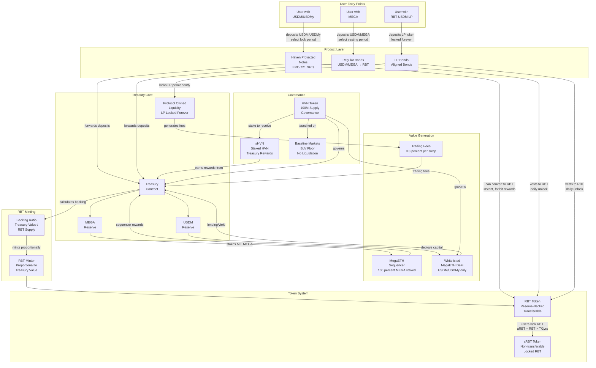
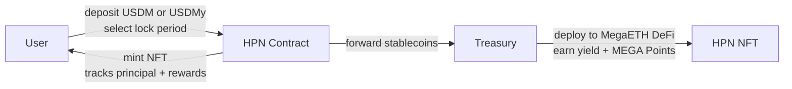
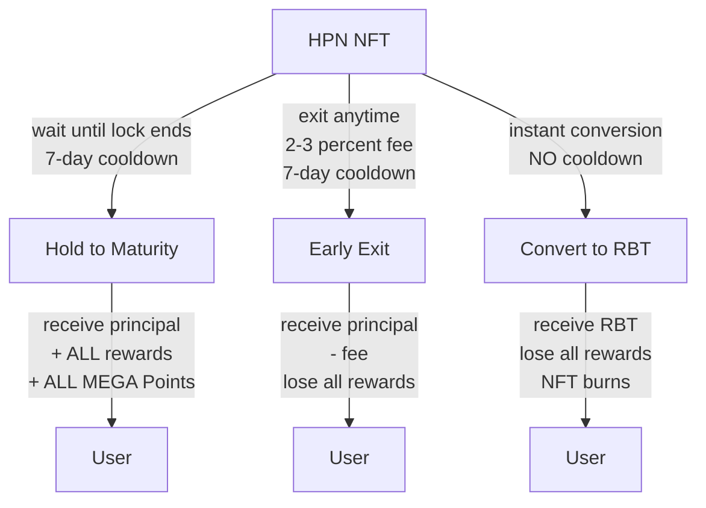
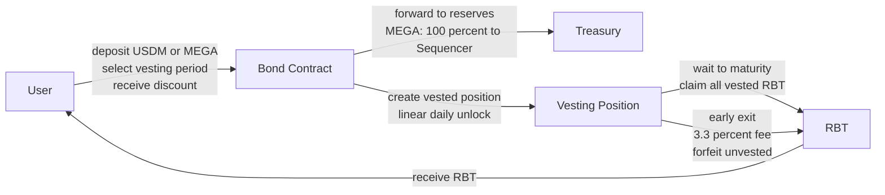
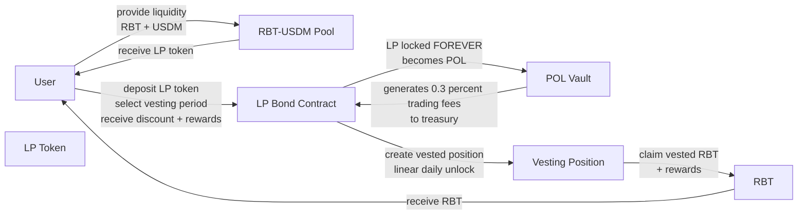
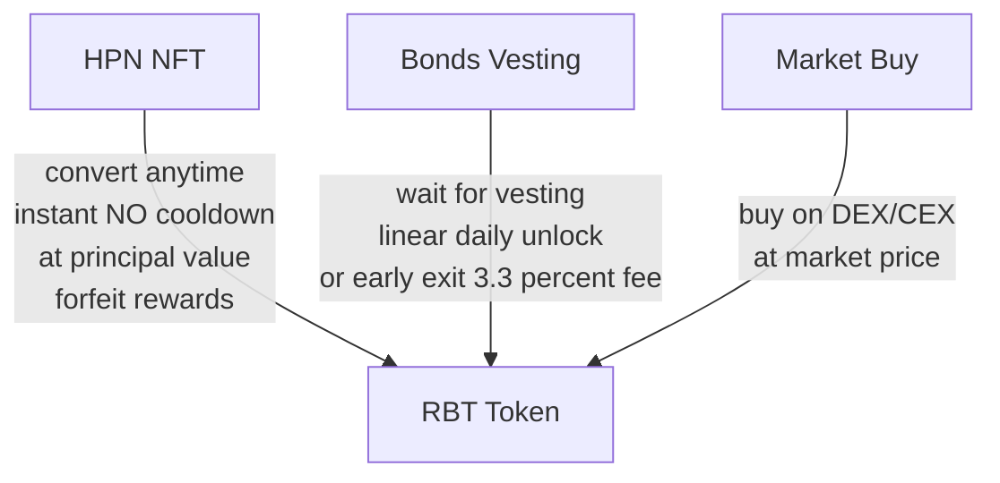
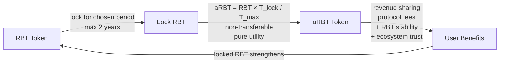
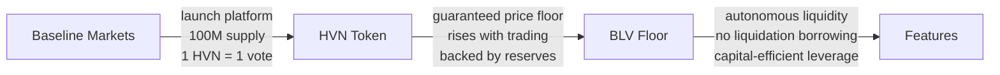
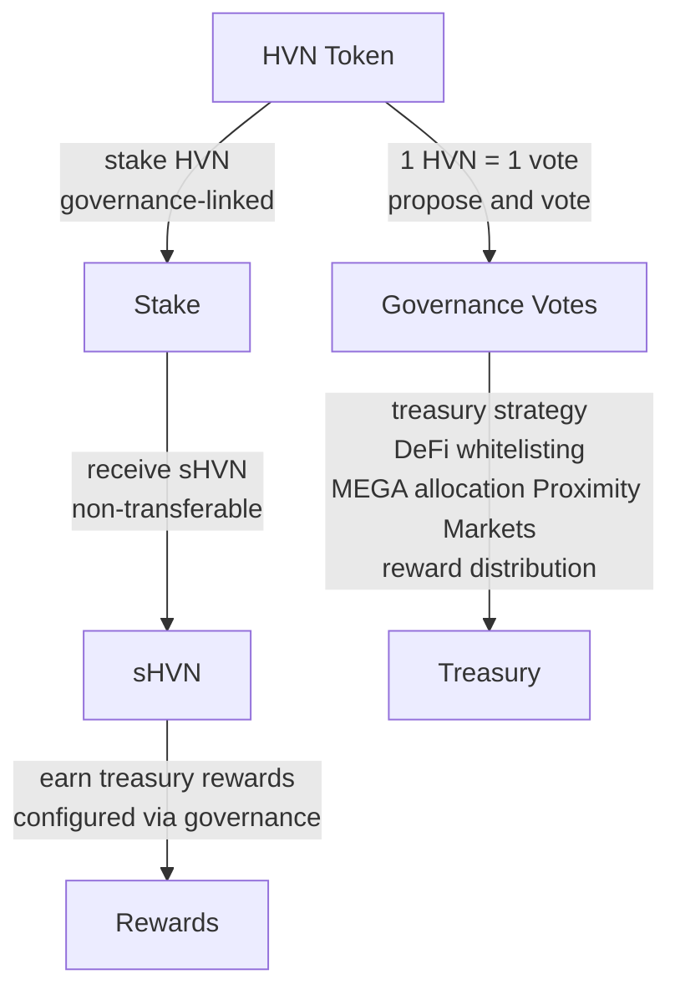
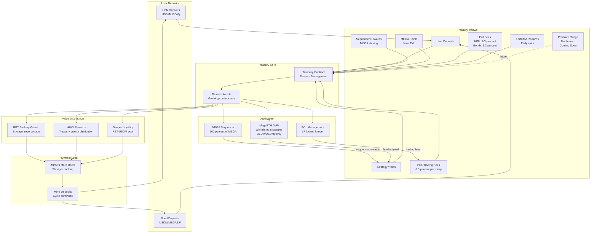

# Blackhaven Protocol Architecture

## 1. Complete Blackhaven System Architecture

## 2A. HPN Deposit Flow

## 2B. HPN Exit Options

## 3A. Regular Bonds (USDM/MEGA)

## 3B. LP Bonds (Aligned Bonds)

## 4A. How to Get RBT

## 4B. RBT to aRBT (Locking)

## 5A. HVN Launch on Baseline Markets

## 5B. HVN Staking & Governance

## 6. Treasury Flywheel & Value Accrual

---

*Blackhaven Protocol Architecture - System Component Diagrams*
