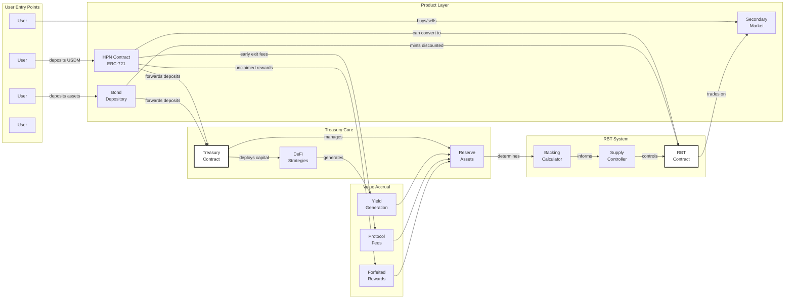
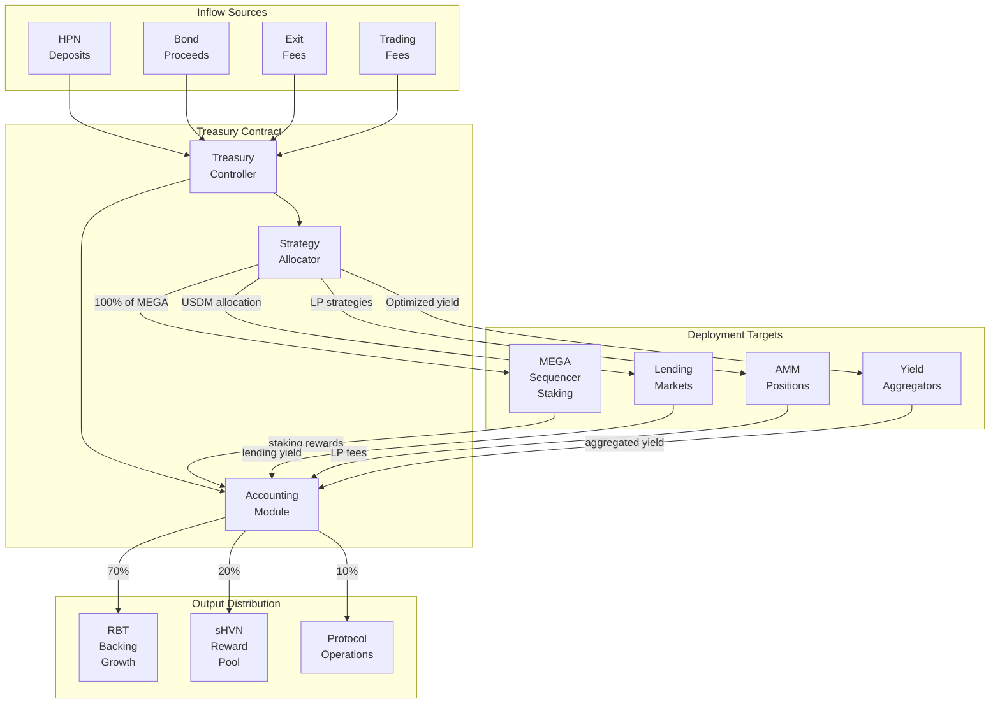
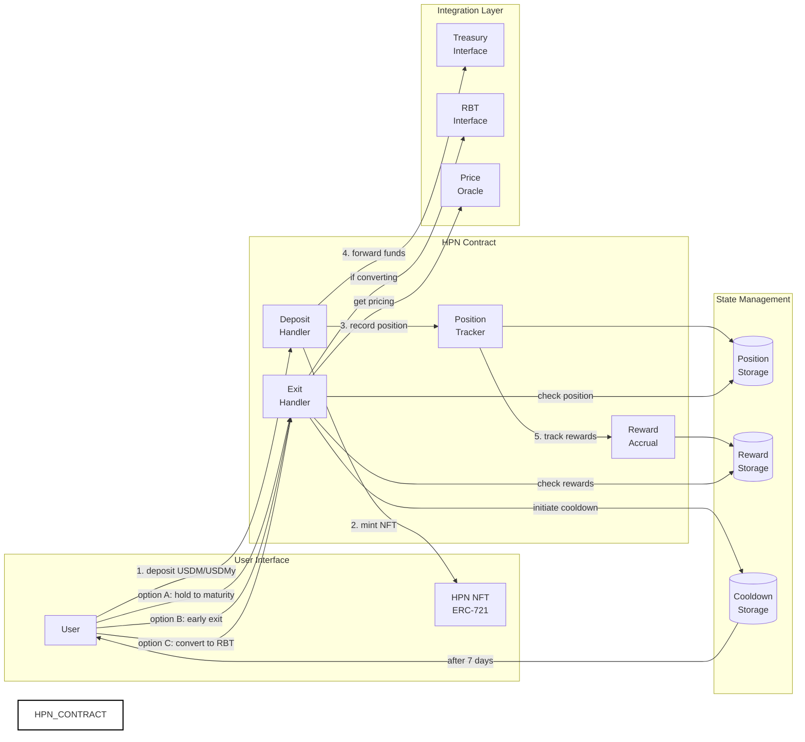
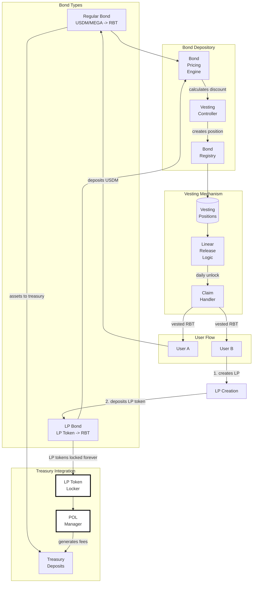
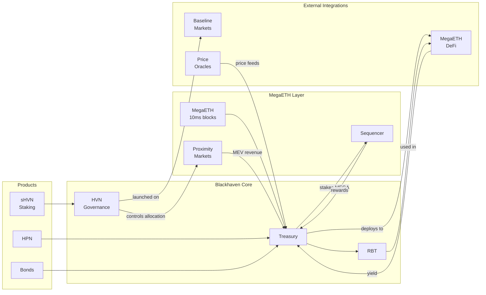

# Blackhaven Architecture Diagrams

## RBT (Reserve-Backed Token) Architecture Model

## Treasury Operations Architecture

## HPN (Haven Protected Notes) Architecture

## Fixed-Term Bonds Architecture

## Complete System Integration

---

*Technical architecture diagrams for Blackhaven protocol on MegaETH*
