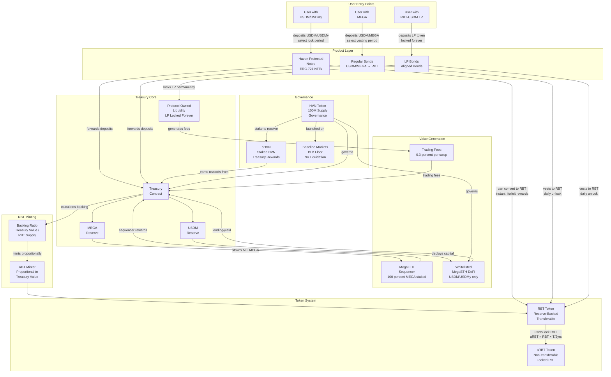
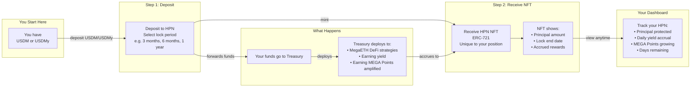
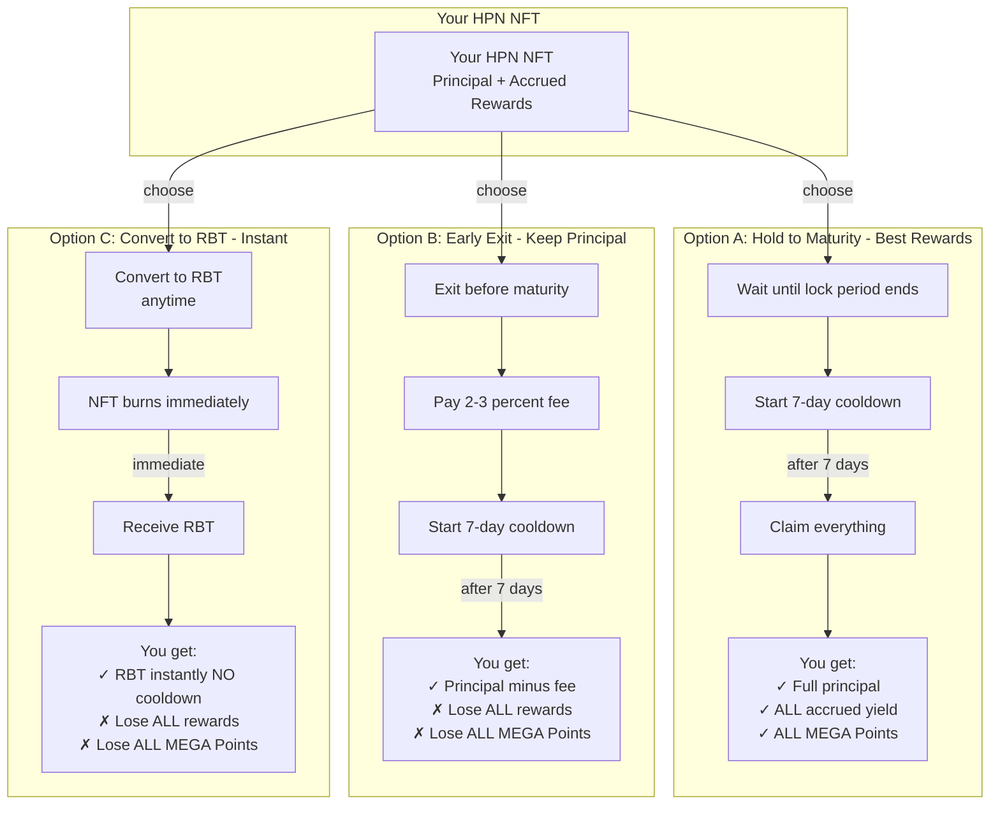
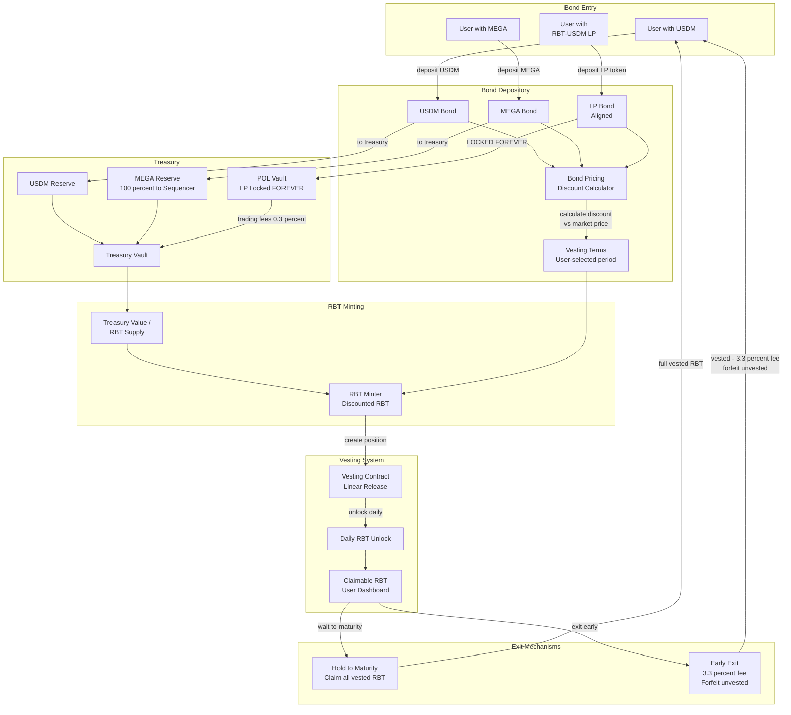
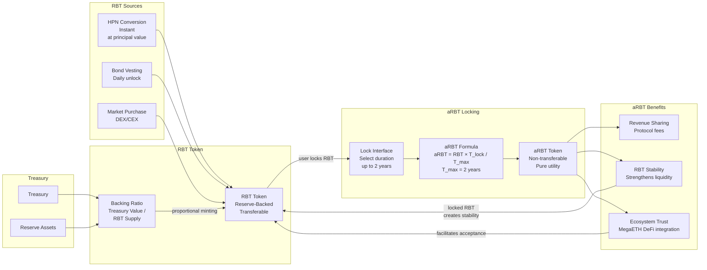
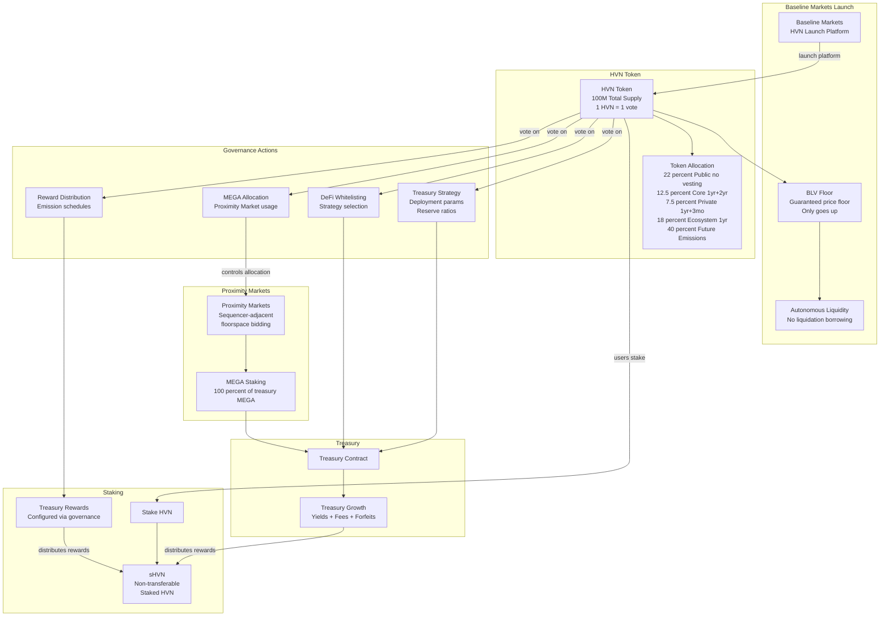
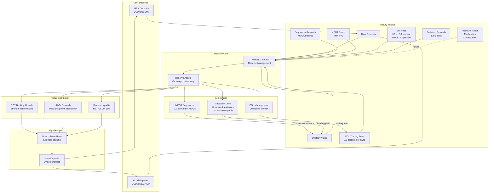

# Blackhaven Protocol Architecture

## 1. Complete Blackhaven System Architecture

## 2A. HPN Deposit Flow - Simple

## 2B. HPN Exit Options - Three Ways Out

## 3. Fixed-Term Bonds Architecture

## 4. RBT & aRBT System

## 5. HVN & sHVN Governance System

## 6. Treasury Flywheel & Value Accrual

---

*Blackhaven Protocol Architecture - System Component Diagrams*
