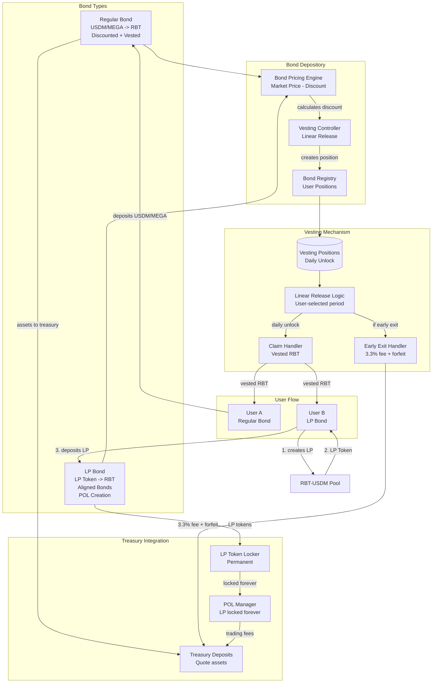

# Blackhaven Architecture Diagrams

## Complete System Architecture

## Treasury Operations Architecture

## LP Bonds (Aligned Bonds) Detailed Flow

## RBT and aRBT System

## HPN (Haven Protected Notes) Architecture

## Fixed-Term Bonds Architecture

## Complete System Integration

---

*Complete architecture diagrams based on official Blackhaven documentation*
