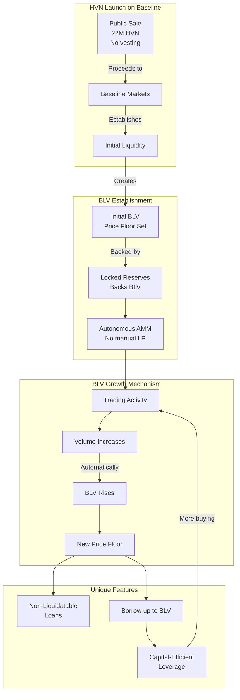
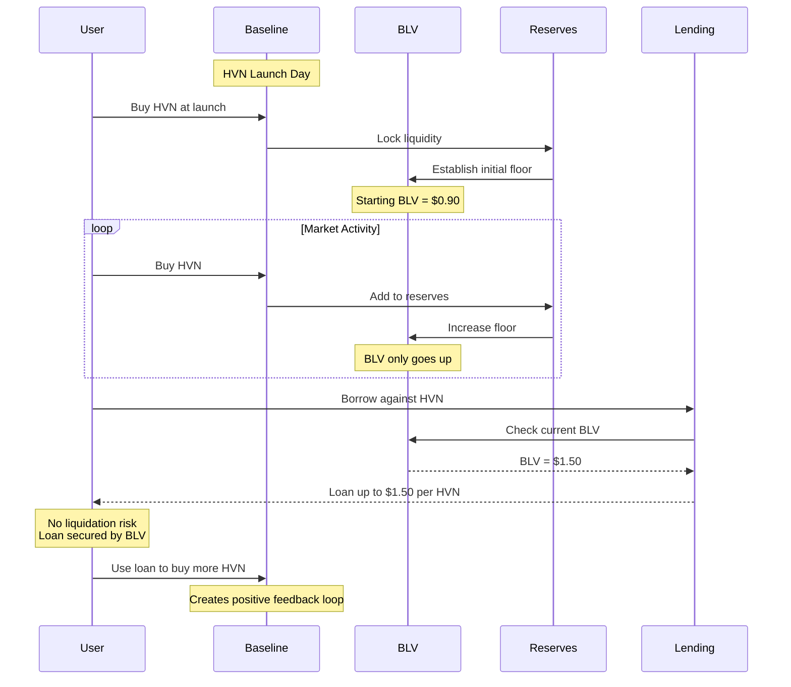
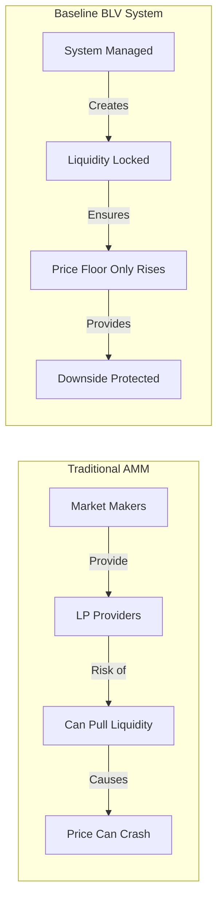
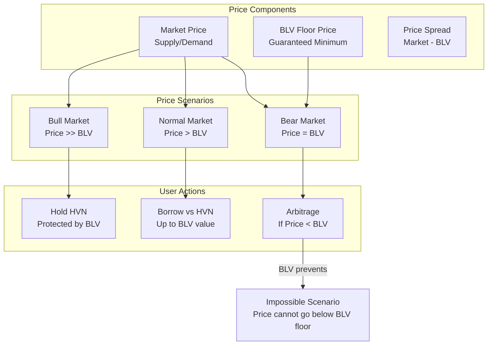
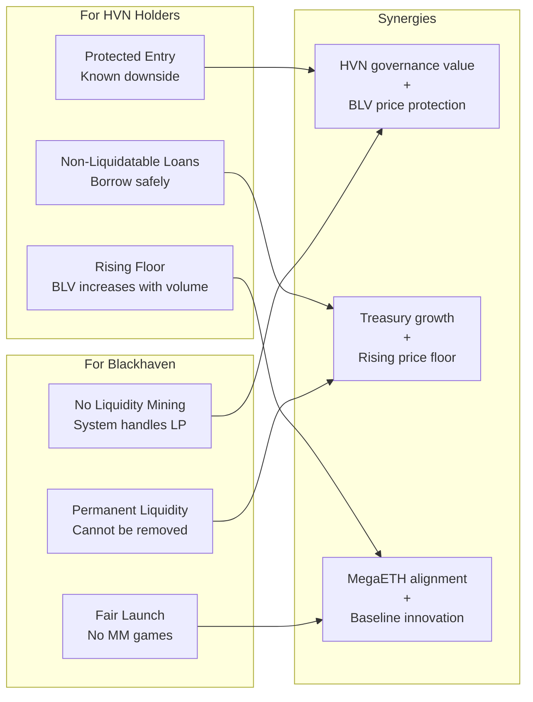
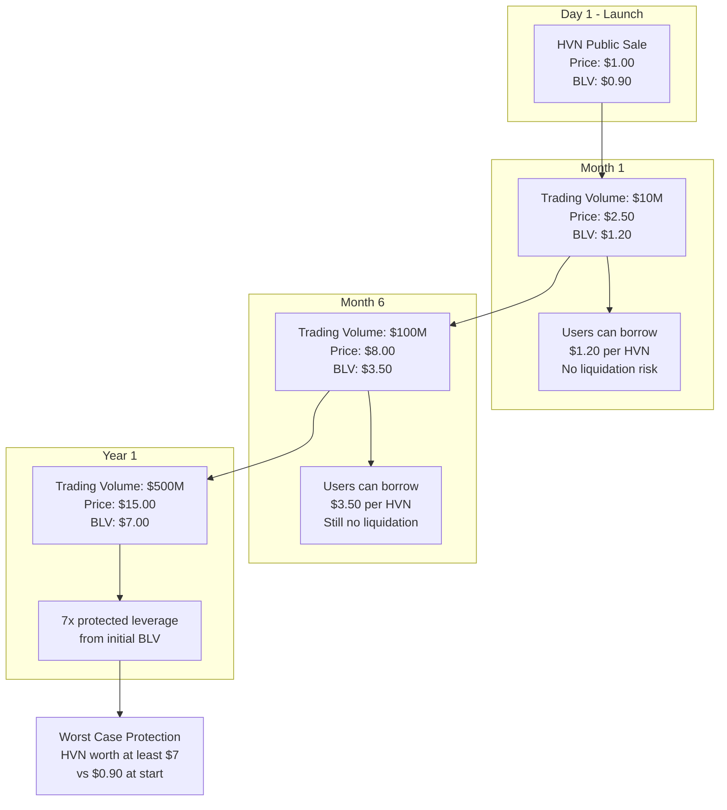

# Blackhaven BLV (Baseline Value) Diagram

## HVN on Baseline Markets - BLV Mechanism

## BLV Mechanics Flow

## BLV vs Traditional Liquidity

## HVN Price Dynamics with BLV

## Baseline Integration Benefits

## Example: HVN Launch to Maturity

---

*BLV mechanism ensures HVN holders always have a rising price floor, enabling unique DeFi strategies with protected downside*

