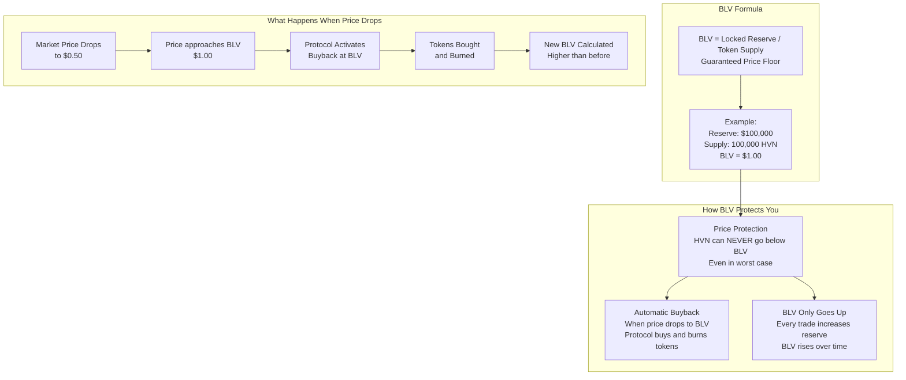
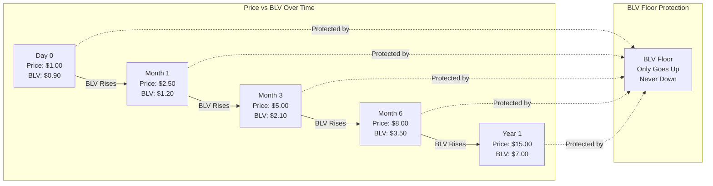
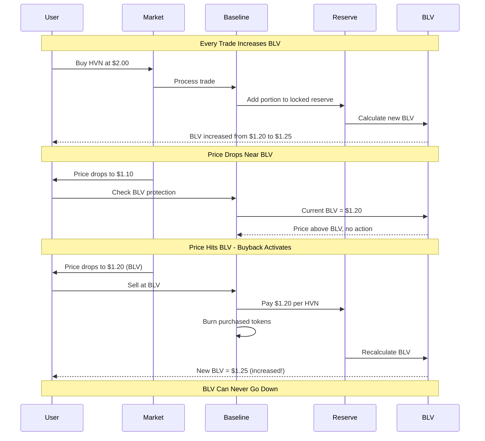
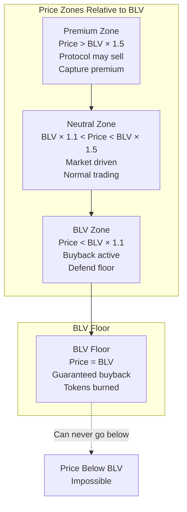
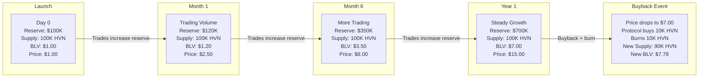
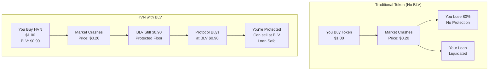
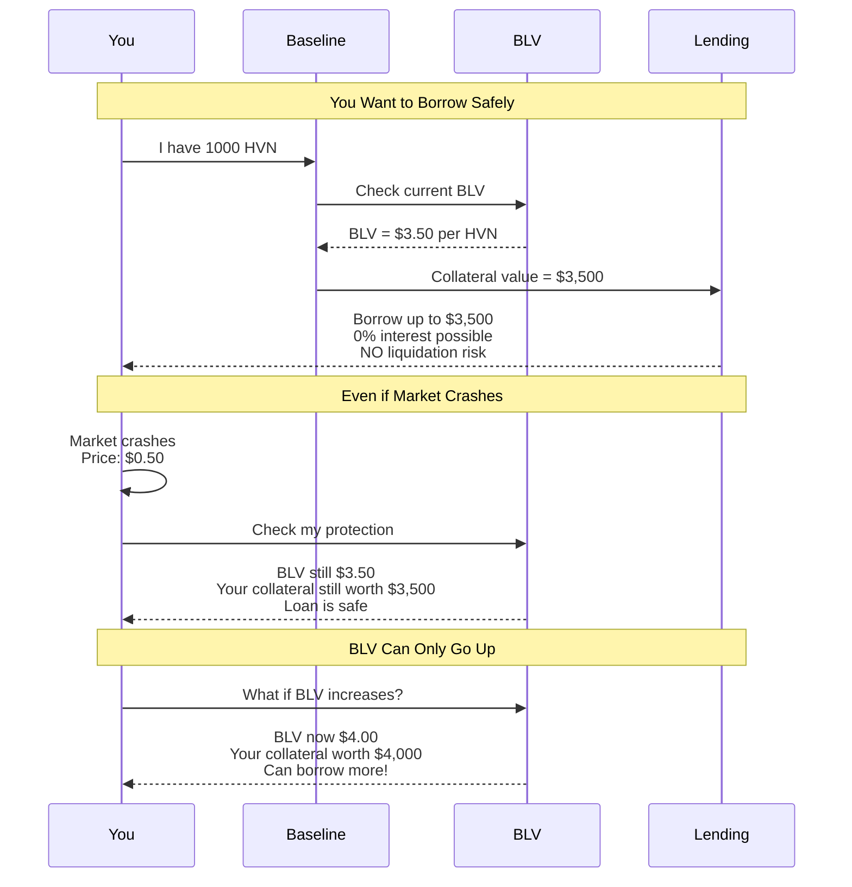
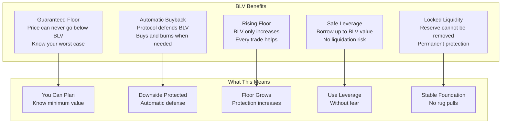

# Blackhaven BLV - User-Friendly Visual Guide

## How BLV (Baseline Value) Works - Simple Explanation

## BLV Price Dynamics - Visual Graph

## BLV Growth Mechanism - How It Works

## BLV Zones - How Baseline Market Maker Works

## Example: BLV Growth Timeline

## BLV vs Traditional Tokens - Side by Side

## Safe Borrowing Against BLV

## Key Benefits Summary

---

## Simple Explanation

**BLV (Baseline Value) = Your Guaranteed Safety Net**

- **What it is**: BLV = Locked Reserve / Token Supply. A guaranteed minimum price that can NEVER go down
- **How it grows**: Every trade adds to the locked reserve, increasing BLV. When price drops to BLV, protocol buys tokens and burns them, reducing supply and increasing BLV further
- **Why it matters**: Even if the market crashes, you're protected at BLV level. You can always sell at BLV price
- **Bonus**: You can borrow money using HVN as collateral, up to BLV value, with NO liquidation risk because BLV can only go up

**Think of it like**: A house with a guaranteed minimum value that only increases. Even if the market crashes, you know your house is worth at least BLV amount. And you can borrow against that guaranteed value safely, with no risk of losing your house.

---

*Simple visual guide to understanding BLV protection for HVN holders based on Baseline Markets mechanism*
