# Blackhaven BLV - User-Friendly Visual Guide

## How BLV (Baseline Value) Works - Simple Explanation

```mermaid
graph TB
    subgraph "Day 1: HVN Launch"
        LAUNCH[You Buy HVN<br/>Price: $1.00]
        BLV_START[BLV Floor Set<br/>$0.90<br/>Your Protection]
        RESERVES[Reserves Locked<br/>Backs BLV]
    end
    
    subgraph "What BLV Means For You"
        PROTECTION[🛡️ Price Protection<br/>HVN can NEVER go below BLV<br/>Even in worst case]
        BORROW[💰 Safe Borrowing<br/>Borrow up to BLV value<br/>NO liquidation risk]
        GROWTH[📈 BLV Only Goes Up<br/>More trading = Higher BLV<br/>Your floor rises]
    end
    
    subgraph "Example: 6 Months Later"
        MARKET_PRICE[Market Price<br/>$8.00]
        BLV_NOW[BLV Floor<br/>$3.50<br/>Still Protected]
        BORROW_NOW[You Can Borrow<br/>$3.50 per HVN<br/>Still Safe]
    end
    
    subgraph "Why This Matters"
        COMPARE[Compare to Normal Tokens]
        NORMAL[❌ Normal Token<br/>Price can crash to $0<br/>Loans get liquidated]
        HVN_BLV[✅ HVN with BLV<br/>Price protected at $3.50<br/>Loans never liquidated]
    end
    
    LAUNCH --> BLV_START
    BLV_START --> RESERVES
    RESERVES --> PROTECTION
    
    PROTECTION --> BORROW
    PROTECTION --> GROWTH
    
    GROWTH --> MARKET_PRICE
    GROWTH --> BLV_NOW
    BLV_NOW --> BORROW_NOW
    
    COMPARE --> NORMAL
    COMPARE --> HVN_BLV
    
    style BLV_START fill:#4caf50,stroke-width:3px
    style BLV_NOW fill:#4caf50,stroke-width:3px
    style PROTECTION fill:#2196f3,stroke-width:3px
    style BORROW fill:#ff9800,stroke-width:3px
    style HVN_BLV fill:#4caf50,stroke-width:3px
    style NORMAL fill:#f44336,stroke-width:2px
```

## BLV Growth Over Time - Visual Timeline

```mermaid
graph LR
    subgraph "Month 1"
        M1_PRICE[Market: $2.50]
        M1_BLV[BLV: $1.20<br/>🛡️ Protected]
        M1_BORROW[Borrow: $1.20<br/>Safe]
    end
    
    subgraph "Month 3"
        M3_PRICE[Market: $5.00]
        M3_BLV[BLV: $2.10<br/>🛡️ Protected]
        M3_BORROW[Borrow: $2.10<br/>Safe]
    end
    
    subgraph "Month 6"
        M6_PRICE[Market: $8.00]
        M6_BLV[BLV: $3.50<br/>🛡️ Protected]
        M6_BORROW[Borrow: $3.50<br/>Safe]
    end
    
    subgraph "Year 1"
        Y1_PRICE[Market: $15.00]
        Y1_BLV[BLV: $7.00<br/>🛡️ Protected]
        Y1_BORROW[Borrow: $7.00<br/>Safe]
    end
    
    M1_BLV -->|BLV Rises| M3_BLV
    M3_BLV -->|BLV Rises| M6_BLV
    M6_BLV -->|BLV Rises| Y1_BLV
    
    M1_BORROW -->|More Safe Borrowing| M3_BORROW
    M3_BORROW -->|More Safe Borrowing| M6_BORROW
    M6_BORROW -->|More Safe Borrowing| Y1_BORROW
    
    style M1_BLV fill:#4caf50,stroke-width:2px
    style M3_BLV fill:#4caf50,stroke-width:2px
    style M6_BLV fill:#4caf50,stroke-width:2px
    style Y1_BLV fill:#4caf50,stroke-width:2px
```

## BLV vs Traditional Tokens - Side by Side

```mermaid
graph TB
    subgraph "Traditional Token (No BLV)"
        TRAD_USER[You Buy Token<br/>$1.00]
        TRAD_DROP[Market Crashes<br/>Price: $0.20]
        TRAD_LOAN[Your Loan<br/>Liquidated ❌]
        TRAD_LOSS[You Lose Everything]
    end
    
    subgraph "HVN with BLV"
        HVN_USER[You Buy HVN<br/>$1.00]
        HVN_BLV[BLV Floor<br/>$0.90 Protected]
        HVN_DROP[Market Crashes<br/>Price: $0.20]
        HVN_SAFE[BLV Still $0.90<br/>You're Protected ✅]
        HVN_BORROW[You Can Still Borrow<br/>Up to $0.90<br/>No Liquidation]
    end
    
    TRAD_USER --> TRAD_DROP
    TRAD_DROP --> TRAD_LOAN
    TRAD_LOAN --> TRAD_LOSS
    
    HVN_USER --> HVN_BLV
    HVN_BLV --> HVN_DROP
    HVN_DROP --> HVN_SAFE
    HVN_SAFE --> HVN_BORROW
    
    style TRAD_LOSS fill:#f44336,stroke-width:3px
    style HVN_SAFE fill:#4caf50,stroke-width:3px
    style HVN_BORROW fill:#4caf50,stroke-width:3px
```

## How BLV Protects You - Step by Step

```mermaid
sequenceDiagram
    participant You
    participant Baseline
    participant BLV
    participant Market
    
    Note over You,Market: Day 1 - You Buy HVN
    
    You->>Baseline: Buy HVN at $1.00
    Baseline->>BLV: Set initial floor at $0.90
    BLV-->>You: 🛡️ You're protected!
    
    Note over You,Market: Market goes up and down...
    
    Market->>You: Price drops to $0.50
    You->>BLV: Check my protection
    BLV-->>You: Still protected at $0.90!<br/>Price can't go below BLV
    
    Note over You,Market: You want to borrow safely
    
    You->>Baseline: Can I borrow against my HVN?
    Baseline->>BLV: Check current BLV
    BLV-->>Baseline: BLV = $1.50
    Baseline-->>You: Yes! Borrow up to $1.50<br/>NO liquidation risk ✅
    
    Note over You,Market: Even if market crashes
    
    Market->>You: Price crashes to $0.30
    You->>BLV: Am I still safe?
    BLV-->>You: Yes! BLV still $1.50<br/>Your loan is safe ✅
```

## Key Benefits Visual

```mermaid
graph TD
    subgraph "BLV Benefits"
        BENEFIT1[🛡️ Protected Entry<br/>You know the worst case<br/>BLV = minimum price]
        BENEFIT2[💰 Safe Leverage<br/>Borrow up to BLV<br/>Never get liquidated]
        BENEFIT3[📈 Rising Floor<br/>BLV only goes UP<br/>More trading = Higher BLV]
        BENEFIT4[🔒 Locked Liquidity<br/>Can't be pulled<br/>Permanent protection]
    end
    
    subgraph "What This Means"
        MEANING1[You Can Plan Ahead<br/>Know your downside]
        MEANING2[Use Leverage Safely<br/>No liquidation fear]
        MEANING3[Floor Keeps Rising<br/>Your protection grows]
        MEANING4[Stable Foundation<br/>No rug pulls]
    end
    
    BENEFIT1 --> MEANING1
    BENEFIT2 --> MEANING2
    BENEFIT3 --> MEANING3
    BENEFIT4 --> MEANING4
    
    style BENEFIT1 fill:#2196f3,stroke-width:2px
    style BENEFIT2 fill:#ff9800,stroke-width:2px
    style BENEFIT3 fill:#4caf50,stroke-width:2px
    style BENEFIT4 fill:#9c27b0,stroke-width:2px
```

## Simple Example: Your HVN Journey

```mermaid
graph LR
    subgraph "You Start"
        BUY[You Buy<br/>100 HVN<br/>at $1.00<br/>Total: $100]
    end
    
    subgraph "BLV Protection"
        BLV_INIT[BLV Floor<br/>$0.90<br/>Worst Case Value<br/>$90]
    end
    
    subgraph "6 Months Later"
        MARKET[Market Price<br/>$8.00<br/>Your Value<br/>$800]
        BLV_NOW[BLV Floor<br/>$3.50<br/>Worst Case<br/>$350]
        BORROW[You Borrow<br/>$350<br/>Still Safe]
    end
    
    subgraph "Worst Case Scenario"
        CRASH[Market Crashes<br/>Price: $0.50]
        PROTECTED[You're Still Protected<br/>BLV: $3.50<br/>Value: $350<br/>Loan Safe ✅]
    end
    
    BUY --> BLV_INIT
    BLV_INIT --> MARKET
    MARKET --> BLV_NOW
    BLV_NOW --> BORROW
    
    MARKET --> CRASH
    CRASH --> PROTECTED
    
    style BLV_INIT fill:#4caf50,stroke-width:3px
    style BLV_NOW fill:#4caf50,stroke-width:3px
    style PROTECTED fill:#4caf50,stroke-width:3px
    style CRASH fill:#f44336,stroke-width:2px
```

---

## Simple Explanation

**BLV (Baseline Value) = Your Safety Net**

- **What it is**: A guaranteed minimum price for HVN that can NEVER go down
- **How it works**: The more people trade HVN, the higher BLV goes
- **Why it matters**: Even if the market crashes, you're protected at BLV level
- **Bonus**: You can borrow money using HVN as collateral, up to BLV value, and NEVER get liquidated

**Think of it like**: A house with a guaranteed minimum value. Even if the market crashes, you know your house is worth at least BLV amount. And you can borrow against that guaranteed value safely.

---

*Simple visual guide to understanding BLV protection for HVN holders*

