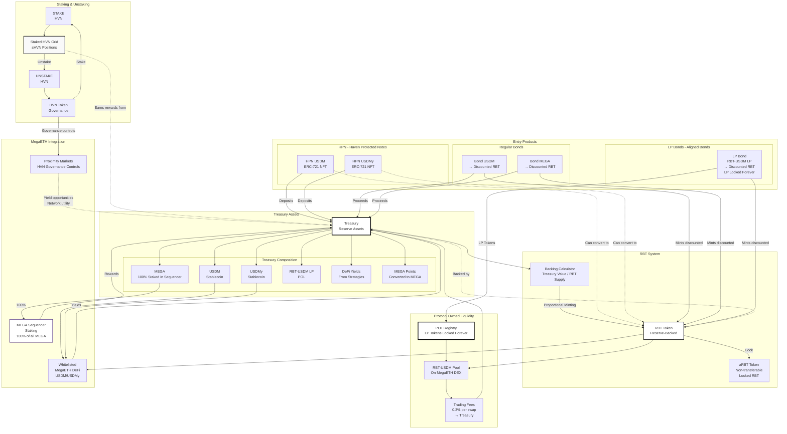

# Blackhaven Complete Mechanics Diagram

## Complete System Overview (Olympus-Style)

## Detailed Annotations

### Staking & Unstaking
- **Stake HVN**: Lock HVN to receive sHVN (staked HVN)
- **Unstake**: Instant unstaking (no cooldown for HVN/sHVN)
- **sHVN Rewards**: Earn rewards from treasury growth, configured via HVN governance
- **Note**: sHVN does NOT control governance, only receives rewards

### Treasury Composition
- **USDM/USDMy**: Stablecoin deposits from HPN and Bonds
- **MEGA**: 100% of all MEGA tokens are staked in MegaETH Sequencer
- **RBT-USDM LP**: Protocol Owned Liquidity, locked forever
- **DeFi Yields**: Returns from whitelisted MegaETH DeFi strategies
- **MEGA Points**: Converted to MEGA and staked in Sequencer

### Entry Products
- **HPN (Haven Protected Notes)**: 
  - ERC-721 NFTs
  - Principal-protected positions
  - USDM/USDMy deposits only
  - 7-day cooldown on maturity/early exit
  - Can convert to RBT (immediate, no cooldown)
  
- **Regular Bonds**:
  - USDM/MEGA → Discounted RBT
  - Linear vesting
  - 3.3% early exit fee
  
- **LP Bonds (Aligned Bonds)**:
  - RBT-USDM LP tokens → Discounted RBT
  - LP tokens locked forever (POL)
  - Trading fees go to treasury

### RBT System
- **RBT**: Reserve-Backed Token, proportional minting preserves reserve ratio
- **aRBT**: Non-transferable token from locking RBT (formula: RBT_locked × T_lock / T_max, T_max = 2 years)
- **Backing**: Treasury Value / RBT Supply

### Protocol Owned Liquidity
- **POL**: LP tokens from LP Bonds are locked forever
- **Trading Fees**: 0.3% per swap goes to treasury
- **Liquidity Depth**: Provides price stability for RBT

### MegaETH Integration
- **Sequencer Staking**: 100% of MEGA staked, rewards compound to treasury
- **DeFi Strategies**: Whitelisted strategies for USDM/USDMy
- **Proximity Markets**: HVN governance controls how staked MEGA is used for yield opportunities and network utility

---

*Complete mechanics diagram showing all Blackhaven protocol components and their interactions*

