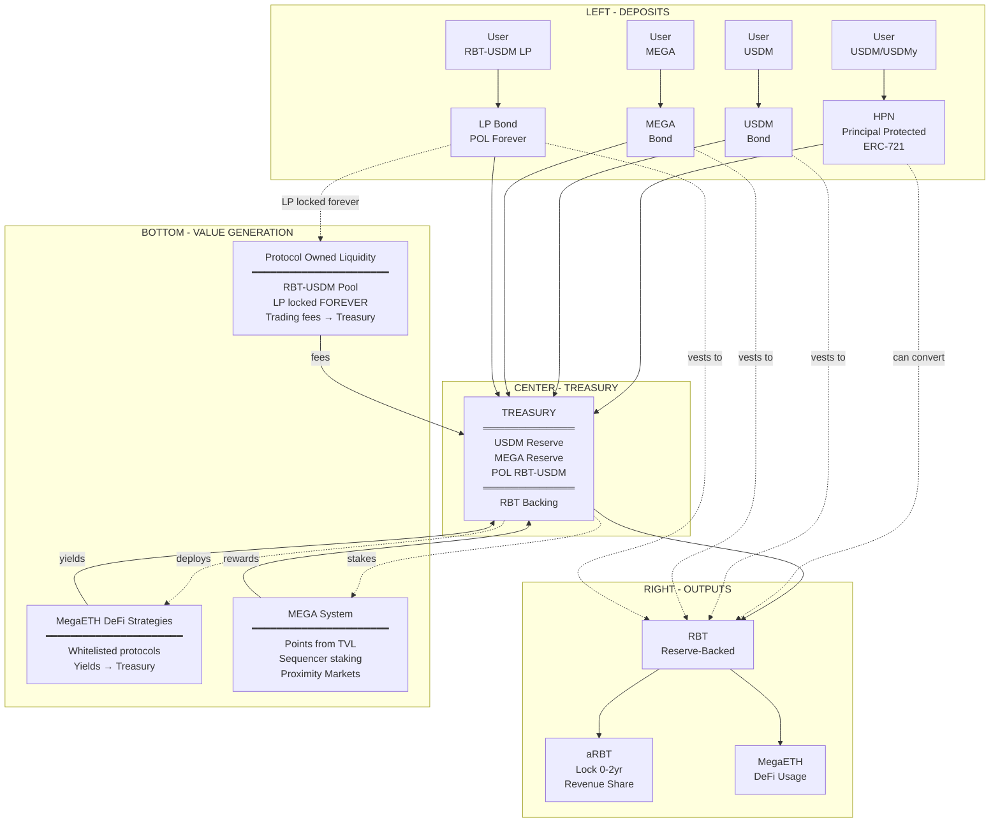

# Blackhaven Complete System Diagram

## Full Protocol Architecture - Olympus DAO Style

```mermaid
graph TB
    subgraph "LEFT - DEPOSITS"
        USER_HPN[User<br/>USDM/USDMy]
        USER_USDM[User<br/>USDM]
        USER_MEGA[User<br/>MEGA]
        USER_LP[User<br/>RBT-USDM LP]
        
        HPN[HPN<br/>Principal Protected<br/>ERC-721]
        BOND_USDM[USDM<br/>Bond]
        BOND_MEGA[MEGA<br/>Bond]
        LP_BOND[LP Bond<br/>POL Forever]
        
        USER_HPN --> HPN
        USER_USDM --> BOND_USDM
        USER_MEGA --> BOND_MEGA
        USER_LP --> LP_BOND
    end
    
    subgraph "CENTER - TREASURY"
        TREASURY[TREASURY<br/>═════════════<br/>USDM Reserve<br/>MEGA Reserve<br/>POL RBT-USDM<br/>═════════════<br/>RBT Backing]
    end
    
    subgraph "RIGHT - OUTPUTS"
        RBT[RBT<br/>Reserve-Backed]
        ARBT[aRBT<br/>Lock 0-2yr<br/>Revenue Share]
        
        DEFI_USE[MegaETH<br/>DeFi Usage]
        
        RBT --> ARBT
        RBT --> DEFI_USE
    end
    
    subgraph "BOTTOM - VALUE GENERATION"
        POL_VAULT[Protocol Owned Liquidity<br/>━━━━━━━━━━━━━━━━━━━━━━<br/>RBT-USDM Pool<br/>LP locked FOREVER<br/>Trading fees → Treasury]
        
        DEFI_YIELD[MegaETH DeFi Strategies<br/>━━━━━━━━━━━━━━━━━━━━━━<br/>Whitelisted protocols<br/>Yields → Treasury]
        
        MEGA_SYS[MEGA System<br/>━━━━━━━━━━━━━━━━━━━━━━<br/>Points from TVL<br/>Sequencer staking<br/>Proximity Markets]
    end
    
    HPN --> TREASURY
    BOND_USDM --> TREASURY
    BOND_MEGA --> TREASURY
    LP_BOND --> TREASURY
    
    LP_BOND -.->|LP locked forever| POL_VAULT
    
    TREASURY --> RBT
    
    HPN -.->|can convert| RBT
    BOND_USDM -.->|vests to| RBT
    BOND_MEGA -.->|vests to| RBT
    LP_BOND -.->|vests to| RBT
    
    POL_VAULT -->|fees| TREASURY
    DEFI_YIELD -->|yields| TREASURY
    MEGA_SYS -->|rewards| TREASURY
    
    TREASURY -.->|deploys| DEFI_YIELD
    TREASURY -.->|stakes| MEGA_SYS
```

---

*Blackhaven Protocol - Complete System with User Flows and Integrations*

