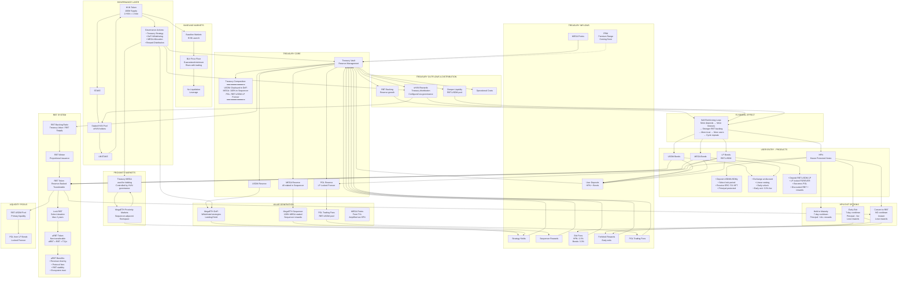

# Blackhaven Complete System Diagram

## Full Protocol Architecture - Olympus DAO Style

```mermaid
graph TB
    subgraph "GOVERNANCE LAYER"
        HVN_TOKEN[HVN Token<br/>100M Supply<br/>1 HVN = 1 Vote]
        STAKE_BTN[STAKE]
        UNSTAKE_BTN[UNSTAKE]
        SHVN_POOL[Staked HVN Pool<br/>sHVN holders]
        
        GOV_ACTIONS[Governance Actions:<br/>• Treasury Strategy<br/>• DeFi Whitelisting<br/>• MEGA Allocation<br/>• Reward Distribution]
        
        HVN_TOKEN --> STAKE_BTN
        STAKE_BTN --> SHVN_POOL
        SHVN_POOL --> UNSTAKE_BTN
        UNSTAKE_BTN --> HVN_TOKEN
        HVN_TOKEN --> GOV_ACTIONS
    end
    
    subgraph "BASELINE MARKETS"
        BASELINE[Baseline Markets<br/>HVN Launch]
        BLV_FLOOR[BLV Price Floor<br/>Guaranteed minimum<br/>Rises with trading]
        NO_LIQ[No Liquidation<br/>Leverage]
        
        BASELINE --> BLV_FLOOR
        BLV_FLOOR --> NO_LIQ
    end
    
    subgraph "USER ENTRY - PRODUCTS"
        HPN_ENTRY[HPN<br/>Haven Protected Notes]
        BOND_USDM[USDM Bonds]
        BOND_MEGA[MEGA Bonds]
        BOND_LP[LP Bonds<br/>RBT-USDM]
        
        HPN_DETAILS[• Deposit USDM/USDMy<br/>• Select lock period<br/>• Receive ERC-721 NFT<br/>• Principal protected]
        BOND_DETAILS[• Exchange at discount<br/>• Linear vesting<br/>• Daily unlock<br/>• Early exit: 3.3% fee]
        LP_BOND_DETAILS[• Deposit RBT-USDM LP<br/>• LP locked FOREVER<br/>• Becomes POL<br/>• Discounted RBT + rewards]
        
        HPN_ENTRY --> HPN_DETAILS
        BOND_USDM --> BOND_DETAILS
        BOND_MEGA --> BOND_DETAILS
        BOND_LP --> LP_BOND_DETAILS
    end
    
    subgraph "TREASURY CORE"
        TREASURY_VAULT[Treasury Vault<br/>Reserve Management]
        
        TREASURY_COMPOSITION[Treasury Composition:<br/>━━━━━━━━━━━━━━<br/>USDM: Deployed to DeFi<br/>MEGA: 100% to Sequencer<br/>POL: RBT-USDM LP Forever<br/>━━━━━━━━━━━━━━]
        
        USDM_RESERVE[USDM Reserve]
        MEGA_RESERVE[MEGA Reserve<br/>All staked in Sequencer]
        POL_RESERVE[POL Reserve<br/>LP Locked Forever]
        
        TREASURY_VAULT --> TREASURY_COMPOSITION
        TREASURY_VAULT --> USDM_RESERVE
        TREASURY_VAULT --> MEGA_RESERVE
        TREASURY_VAULT --> POL_RESERVE
    end
    
    subgraph "VALUE GENERATION"
        SEQUENCER_STAKING[MegaETH Sequencer<br/>100% MEGA staked<br/>Sequencer rewards]
        DEFI_STRATEGIES[MegaETH DeFi<br/>Whitelisted strategies<br/>Lending/Yield]
        POL_TRADING[POL Trading Fees<br/>RBT-USDM pool]
        MEGA_POINTS_GEN[MEGA Points<br/>From TVL<br/>Amplified via HPN]
        
        MEGA_RESERVE --> SEQUENCER_STAKING
        USDM_RESERVE --> DEFI_STRATEGIES
        POL_RESERVE --> POL_TRADING
    end
    
    subgraph "TREASURY INFLOWS"
        INFLOW_DEPOSITS[User Deposits<br/>HPN + Bonds]
        INFLOW_YIELD[Strategy Yields]
        INFLOW_SEQ[Sequencer Rewards]
        INFLOW_POINTS[MEGA Points]
        INFLOW_FEES[Exit Fees<br/>HPN: 2-3%<br/>Bonds: 3.3%]
        INFLOW_FORFEIT[Forfeited Rewards<br/>Early exits]
        INFLOW_POL[POL Trading Fees]
        INFLOW_PRM[PRM<br/>Premium Range<br/>Coming Soon]
    end
    
    subgraph "RBT SYSTEM"
        RBT_BACKING[RBT Backing Ratio<br/>Treasury Value / RBT Supply]
        RBT_MINTER[RBT Minter<br/>Proportional issuance]
        RBT_TOKEN[RBT Token<br/>Reserve-Backed<br/>Transferable]
        
        ARBT_LOCK[Lock RBT<br/>Select duration<br/>Max 2 years]
        ARBT_TOKEN[aRBT Token<br/>Non-transferable<br/>aRBT = RBT × T/2yr]
        ARBT_BENEFITS[aRBT Benefits:<br/>• Revenue sharing<br/>• Protocol fees<br/>• RBT stability<br/>• Ecosystem trust]
        
        RBT_BACKING --> RBT_MINTER
        RBT_MINTER --> RBT_TOKEN
        RBT_TOKEN --> ARBT_LOCK
        ARBT_LOCK --> ARBT_TOKEN
        ARBT_TOKEN --> ARBT_BENEFITS
    end
    
    subgraph "HPN EXIT OPTIONS"
        HPN_MATURITY[Hold to Maturity<br/>7-day cooldown<br/>Principal + ALL rewards]
        HPN_EARLY[Early Exit<br/>7-day cooldown<br/>Principal - fee<br/>Lose rewards]
        HPN_CONVERT[Convert to RBT<br/>NO cooldown<br/>Instant<br/>Lose rewards]
    end
    
    subgraph "LIQUIDITY POOLS"
        RBT_USDM_POOL[RBT-USDM Pool<br/>Primary liquidity]
        POL_LOCKED[POL from LP Bonds<br/>Locked Forever]
        
        RBT_USDM_POOL --> POL_LOCKED
    end
    
    subgraph "TREASURY OUTFLOWS & DISTRIBUTION"
        OUTFLOW_RBT[RBT Backing<br/>Reserve growth]
        OUTFLOW_SHVN[sHVN Rewards<br/>Treasury distribution<br/>Configured via governance]
        OUTFLOW_LIQUIDITY[Deeper Liquidity<br/>RBT-USDM pool]
        OUTFLOW_OPS[Operational Costs]
    end
    
    subgraph "FLYWHEEL EFFECT"
        FLYWHEEL[Self-Reinforcing Loop:<br/>More deposits → More treasury<br/>→ Stronger RBT backing<br/>→ More trust → More users<br/>→ Cycle repeats]
    end
    
    subgraph "PROXIMITY MARKETS"
        PROXIMITY[MegaETH Proximity Markets<br/>Sequencer-adjacent floorspace]
        MEGA_BIDDING[Treasury MEGA<br/>used for bidding<br/>Controlled by HVN governance]
        
        PROXIMITY --> MEGA_BIDDING
    end
    
    HPN_ENTRY --> INFLOW_DEPOSITS
    BOND_USDM --> INFLOW_DEPOSITS
    BOND_MEGA --> INFLOW_DEPOSITS
    BOND_LP --> INFLOW_DEPOSITS
    
    INFLOW_DEPOSITS --> TREASURY_VAULT
    
    SEQUENCER_STAKING --> INFLOW_SEQ
    DEFI_STRATEGIES --> INFLOW_YIELD
    POL_TRADING --> INFLOW_POL
    
    INFLOW_SEQ --> TREASURY_VAULT
    INFLOW_YIELD --> TREASURY_VAULT
    INFLOW_POL --> TREASURY_VAULT
    INFLOW_POINTS --> TREASURY_VAULT
    INFLOW_FEES --> TREASURY_VAULT
    INFLOW_FORFEIT --> TREASURY_VAULT
    INFLOW_PRM -.-> TREASURY_VAULT
    
    TREASURY_VAULT --> RBT_BACKING
    
    RBT_TOKEN --> HPN_CONVERT
    HPN_CONVERT --> INFLOW_FORFEIT
    
    HPN_ENTRY --> HPN_MATURITY
    HPN_ENTRY --> HPN_EARLY
    HPN_ENTRY --> HPN_CONVERT
    
    HPN_EARLY --> INFLOW_FEES
    HPN_EARLY --> INFLOW_FORFEIT
    
    BOND_USDM --> RBT_TOKEN
    BOND_MEGA --> RBT_TOKEN
    BOND_LP --> RBT_TOKEN
    
    BOND_LP --> POL_RESERVE
    
    TREASURY_VAULT --> OUTFLOW_RBT
    TREASURY_VAULT --> OUTFLOW_SHVN
    TREASURY_VAULT --> OUTFLOW_LIQUIDITY
    TREASURY_VAULT --> OUTFLOW_OPS
    
    OUTFLOW_SHVN --> SHVN_POOL
    
    OUTFLOW_RBT --> FLYWHEEL
    OUTFLOW_SHVN --> FLYWHEEL
    OUTFLOW_LIQUIDITY --> FLYWHEEL
    
    FLYWHEEL --> HPN_ENTRY
    FLYWHEEL --> BOND_USDM
    FLYWHEEL --> BOND_MEGA
    FLYWHEEL --> BOND_LP
    
    GOV_ACTIONS --> TREASURY_VAULT
    GOV_ACTIONS --> DEFI_STRATEGIES
    GOV_ACTIONS --> MEGA_BIDDING
    GOV_ACTIONS --> OUTFLOW_SHVN
    
    HVN_TOKEN --> BASELINE
    
    RBT_TOKEN --> RBT_USDM_POOL
    
    MEGA_BIDDING --> PROXIMITY
    PROXIMITY --> INFLOW_YIELD
```

---

*Complete Blackhaven Protocol System - All components, flows, and interactions*

