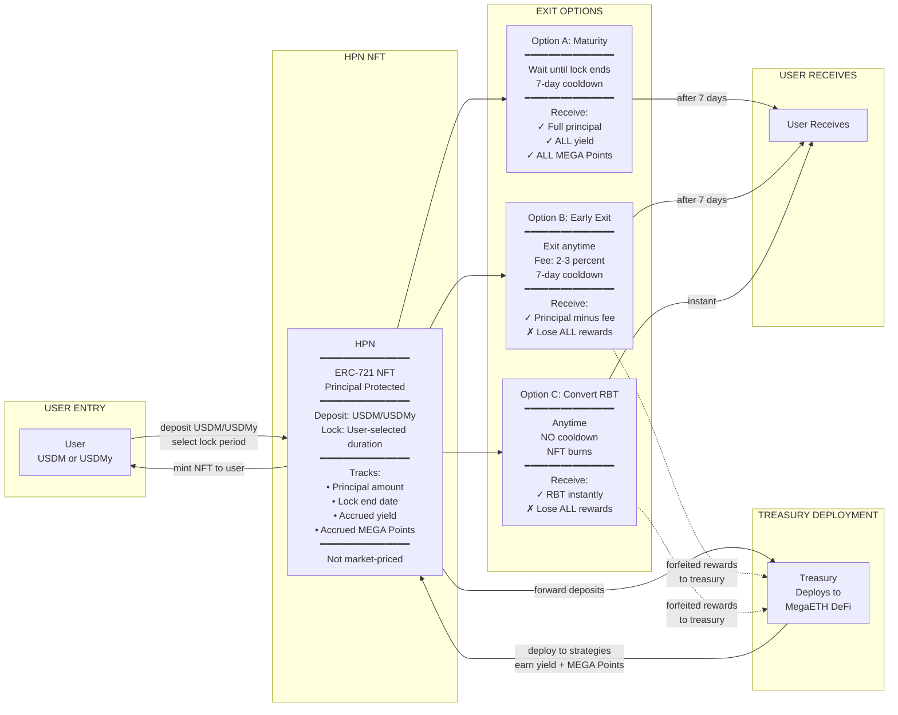
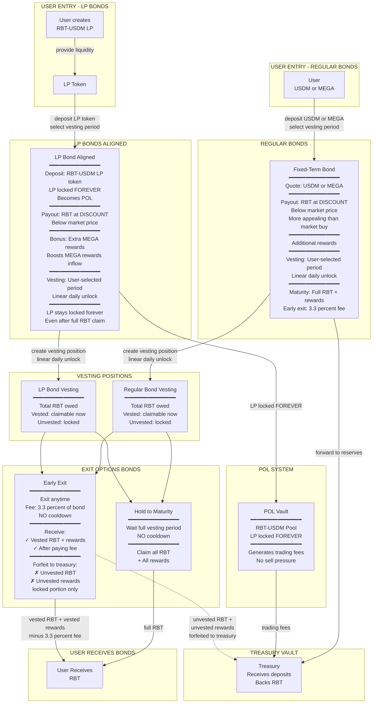
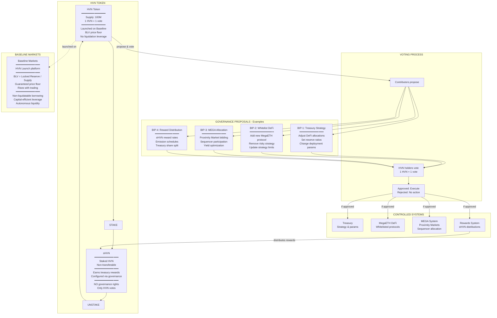

# Blackhaven Complete System Diagram

## Full Protocol Architecture - Olympus DAO Style

---

## HPN (Haven Protected Notes) - Complete Flow

---

## Fixed-Term Bonds - Complete Flow

---

## HVN & sHVN - Governance System

---

*Blackhaven Protocol - Complete System with User Flows and Integrations*

