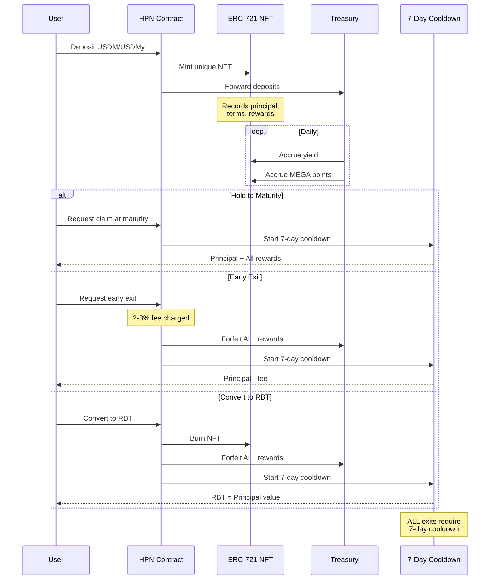
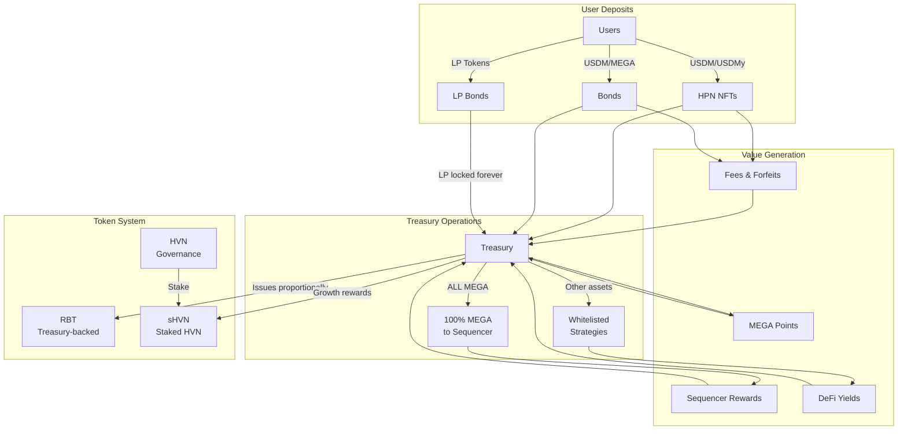

# Blackhaven Protocol Diagrams - Corrected Version

## RBT (Reserve-Backed Token) System

```mermaid
graph LR
    subgraph "Entry Points"
        HPN[Haven Protected Notes<br/>USDM/USDMy deposits]
        BONDS[Fixed-Term Bonds<br/>USDM/MEGA deposits]
        LP_BONDS[LP Bonds<br/>LP token deposits]
    end
    
    subgraph "Treasury Core"
        TREASURY[Treasury Contract]
        RESERVE[Reserve Assets]
    end
    
    subgraph "RBT Mechanics"
        RBT[RBT Contract]
        RATIO[Reserve Ratio<br/>Backing = Treasury Value / RBT Supply]
        MINT[Proportional Minting<br/>Preserves ratio]
    end
    
    subgraph "Value Sources"
        DEPOSITS[User Deposits]
        YIELD[Strategy Yields]
        POINTS[MEGA Points]
        FEES[Exit Fees & Forfeits]
    end
    
    HPN --> TREASURY
    BONDS --> TREASURY
    LP_BONDS --> TREASURY
    
    DEPOSITS --> RESERVE
    YIELD --> RESERVE
    POINTS --> RESERVE
    FEES --> RESERVE
    
    TREASURY --> RATIO
    RATIO --> MINT
    MINT --> RBT
    
    Note over RBT: Can be used across<br/>MegaETH DeFi ecosystem
```

## Treasury Operations

```mermaid
graph TD
    subgraph "Inflows"
        HPN_DEPOSITS[HPN Deposits<br/>USDM/USDMy]
        BOND_SALES[Bond Sales<br/>USDM/MEGA]
        YIELD_GEN[Generated Yields]
        MEGA_POINTS[MEGA Points<br/>Converted to MEGA]
        PRM[Premium Range Mechanism<br/>Coming Soon]
    end
    
    subgraph "Treasury Management"
        TREASURY[Treasury Contract]
        MEGA_ALLOCATION[100% MEGA to Sequencer]
        DEFI_STRATEGIES[Whitelisted<br/>MegaETH DeFi]
    end
    
    subgraph "Outputs"
        RBT_BACKING[RBT Backing Growth]
        SHVN_REWARDS[sHVN Rewards<br/>From treasury growth<br/>Configured via governance]
    end
    
    HPN_DEPOSITS --> TREASURY
    BOND_SALES --> TREASURY
    YIELD_GEN --> TREASURY
    MEGA_POINTS --> TREASURY
    PRM -.-> TREASURY
    
    TREASURY -->|ALL MEGA| MEGA_ALLOCATION
    TREASURY -->|Other assets| DEFI_STRATEGIES
    
    MEGA_ALLOCATION --> RBT_BACKING
    DEFI_STRATEGIES --> RBT_BACKING
    
    TREASURY --> SHVN_REWARDS
    
    Note over MEGA_ALLOCATION: Every single MEGA token<br/>staked in MegaETH Sequencer
```

## HPN (Haven Protected Notes) Lifecycle



## Fixed-Term Bonds Mechanism

```mermaid
graph TB
    subgraph "Bond Types"
        REGULAR[Regular Bonds]
        LP[LP Bonds<br/>(Aligned Bonds)]
    end
    
    subgraph "Regular Bond Flow"
        USER1[User] -->|USDM/MEGA| BOND_CONTRACT[Bond Contract]
        BOND_CONTRACT -->|To Treasury| TREASURY1[Treasury]
        BOND_CONTRACT -->|Discounted RBT<br/>with vesting| VESTING1[Linear Vesting]
        VESTING1 -->|Daily unlock| USER1
    end
    
    subgraph "LP Bond Flow"
        USER2[User] -->|1. Create LP| DEX[RBT-USDM Pool]
        DEX -->|2. LP Token| USER2
        USER2 -->|3. Deposit LP| LP_BOND[LP Bond Contract]
        LP_BOND -->|LOCKED FOREVER| POL[Protocol Owned<br/>Liquidity]
        LP_BOND -->|Discounted RBT<br/>with vesting| VESTING2[Linear Vesting]
        VESTING2 -->|Daily unlock| USER2
        POL -->|Trading fees| TREASURY2[Treasury Forever]
    end
    
    Note over POL: LP tokens can NEVER<br/>be withdrawn
    
    Note over VESTING1,VESTING2: Early exit forfeits<br/>unvested tokens
```

## HVN Governance Token System

```mermaid
graph LR
    subgraph "HVN Token"
        SUPPLY[100M Total Supply]
        DISTRIBUTION[22% Public - No vesting<br/>12.5% Core - 1yr cliff + 2yr vest<br/>7.5% Private - 1yr cliff + 3mo vest<br/>18% Ecosystem - 1yr vest<br/>40% Future emissions]
    end
    
    subgraph "Utility"
        GOVERNANCE[Vote on:<br/>- Treasury strategy<br/>- DeFi whitelist<br/>- MEGA allocation<br/>- Reward rates]
        PROXIMITY[Control Proximity<br/>Market allocation]
        BASELINE[Launched on Baseline<br/>with BLV floor]
    end
    
    subgraph "Staking"
        HVN[HVN] -->|Stake| sHVN[sHVN]
        sHVN -->|Earns| REWARDS[Treasury Growth Rewards<br/>Configured post-launch<br/>via governance]
    end
    
    SUPPLY --> DISTRIBUTION
    HVN --> GOVERNANCE
    HVN --> PROXIMITY
    HVN --> BASELINE
    
    Note over BASELINE: Guaranteed price floor<br/>Non-liquidatable loans
```

## Complete System Flow



---

*Corrected diagrams based on official Blackhaven documentation*
