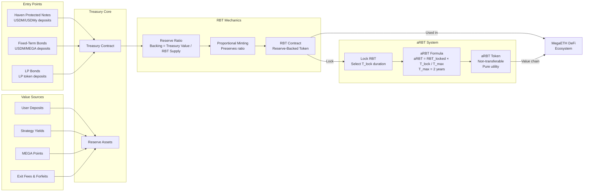
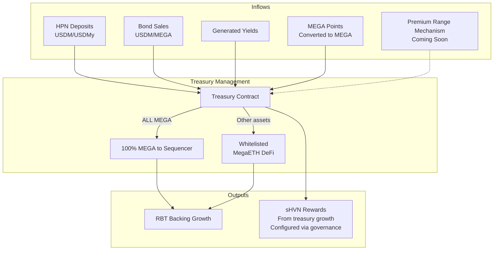
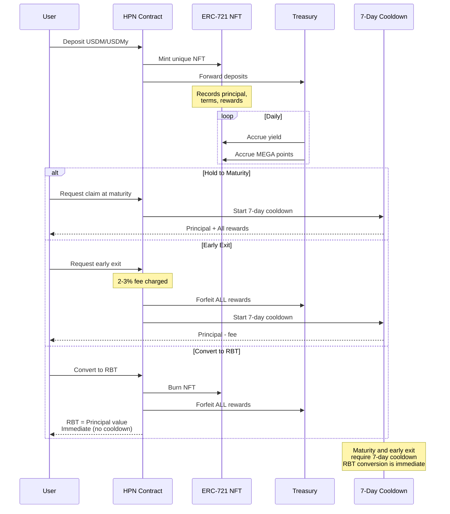
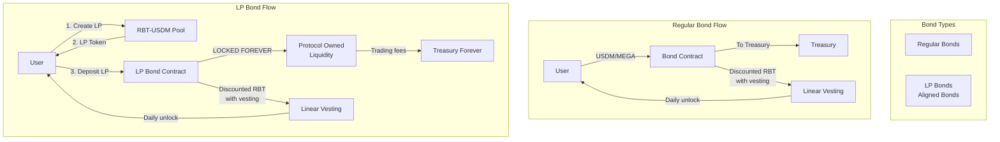
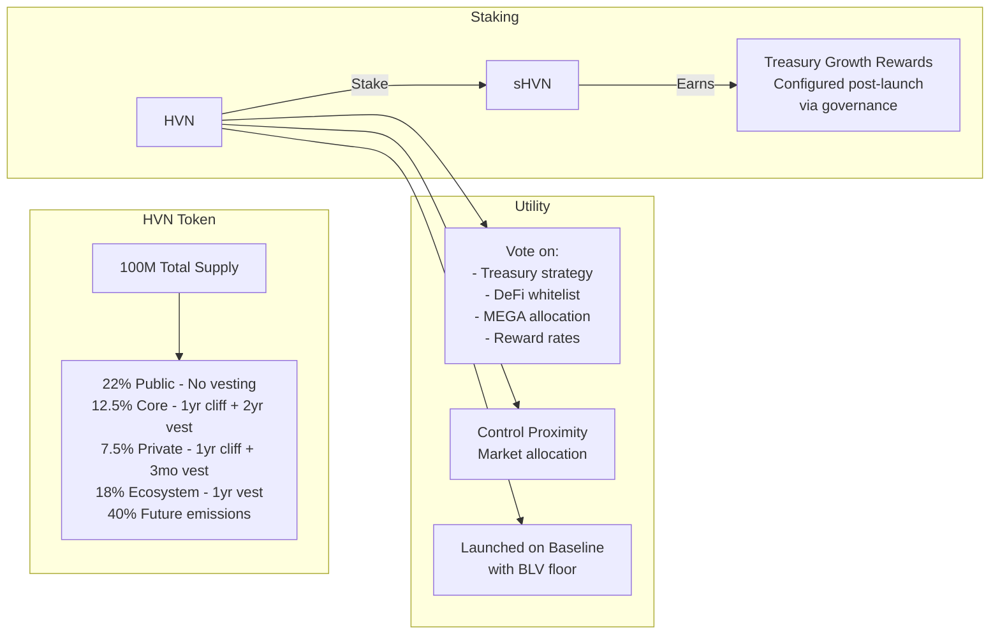
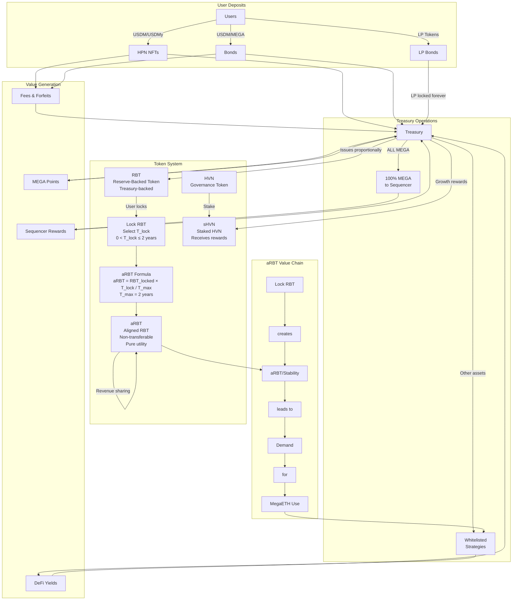

# Blackhaven Protocol Diagrams - Corrected Version

## RBT (Reserve-Backed Token) System

## Treasury Operations

## HPN (Haven Protected Notes) Lifecycle

## Fixed-Term Bonds Mechanism

## HVN Governance Token System

## Complete System Flow

---

*Corrected diagrams based on official Blackhaven documentation*
