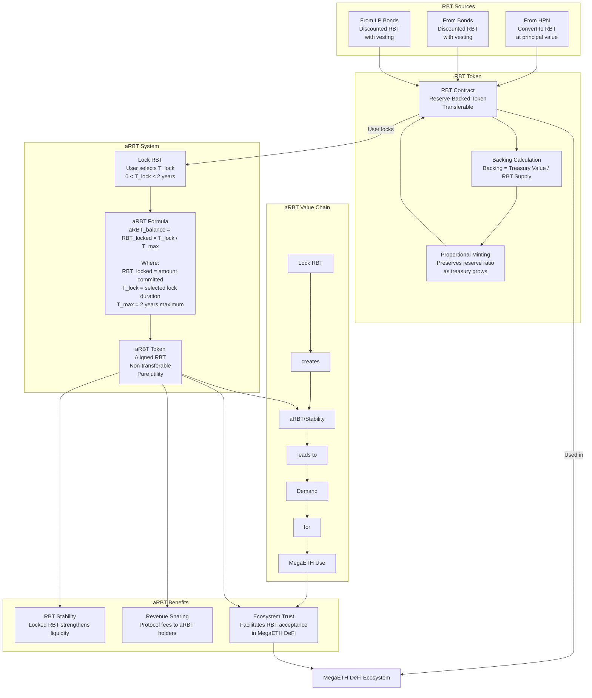
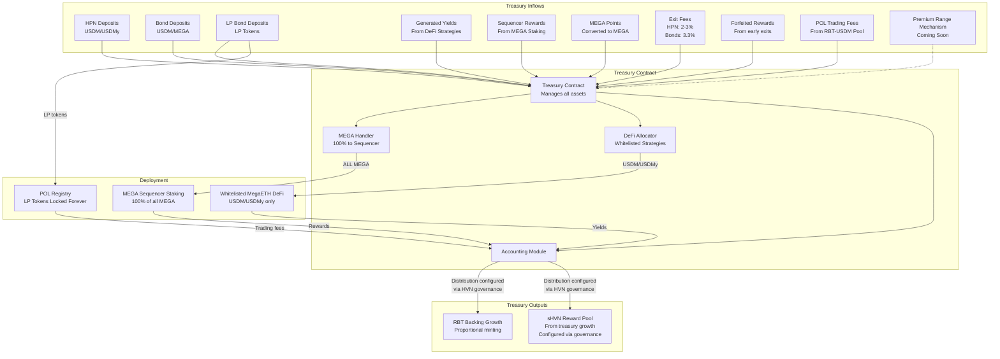
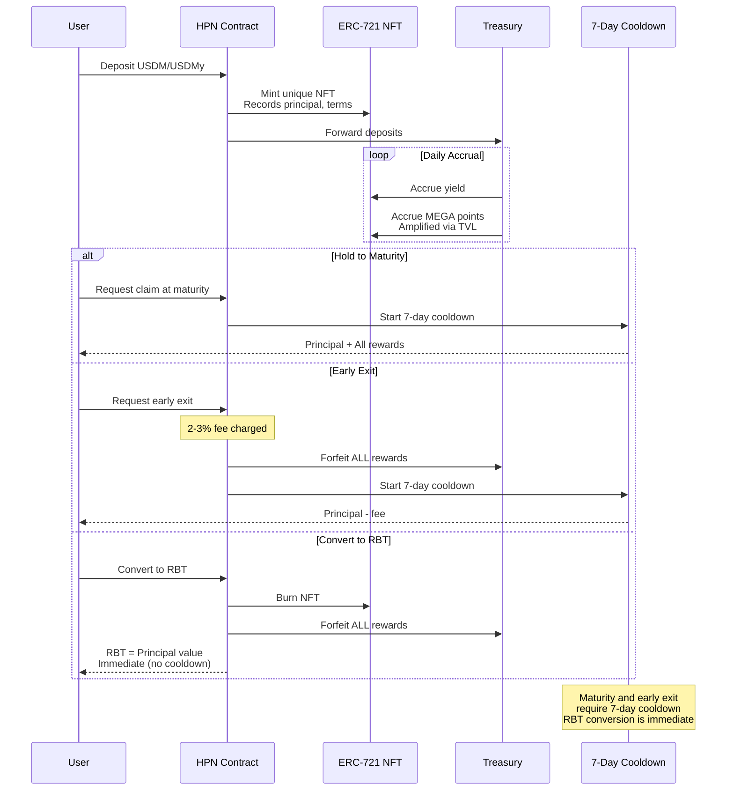
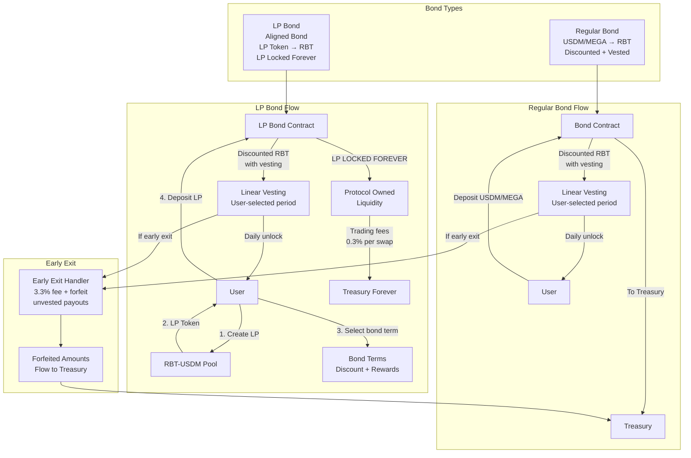
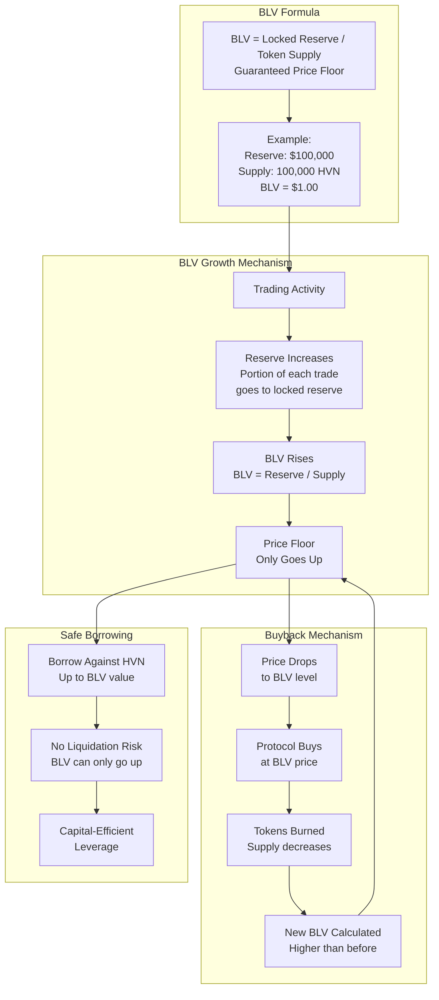
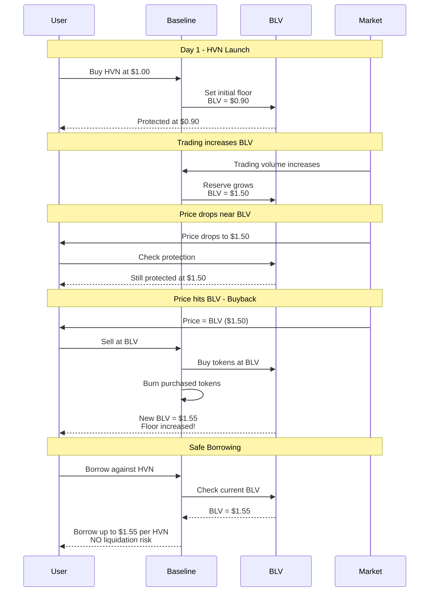

# Blackhaven Protocol Diagrams

## 1. HVN and sHVN System

```mermaid
graph TB
    subgraph "HVN Token"
        HVN_SUPPLY[100M Total Supply]
        HVN_DIST[Token Allocation<br/>22% Public - No vesting<br/>12.5% Core - 1yr cliff + 2yr vest<br/>7.5% Private - 1yr cliff + 3mo vest<br/>18% Ecosystem - 1yr vest<br/>40% Future emissions]
    end
    
    subgraph "HVN Governance"
        GOVERNANCE[Governance Rights<br/>Vote on:<br/>- Treasury strategy<br/>- DeFi whitelist<br/>- MEGA allocation<br/>- Reward rates<br/>- Proximity Market usage]
        BASELINE[Launched on Baseline Markets<br/>BLV price floor<br/>Non-liquidatable leverage]
        PROXIMITY[Control Proximity Markets<br/>HVN governance decides<br/>how staked MEGA is used]
    end
    
    subgraph "sHVN Staking"
        STAKING[Stake HVN]
        SHVN[sHVN Token<br/>Staked HVN<br/>Non-transferable]
        REWARDS[Treasury Growth Rewards<br/>Configured post-launch<br/>via HVN governance]
    end
    
    HVN_SUPPLY --> HVN_DIST
    HVN_DIST --> GOVERNANCE
    HVN_DIST --> BASELINE
    HVN_DIST --> PROXIMITY
    
    GOVERNANCE --> STAKING
    STAKING --> SHVN
    SHVN --> REWARDS
    
    Note over GOVERNANCE: Only HVN controls governance<br/>sHVN does NOT control governance
    Note over SHVN: sHVN receives rewards<br/>from treasury growth
```

## 2. RBT and aRBT System



## 3. Treasury System



## 4. HPN (Haven Protected Notes)



## 5. Fixed-Term Bonds



## 6. BLV (Baseline Value) for HVN



## BLV Price Protection Example



---

*Complete Blackhaven protocol diagrams based on official documentation*
