# Blackhaven Diagrams - MegaETH Native DeFi

## 1. Blackhaven Master Architecture - Real-Time Treasury Engine

```mermaid
graph TB
    subgraph "MegaETH Real-Time Layer (10ms latency)"
        subgraph "User Products"
            HPN["🛡️ Haven Protected Notes<br/>Principal Protected<br/>MEGA Points Amplified"]
            BONDS["💎 Fixed-Term Bonds<br/>Discounted RBT<br/>LP Bonds → POL Forever"]
            HVN_MARKET["🎯 HVN on Baseline<br/>BLV Price Floor<br/>Non-Liquidatable Leverage"]
        end
        
        subgraph "Blackhaven Treasury Core"
            TREASURY["💰 Dynamic Treasury<br/>Whitelisted MegaETH DeFi<br/>100% MEGA Staked"]
            RBT["🪙 RBT (BLK)<br/>Treasury Backed<br/>MegaETH Native"]
            POL["🌊 Protocol Owned Liquidity<br/>LP Locked Forever<br/>Trading Fees → Treasury"]
        end
        
        subgraph "Governance Layer"
            HVN["⚡ HVN Token<br/>Governance Power<br/>Proximity Market Control"]
            sHVN["🔒 sHVN (Staked)<br/>Treasury Growth Rewards<br/>Aligned Incentives"]
        end
        
        subgraph "MegaETH Integration"
            SEQUENCER["🚀 MegaETH Sequencer<br/>100% MEGA Staked<br/>Yield → Treasury"]
            PROXIMITY["📡 Proximity Markets<br/>HVN Controls Allocation<br/>MEV Capture"]
            DEFI["🏗️ MegaETH DeFi<br/>USDm Integration<br/>Real-Time Execution"]
        end
    end
    
    %% User flows
    HPN -->|Deposit USDM/USDMy| TREASURY
    BONDS -->|Deposit USDM/MEGA/LP| TREASURY
    HVN_MARKET -->|Public Sale Proceeds| BASELINE_BLV["Baseline Protocol<br/>Establishes HVN BLV"]
    
    %% Treasury flows
    TREASURY -->|Issues| RBT
    TREASURY -->|Stakes 100%| SEQUENCER
    TREASURY -->|Deploys| DEFI
    TREASURY -->|Manages| POL
    
    %% Governance flows
    HVN -->|Stake| sHVN
    HVN -->|Governs| PROXIMITY
    sHVN -->|Earns| REWARDS["Treasury Growth Rewards"]
    
    %% Value flows
    SEQUENCER -->|Yield| TREASURY
    PROXIMITY -->|MEV Revenue| TREASURY
    DEFI -->|Strategy Yields| TREASURY
    POL -->|Trading Fees| TREASURY
    
    %% Style
    classDef product fill:#1a1a2e,stroke:#16213e,stroke-width:3px,color:#eee
    classDef treasury fill:#0f3460,stroke:#16213e,stroke-width:3px,color:#eee
    classDef governance fill:#e94560,stroke:#16213e,stroke-width:3px,color:#eee
    classDef mega fill:#533483,stroke:#16213e,stroke-width:3px,color:#eee
    
    class HPN,BONDS,HVN_MARKET product
    class TREASURY,RBT,POL treasury
    class HVN,sHVN governance
    class SEQUENCER,PROXIMITY,DEFI mega
```

## 2. Blackhaven Flywheel - Self-Reinforcing Growth

```mermaid
graph LR
    subgraph "The Blackhaven Flywheel 🌀"
        DEPOSIT["💸 User Deposits<br/>HPN + Bonds"]
        TREASURY["💰 Treasury Growth<br/>More Backing"]
        MEGA_POWER["⚡ MEGA Power<br/>Sequencer + Proximity"]
        YIELDS["💎 Higher Yields<br/>More Revenue"]
        REWARDS["🎁 Better Rewards<br/>sHVN + Products"]
        ATTRACT["🧲 Attract Users<br/>Best Risk/Reward"]
    end
    
    DEPOSIT -->|Grows| TREASURY
    TREASURY -->|Increases| MEGA_POWER
    MEGA_POWER -->|Generates| YIELDS
    YIELDS -->|Funds| REWARDS
    REWARDS -->|Creates| ATTRACT
    ATTRACT -->|Drives| DEPOSIT
    
    %% Annotations
    DEPOSIT -.->|"Real-Time<br/>10ms execution"| FAST1[" "]
    YIELDS -.->|"MEV + Staking<br/>+ DeFi Strategies"| FAST2[" "]
    
    style FAST1 fill:none,stroke:none
    style FAST2 fill:none,stroke:none
```

## 3. Haven Protected Notes (HPN) Flow - ERC-721 Journey

## 4. LP Bonds Mechanism - Building Eternal POL

```mermaid
graph TD
    subgraph "LP Bond Process"
        USER["👤 User"]
        DEX["🔄 DEX<br/>RBT-USDM Pool"]
        LP["📜 LP Token"]
        BOND["💎 Bond Contract"]
        VESTING["⏰ Vesting RBT<br/>Linear Unlock"]
        POL["🏛️ Protocol Owned Liquidity<br/>LOCKED FOREVER"]
    end
    
    USER -->|1. Provide Liquidity| DEX
    DEX -->|2. Issue| LP
    USER -->|3. Deposit LP + Choose Term| BOND
    BOND -->|4. Lock LP Forever| POL
    BOND -->|5. Start Vesting| VESTING
    
    subgraph "Value Generation"
        POL -->|Trading Fees| TREASURY["💰 Treasury Growth"]
        TREASURY -->|Stronger Backing| RBT_VALUE["📈 RBT Value"]
        RBT_VALUE -->|Better Liquidity| TRADING["🎯 Tighter Spreads"]
    end
    
    VESTING -.->|"10% Discount<br/>30-Day Vesting"| USER
    
    style POL fill:#e94560,stroke:#333,stroke-width:3px
```

## 5. HVN Tokenomics & Utility

```mermaid
graph TD
    subgraph "HVN Utility Stack"
        HVN["⚡ HVN Token"]
        
        GOVERNANCE["🗳️ Governance<br/>• Treasury Strategy<br/>• Reward Rates<br/>• DeFi Whitelist<br/>• MEGA Allocation"]
        
        PROXIMITY["📡 Proximity Control<br/>• Bid Strategy<br/>• Slot Selection<br/>• MEV Capture<br/>• Execution Priority"]
        
        BASELINE["🛡️ Baseline Launch<br/>• BLV Price Floor<br/>• Non-Liquidatable Loans<br/>• Autonomous Liquidity"]
        
        STAKING["🔒 Stake → sHVN<br/>• Treasury Growth Share<br/>• Compound Rewards<br/>• Long-Term Alignment"]
    end
    
    HVN --> GOVERNANCE
    HVN --> PROXIMITY
    HVN --> BASELINE
    HVN --> STAKING
    
    PROXIMITY -.->|"Unique to MegaETH<br/>10ms advantage"| MEGA_EDGE[" "]
    style MEGA_EDGE fill:none,stroke:none
```

## 6. Treasury Strategy Matrix - Dynamic Allocation

```mermaid
graph LR
    subgraph "Treasury Inputs"
        HPN_DEPOSITS["HPN Deposits<br/>USDM/USDMy"]
        BOND_PROCEEDS["Bond Sales<br/>USDM/MEGA"]
        FORFEIT["Forfeited Rewards<br/>Early Exits"]
        FEES["Protocol Fees<br/>Trading/Exit"]
    end
    
    subgraph "Smart Allocation Engine"
        CONTROLLER["🧠 Treasury Controller<br/>HVN Governance"]
        
        subgraph "Deployment Targets"
            MEGA_STAKE["🚀 100% MEGA → Sequencer<br/>Base Yield + Network Security"]
            DEFI_1["💱 Lending Markets<br/>Supply USDM → Earn"]
            DEFI_2["🌊 AMM Positions<br/>Concentrated Liquidity"]
            DEFI_3["🎯 Yield Aggregators<br/>Auto-Compound Strategies"]
            FUTURE["🔮 Future MegaETH Protocols<br/>First-Mover Advantage"]
        end
    end
    
    subgraph "Value Outputs"
        RBT_BACKING["💎 RBT Backing Growth"]
        sHVN_REWARDS["🎁 sHVN Rewards Pool"]
        MEGA_ACCUMULATION["⚡ MEGA Treasury Reserve"]
    end
    
    HPN_DEPOSITS --> CONTROLLER
    BOND_PROCEEDS --> CONTROLLER
    FORFEIT --> CONTROLLER
    FEES --> CONTROLLER
    
    CONTROLLER --> MEGA_STAKE
    CONTROLLER --> DEFI_1
    CONTROLLER --> DEFI_2
    CONTROLLER --> DEFI_3
    CONTROLLER --> FUTURE
    
    MEGA_STAKE --> RBT_BACKING
    DEFI_1 --> sHVN_REWARDS
    DEFI_2 --> MEGA_ACCUMULATION
    DEFI_3 --> RBT_BACKING
    FUTURE --> sHVN_REWARDS
```

## 7. MegaETH Proximity Markets Integration

```mermaid
sequenceDiagram
    participant HVN_Holders as HVN Governance
    participant Treasury as Blackhaven Treasury
    participant Sequencer as MegaETH Sequencer
    participant Proximity as Proximity Markets
    participant MEV as MEV Opportunities
    
    Note over HVN_Holders: Vote on MEGA allocation strategy
    HVN_Holders->>Treasury: Set Proximity Bid Parameters
    
    Treasury->>Sequencer: Stake 100% MEGA
    Sequencer-->>Treasury: Base Staking Yield
    
    loop Each Rotation Window
        Note over Proximity: Tokyo → Netherlands → Virginia → LA
        Treasury->>Proximity: Bid for Sequencer-Adjacent Slots
        Proximity-->>Treasury: Win Priority Positions
        
        Note over MEV: 10ms Latency Advantage
        MEV->>Treasury: Capture Arbitrage
        MEV->>Treasury: Front-Run Protection
        MEV->>Treasury: Better Execution
    end
    
    Treasury-->>HVN_Holders: Report Performance
    Treasury-->>Treasury: Compound Gains
```

## 8. Complete User Journey Map

## 9. Risk & Mitigation Framework

```mermaid
graph TD
    subgraph "Risk Categories"
        SMART["🔧 Smart Contract Risk"]
        MEGA_PRICE["📉 MEGA Price Risk"]
        STRATEGY["🎯 Strategy Risk"]
        LIQUIDITY["💧 Liquidity Risk"]
    end
    
    subgraph "Mitigation Strategies"
        AUDIT["✅ Multi-Audited Contracts"]
        DIVERSIFY["🎨 Diversified Treasury"]
        WHITELIST["📋 Vetted DeFi Only"]
        POL_DEEP["🌊 Deep POL Reserves"]
    end
    
    subgraph "Safety Mechanisms"
        TIMELOCK["⏰ Governance Timelock"]
        BACKING["💎 Guaranteed RBT Backing"]
        COOLDOWN["🕐 7-Day HPN Cooldown"]
        BLV["🛡️ HVN Price Floor"]
    end
    
    SMART --> AUDIT
    MEGA_PRICE --> DIVERSIFY
    STRATEGY --> WHITELIST
    LIQUIDITY --> POL_DEEP
    
    AUDIT --> TIMELOCK
    DIVERSIFY --> BACKING
    WHITELIST --> COOLDOWN
    POL_DEEP --> BLV
```

## 10. Blackhaven KPIs Dashboard

```mermaid
graph LR
    subgraph "Core Metrics"
        TVL["💰 Total Value Locked<br/>Target: $1B+"]
        RBT_BACK["💎 RBT Backing<br/>Always Growing"]
        MEGA_LOCKED["⚡ MEGA Staked<br/>100% of Treasury MEGA"]
    end
    
    subgraph "Growth Metrics"
        HPN_TVL["🛡️ HPN Deposits<br/>Monthly Growth"]
        POL_DEPTH["🌊 POL Value<br/>Cumulative Forever"]
        sHVN_RATIO["🔒 sHVN Stake Ratio<br/>Long-Term Alignment"]
    end
    
    subgraph "Performance Metrics"
        APY["📈 Treasury APY<br/>From All Sources"]
        VOLUME["💹 RBT Volume<br/>24h Trading"]
        USERS["👥 Unique Users<br/>Active Participants"]
    end
    
    TVL --> RBT_BACK
    MEGA_LOCKED --> APY
    HPN_TVL --> TVL
    POL_DEPTH --> VOLUME
    sHVN_RATIO --> USERS
```

---

*Built for MegaETH's 10ms future. Where real-time performance meets sustainable DeFi.*
