# Blackhaven Economics & Tokenomics Visual Guide

## 1. The Blackhaven Economic Trinity

```mermaid
graph TB
    subgraph "The Trinity of Value"
        HVN["⚡ HVN<br/>Governance Power<br/>100M Supply<br/>Controls Everything"]
        RBT["💎 RBT (BLK)<br/>Treasury Backed<br/>Elastic Supply<br/>Value Storage"]
        sHVN["🔒 sHVN<br/>Staked HVN<br/>Earns Treasury Growth<br/>Long-term Aligned"]
    end
    
    subgraph "Value Flows"
        USERS["👥 Users"]
        TREASURY["💰 Treasury"]
        MARKET["📈 Market"]
    end
    
    USERS -->|Buy/Stake| HVN
    HVN -->|Stake| sHVN
    USERS -->|Deposit| TREASURY
    TREASURY -->|Issues| RBT
    RBT -->|Trade| MARKET
    MARKET -->|Price Discovery| RBT
    sHVN -->|Earns From| TREASURY
    
    style HVN fill:#e91e63,stroke:#fff,stroke-width:3px,color:#fff
    style RBT fill:#3f51b5,stroke:#fff,stroke-width:3px,color:#fff
    style sHVN fill:#009688,stroke:#fff,stroke-width:3px,color:#fff
```

## 2. HVN Launch Economics on Baseline

## 3. RBT Backing Growth Model

```mermaid
graph LR
    subgraph "Backing Sources"
        DEPOSITS["💵 User Deposits<br/>HPN + Bonds"]
        YIELDS["📈 Strategy Yields<br/>5-15% APY"]
        MEGA_STAKE["⚡ MEGA Staking<br/>Sequencer Rewards"]
        FEES["💰 Protocol Fees<br/>Exit + Trading"]
        POINTS["🎯 MEGA Points<br/>Converted to MEGA"]
    end
    
    subgraph "Backing Growth"
        BACKING["RBT Backing Value<br/>Always Increasing"]
        FORMULA["Backing = Treasury / RBT Supply"]
    end
    
    subgraph "Results"
        PRICE_SUPPORT["Price Support<br/>Natural Floor"]
        CONFIDENCE["User Confidence<br/>Backed Asset"]
        SUSTAINABILITY["Sustainable Model<br/>Real Yield"]
    end
    
    DEPOSITS --> BACKING
    YIELDS --> BACKING
    MEGA_STAKE --> BACKING
    FEES --> BACKING
    POINTS --> BACKING
    
    BACKING --> FORMULA
    FORMULA --> PRICE_SUPPORT
    FORMULA --> CONFIDENCE
    FORMULA --> SUSTAINABILITY
```

## 4. Comparative DeFi Economics

## 5. The MEGA Accumulation Engine

```mermaid
graph TB
    subgraph "MEGA Sources"
        FORFEIT["💸 Forfeited Rewards<br/>Early Exits"]
        PENALTIES["⚠️ Exit Penalties<br/>Bond/HPN Early Exit"]
        ALLOCATIONS["🎯 Point Conversions<br/>Treasury Activity"]
        PURCHASES["💰 Direct Purchases<br/>From Revenue"]
    end
    
    subgraph "MEGA Deployment"
        SEQUENCER["🚀 100% to Sequencer<br/>Perpetual Staking"]
        
        subgraph "Returns"
            BASE_YIELD["Base Staking Yield"]
            PROXIMITY_REVENUE["Proximity Market Revenue"]
            NETWORK_REWARDS["Network Incentives"]
        end
    end
    
    subgraph "Value Capture"
        TO_TREASURY["Back to Treasury<br/>Compounds Forever"]
        TO_RBT["Increases RBT Backing"]
        TO_sHVN["Funds sHVN Rewards"]
    end
    
    FORFEIT --> SEQUENCER
    PENALTIES --> SEQUENCER
    ALLOCATIONS --> SEQUENCER
    PURCHASES --> SEQUENCER
    
    SEQUENCER --> BASE_YIELD
    SEQUENCER --> PROXIMITY_REVENUE
    SEQUENCER --> NETWORK_REWARDS
    
    BASE_YIELD --> TO_TREASURY
    PROXIMITY_REVENUE --> TO_RBT
    NETWORK_REWARDS --> TO_sHVN
```

## 6. User Economic Pathways

```mermaid
graph TD
    subgraph "Entry Points"
        START["💵 $10,000 USDM"]
    end
    
    subgraph "Path 1: Safety First"
        HPN["🛡️ HPN 6-month<br/>Principal Protected<br/>~8% APY + MEGA Points"]
    end
    
    subgraph "Path 2: Liquidity Provider"
        LP["💧 Provide RBT-USDM LP<br/>→ Bond for 30 days<br/>10% Discount + Rewards"]
    end
    
    subgraph "Path 3: Governance Maxi"
        HVN_BUY["⚡ Buy HVN on Baseline<br/>→ Stake for sHVN<br/>Treasury Growth Share"]
    end
    
    subgraph "Path 4: Treasury Farmer"
        RBT_ACCUMULATE["💎 Buy RBT<br/>Benefit from Backing Growth<br/>Use in MegaETH DeFi"]
    end
    
    START --> HPN
    START --> LP
    START --> HVN_BUY
    START --> RBT_ACCUMULATE
    
    HPN -->|After 6mo| RETURNS1["$10,800 + MEGA"]
    LP -->|After 30d| RETURNS2["11,000 RBT value"]
    HVN_BUY -->|Long-term| RETURNS3["Gov Power + Rewards"]
    RBT_ACCUMULATE -->|Backing Growth| RETURNS4["Appreciation + Utility"]
```

## 7. Protocol Revenue Streams

## 8. Token Velocity Analysis

```mermaid
graph LR
    subgraph "High Velocity (Bad)"
        FARM["🚜 Farm Token"] -->|Instant Sell| EXCHANGE["CEX/DEX"]
        EXCHANGE -->|Dump| PRICE_DOWN["📉 Price"]
    end
    
    subgraph "Low Velocity (Good)"
        HVN_TOKEN["⚡ HVN"] -->|Stake| LOCKED["🔒 sHVN"]
        RBT_TOKEN["💎 RBT"] -->|Hold/Use| DEFI["🏗️ DeFi"]
        LP_TOKEN["💧 LP Bonds"] -->|Lock Forever| POL["🏛️ POL"]
    end
    
    subgraph "Velocity Sinks"
        SINK1["✓ Staking Incentives"]
        SINK2["✓ Utility in DeFi"]
        SINK3["✓ Permanent Locking"]
        SINK4["✓ Governance Value"]
    end
    
    LOCKED --> SINK1
    DEFI --> SINK2
    POL --> SINK3
    HVN_TOKEN --> SINK4
```

## 9. MegaETH Ecosystem Value Capture

```mermaid
graph TB
    subgraph "MegaETH Benefits"
        TVL["📊 Increases TVL"]
        ACTIVITY["⚡ Drives Activity"]
        SHOWCASE["🎯 Showcase 10ms"]
        STICKY["🔒 Sticky Liquidity"]
    end
    
    subgraph "Blackhaven Captures"
        FIRST["🥇 First-Mover"]
        INTEGRATIONS["🔗 Deep Integrations"]
        POINTS["💎 MEGA Points"]
        INFLUENCE["🎮 Proximity Control"]
    end
    
    subgraph "Mutual Growth"
        MEGA_PRICE["MEGA Price ↑"]
        BH_SUCCESS["Blackhaven Success ↑"]
        USER_WIN["Users Win 🎉"]
    end
    
    TVL --> MEGA_PRICE
    ACTIVITY --> MEGA_PRICE
    SHOWCASE --> BH_SUCCESS
    STICKY --> BH_SUCCESS
    
    FIRST --> USER_WIN
    INTEGRATIONS --> USER_WIN
    POINTS --> USER_WIN
    INFLUENCE --> USER_WIN
    
    MEGA_PRICE -.->|Reinforces| BH_SUCCESS
    BH_SUCCESS -.->|Reinforces| MEGA_PRICE
```

## 10. Long-Term Economic Sustainability

---

## Key Economic Insights

### 1. **No Ponzinomics**
- Real yield from real sources (MEGA staking, DeFi strategies, trading fees)
- No inflationary rewards or unsustainable emissions

### 2. **Aligned Incentives**
- HVN holders want treasury growth (increases their rewards)
- RBT holders want backing growth (increases their value)
- LPs locked forever (no mercenary capital)

### 3. **MegaETH Native Advantages**
- 10ms execution enables strategies impossible elsewhere
- Proximity markets create unique revenue stream
- USDm integration provides additional yield

### 4. **Sustainable Growth**
- Start with high yields to attract capital
- Diversify revenue as TVL grows
- Mature into sustainable 5-10% real yield

---

*Built for the real-time future. Where speed meets sustainability.*
