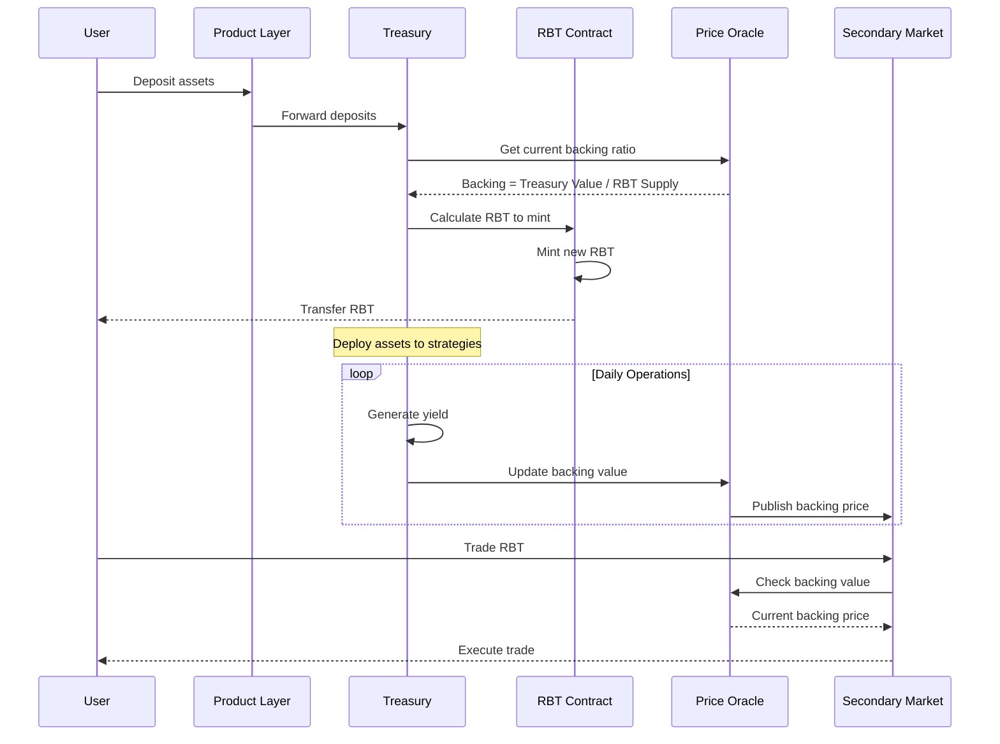
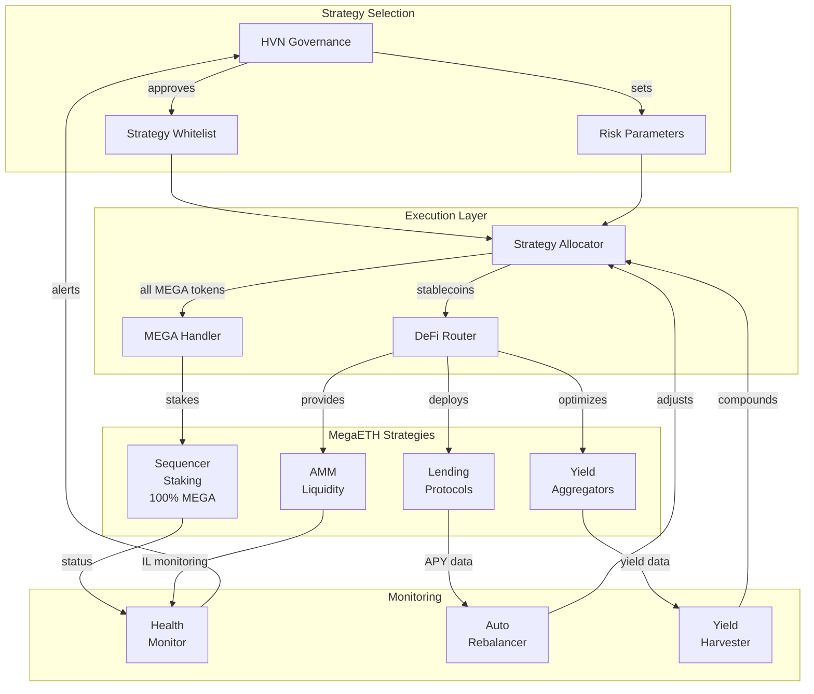
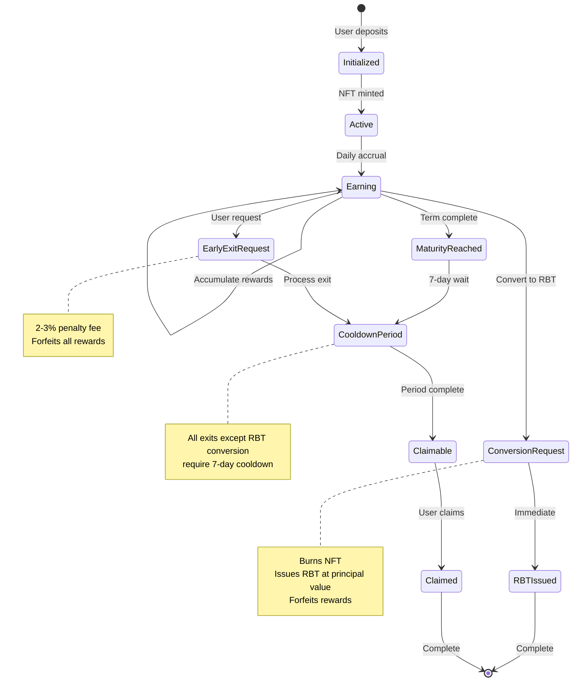
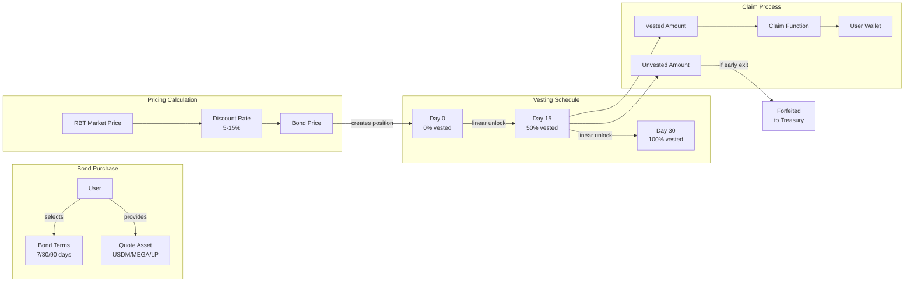
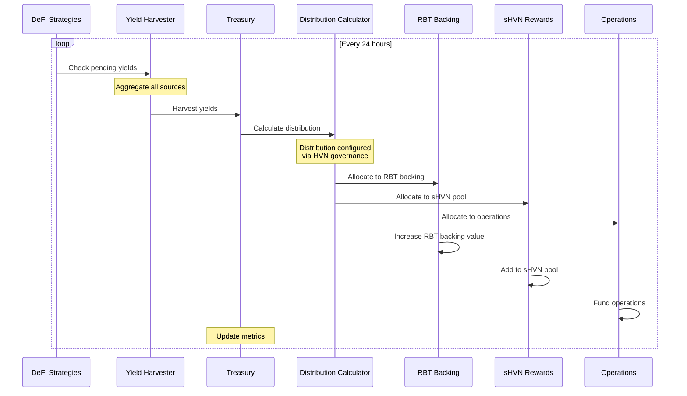

# Blackhaven Flow Diagrams

## RBT Minting and Backing Flow



## Treasury Strategy Execution Flow



## HPN Lifecycle State Machine



## Bond Vesting Mechanism



## Protocol Owned Liquidity (POL) Architecture

```mermaid
graph TB
    subgraph "LP Bond Creation"
        USER_LP[LP Provider]
        DEX[DEX<br/>RBT-USDM Pool]
        LP_TOKEN[LP Token]
    end
    
    subgraph "Bond Contract"
        LP_DEPOSIT[LP Deposit<br/>Handler]
        LOCK_FOREVER[Permanent<br/>Lock]
        BOND_MINT[Bond<br/>Position]
    end
    
    subgraph "POL Management"
        POL_REGISTRY[POL<br/>Registry]
        FEE_COLLECTOR[Fee<br/>Collector]
        TREASURY_CREDIT[Treasury<br/>Credit]
    end
    
    subgraph "Benefits Distribution"
        TRADING_FEES[Trading Fees<br/>0.3% per swap]
        IMPERMANENT[Impermanent<br/>Gain/Loss]
        NET_VALUE[Net POL<br/>Value]
    end
    
    USER_LP -->|1. provides liquidity| DEX
    DEX -->|2. issues| LP_TOKEN
    USER_LP -->|3. deposits LP| LP_DEPOSIT
    
    LP_DEPOSIT -->|4. locks permanently| LOCK_FOREVER
    LP_DEPOSIT -->|5. creates| BOND_MINT
    LOCK_FOREVER -->|6. registers| POL_REGISTRY
    
    DEX -->|generates| TRADING_FEES
    DEX -->|experiences| IMPERMANENT
    
    TRADING_FEES --> FEE_COLLECTOR
    IMPERMANENT --> NET_VALUE
    FEE_COLLECTOR --> TREASURY_CREDIT
    NET_VALUE --> TREASURY_CREDIT
    
    BOND_MINT -->|vested RBT| USER_LP
    
    note right of LOCK_FOREVER
        LP tokens can never
        be withdrawn
    end note
    
    note right of TRADING_FEES
        All fees go to
        treasury forever
    end note
```

## Yield Distribution Flow



---

*Technical flow diagrams illustrating Blackhaven protocol operations*
