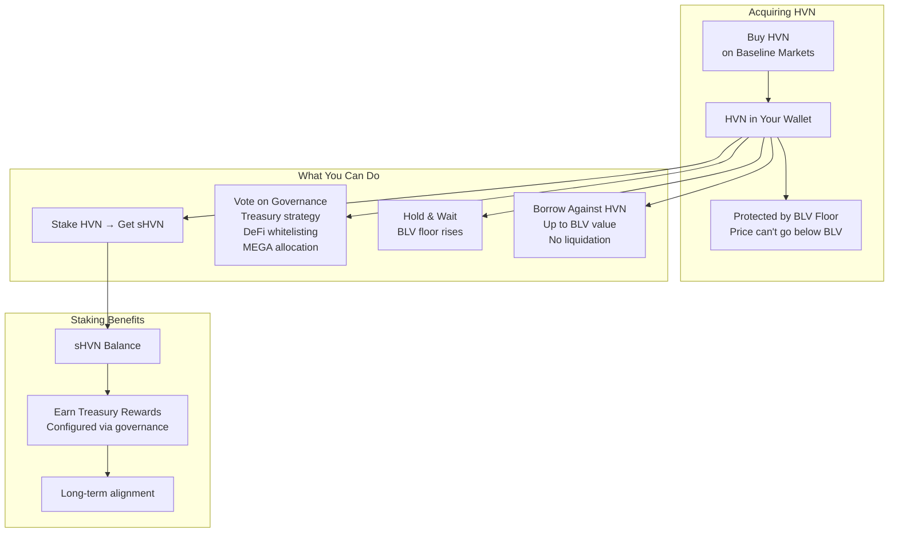
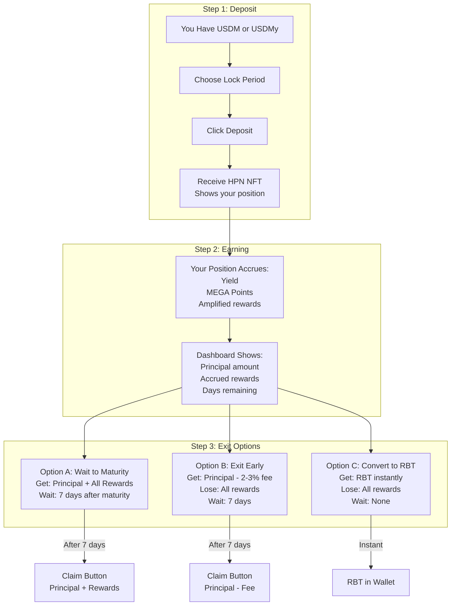
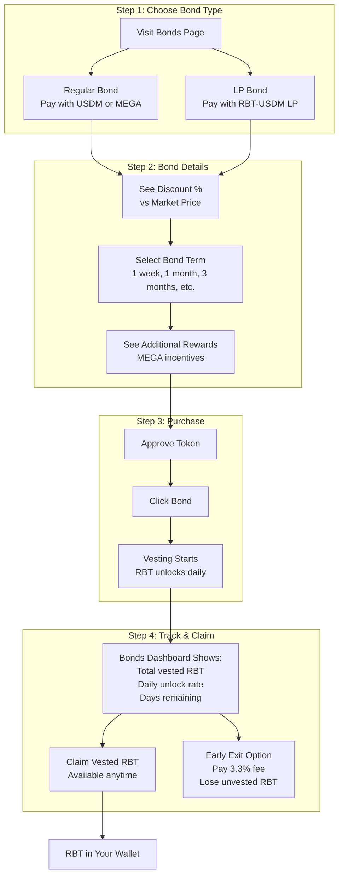
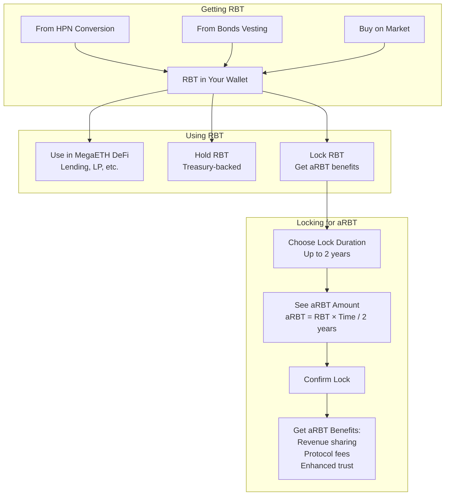
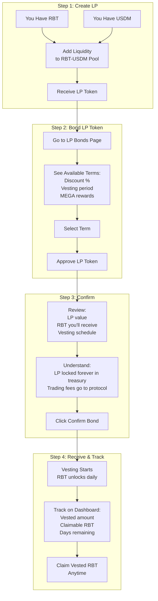
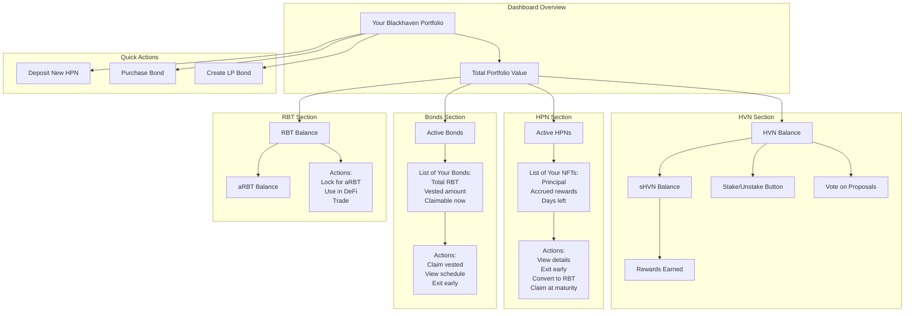
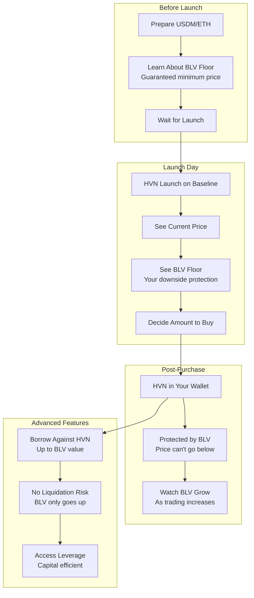

# Blackhaven Protocol - Frontend User Flows

## 1. HVN Token - User Journey

## 2. Haven Protected Notes (HPN) - User Flow

## 3. Fixed-Term Bonds - User Flow

## 4. RBT & aRBT - User Journey

## 5. LP Bonds - Detailed User Flow

## 6. Complete User Dashboard View

## 7. Baseline Markets HVN Launch - User Experience

---

*Frontend-focused user flows for Blackhaven Protocol*

