# Blackhaven × MegaETH Ecosystem Map

## 🌐 The Complete Ecosystem

```mermaid
graph TB
    subgraph "MegaETH Layer - 10ms Real-Time"
        subgraph "Core Infrastructure"
            MEGA_CHAIN["⚡ MegaETH Chain<br/>100k TPS<br/>10ms blocks"]
            SEQUENCER["🚀 Sequencer<br/>Rotates globally<br/>Stake MEGA"]
            PROXIMITY["📡 Proximity Markets<br/>Pay for priority<br/>Yield opportunities"]
        end
        
        subgraph "Native Assets"
            MEGA["💜 $MEGA<br/>Sequencer staking<br/>Proximity bidding"]
            USDM["💵 $USDm<br/>Native stablecoin<br/>Ethena powered"]
            ETH["🔷 $ETH<br/>Gas token<br/>Security layer"]
        end
        
        subgraph "MegaMafia Apps"
            PUMPPARTY["🎮 Pump.Party<br/>Interactive games"]
            EUPHORIA["🌟 Euphoria<br/>DeFi hub"]
            VALHALLA["⚔️ Valhalla<br/>Battle arena"]
            LEGEND["📈 Legend<br/>Trading platform"]
            MORE["... and 20+ more"]
        end
    end
    
    subgraph "Blackhaven Protocol"
        subgraph "Core Components"
            TREASURY_ENGINE["💰 Treasury Engine<br/>Smart allocation<br/>Real yield generation"]
            GOV_LAYER["🗳️ Governance Layer<br/>HVN powered<br/>Community driven"]
            PRODUCT_SUITE["📦 Product Suite<br/>HPN, Bonds, Staking"]
        end
        
        subgraph "Token System"
            HVN_TOKEN["⚡ HVN<br/>Governance<br/>100M supply"]
            RBT_TOKEN["💎 RBT (BLK)<br/>Treasury backed<br/>Elastic supply"]
            sHVN_TOKEN["🔒 sHVN<br/>Staked HVN<br/>Earn rewards"]
        end
        
        subgraph "Integrations"
            BASELINE["🛡️ Baseline Markets<br/>HVN launch<br/>BLV protection"]
            DEFI_INT["🏗️ DeFi Integrations<br/>Lending, AMMs<br/>Yield strategies"]
            ORACLE_INT["🔮 Oracle Network<br/>Price feeds<br/>Real-time data"]
        end
    end
    
    subgraph "Value Flows"
        USER_DEPOSITS["👥 User Deposits"]
        YIELD_GEN["📈 Yield Generation"]
        REWARDS_DIST["🎁 Rewards Distribution"]
        ECOSYSTEM_GROWTH["🌱 Ecosystem Growth"]
    end
    
    %% Connections
    MEGA_CHAIN --> BLACKHAVEN
    SEQUENCER --> TREASURY_ENGINE
    PROXIMITY --> GOV_LAYER
    
    MEGA --> TREASURY_ENGINE
    USDM --> PRODUCT_SUITE
    
    PUMPPARTY -.->|"Accepts RBT"| RBT_TOKEN
    EUPHORIA -.->|"HPN collateral"| PRODUCT_SUITE
    
    HVN_TOKEN --> BASELINE
    TREASURY_ENGINE --> DEFI_INT
    
    USER_DEPOSITS --> TREASURY_ENGINE
    TREASURY_ENGINE --> YIELD_GEN
    YIELD_GEN --> REWARDS_DIST
    REWARDS_DIST --> ECOSYSTEM_GROWTH
    
    style MEGA_CHAIN fill:#1a237e,stroke-width:3px
    style TREASURY_ENGINE fill:#d32f2f,stroke-width:3px
    style HVN_TOKEN fill:#ff6f00,stroke-width:3px
```

## 🔄 The Synergy Loops

```mermaid
graph LR
    subgraph "Loop 1: Speed Advantage"
        SPEED["10ms Execution"] --> ARBITRAGE["Better Arbitrage"]
        ARBITRAGE --> TREASURY_YIELD["Higher Treasury Yield"]
        TREASURY_YIELD --> USER_REWARDS["More User Rewards"]
        USER_REWARDS --> MORE_DEPOSITS["Attract More Deposits"]
        MORE_DEPOSITS --> SPEED
    end
    
    subgraph "Loop 2: Ecosystem Growth"
        BLACKHAVEN_TVL["Blackhaven TVL ↑"] --> MEGA_DEMAND["MEGA Demand ↑"]
        MEGA_DEMAND --> MEGA_PRICE["MEGA Price ↑"]
        MEGA_PRICE --> TREASURY_VALUE["Treasury Value ↑"]
        TREASURY_VALUE --> RBT_BACKING["RBT Backing ↑"]
        RBT_BACKING --> BLACKHAVEN_TVL
    end
    
    subgraph "Loop 3: Network Effects"
        MORE_APPS["More MegaMafia Apps"] --> RBT_UTILITY["RBT Utility ↑"]
        RBT_UTILITY --> USER_ADOPTION["User Adoption ↑"]
        USER_ADOPTION --> LIQUIDITY["Liquidity ↑"]
        LIQUIDITY --> DEV_INTEREST["Developer Interest ↑"]
        DEV_INTEREST --> MORE_APPS
    end
```

## 💎 Why Blackhaven × MegaETH is Inevitable

```mermaid
mindmap
  root((Blackhaven × MegaETH))
    Technical Alignment
      10ms enables real-time treasury management
      100k TPS supports complex strategies
      Proximity markets create unique revenue
      Native USDm integration
    Economic Alignment
      MEGA staking generates yield
      Treasury growth benefits all
      No extractive tokenomics
      Real yield > ponzinomics
    Cultural Alignment
      MegaMafia builder ethos
      A24 philosophy
      Innovation first
      Community driven
    Strategic Alignment
      First major DeFi on MegaETH
      Deep protocol integration
      Shared success model
      Long-term vision
```

## 📊 Ecosystem Metrics Dashboard

## 🚀 Launch Sequence

## 🎯 The MegaETH Advantage for Blackhaven

| Feature | Traditional L2 | MegaETH | Blackhaven Benefit |
|---------|---------------|---------|-------------------|
| **Latency** | 200-400ms | 10ms | Real-time arbitrage, instant rebalancing |
| **Throughput** | 1-5k TPS | 100k TPS | Complex strategies, no congestion |
| **Gas Costs** | $0.10-1.00 | Sub-cent | More transactions, better yields |
| **MEV** | Extracted by others | Proximity markets | Treasury captures value |
| **Native Stable** | USDC/USDT | USDm | Additional yield source |
| **Ecosystem** | Fragmented | MegaMafia | Deep integrations |
| **Philosophy** | Ship fast, fix later | A24 quality | Sustainable growth |

## 🌟 End Game Vision

```mermaid
graph TB
    subgraph "2025 - Launch Year"
        LAUNCH["🚀 Launch on MegaETH<br/>First-mover advantage"]
        ESTABLISH["🏗️ Establish TVL<br/>$100M target"]
        INTEGRATE["🔗 Deep integrations<br/>MegaMafia apps"]
    end
    
    subgraph "2027 - Growth Phase"
        SCALE["📈 Scale to $1B TVL<br/>Proven model"]
        EXPAND["🌍 Expand strategies<br/>New yield sources"]
        LEAD["👑 DeFi leader on MegaETH<br/>Go-to treasury"]
    end
    
    subgraph "2030 - Maturity"
        INSTITUTION["🏦 Institutional standard<br/>Risk-adjusted yields"]
        ECOSYSTEM["🌐 Ecosystem backbone<br/>Powers MegaETH DeFi"]
        SUSTAINABLE["♻️ Fully sustainable<br/>Real yield forever"]
    end
    
    LAUNCH --> ESTABLISH
    ESTABLISH --> INTEGRATE
    INTEGRATE --> SCALE
    SCALE --> EXPAND
    EXPAND --> LEAD
    LEAD --> INSTITUTION
    INSTITUTION --> ECOSYSTEM
    ECOSYSTEM --> SUSTAINABLE
    
    style LAUNCH fill:#e91e63
    style SCALE fill:#3f51b5
    style SUSTAINABLE fill:#4caf50
```

---

## 🔥 The Blackhaven × MegaETH Thesis

**Speed** + **Yield** + **Community** = **Unstoppable**

1. **Only possible on MegaETH** - 10ms execution enables strategies that can't exist elsewhere
2. **Aligned incentives everywhere** - MegaETH wins, Blackhaven wins, Users win
3. **Real yield, real value** - No ponzis, no unsustainable emissions, just math
4. **Built to last** - Institutional-grade infrastructure with degen-friendly UX
5. **The future is real-time** - And Blackhaven is ready for it

---

*Welcome to the real-time DeFi revolution. Welcome to Blackhaven on MegaETH.*

🚀 **LFG** 🚀
