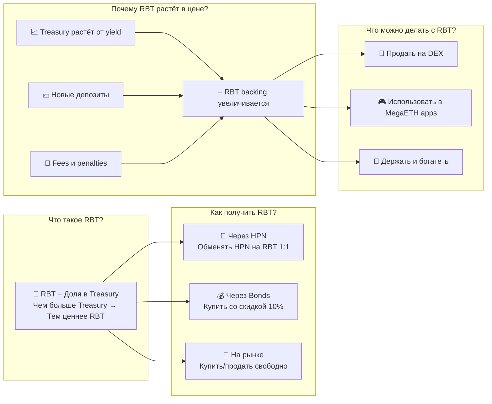
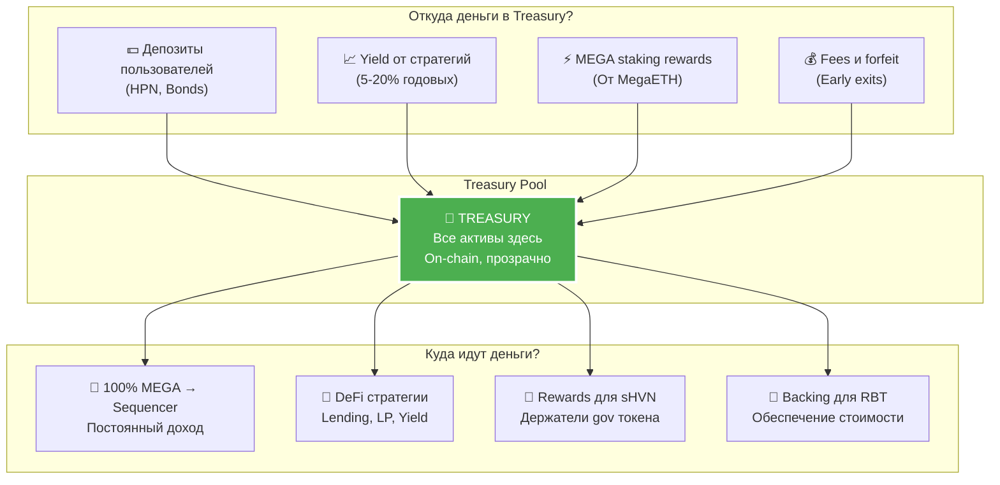
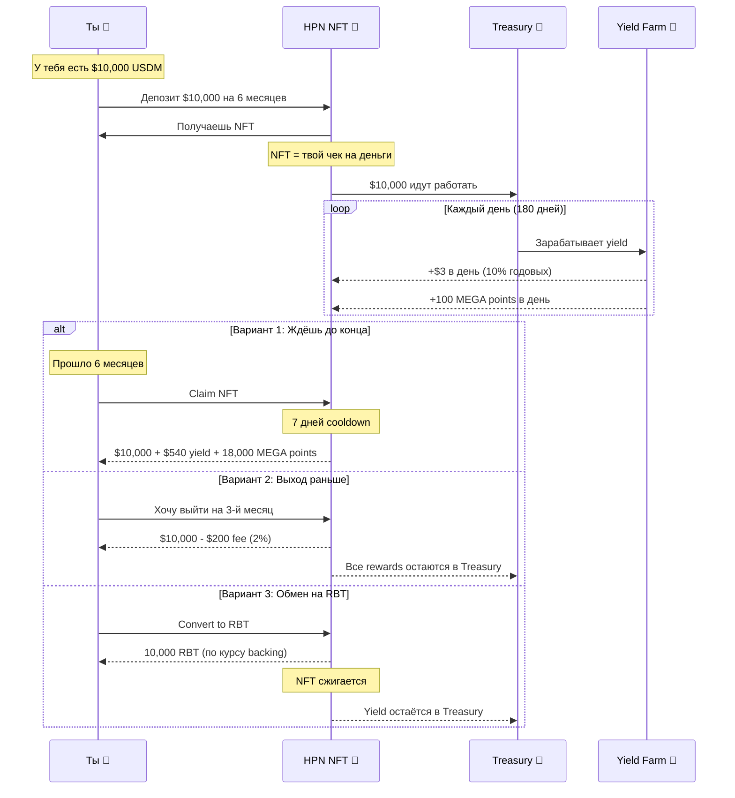
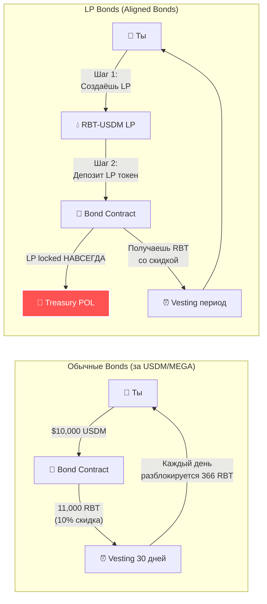
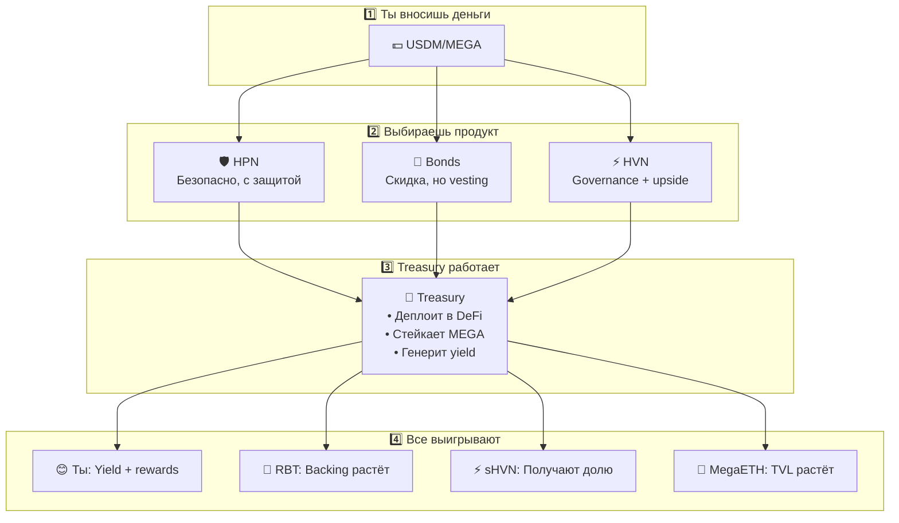

# Blackhaven - Как Это Работает (Простые Диаграммы)

## 1. Как работает RBT (BLK) - Reserve-Backed Token



### RBT в цифрах (пример):
```
День 1:
- Treasury: $1,000,000
- RBT в обороте: 1,000,000
- Backing: $1 за RBT

День 365 (через год):
- Treasury: $1,500,000 (рост от yield)
- RBT в обороте: 1,200,000 (новые выпуски)
- Backing: $1.25 за RBT (+25%)

Твой RBT автоматически стоит больше!
```

---

## 2. Как работает Treasury - Сердце Протокола



### Treasury математика:
```
Ты вносишь: $10,000
Treasury деплоит в:
├── MegaETH стратегии: ~12% APY
├── MEGA staking: ~8% APY
├── LP fees от POL: ~5% APY
└── Общий yield: ~10-15% APY

Из этого yield:
├── 70% → Увеличение RBT backing
├── 20% → Rewards для sHVN
└── 10% → Операционные расходы
```

---

## 3. Как работает HPN (Haven Protected Notes)



### HPN - Это как депозит в банке, но лучше:
```
✅ Принципал защищён (не потеряешь)
✅ Yield выше чем в TradFi (8-15%)
✅ MEGA points бонусом
✅ Можно выйти в любой момент
✅ NFT = можно передать/продать позицию
❌ 7 дней ждать при выходе
```

---

## 4. Как работают Fixed-Term Bonds



### Bonds математика:

**Обычный Bond:**
```
Вносишь: $10,000 USDM
RBT рыночная цена: $1.00
Скидка за 30-день bond: 10%
Получаешь: 11,000 RBT (vesting 30 дней)

Профит: $1,000 (10%)
Риск: Если RBT упадёт > 10%, будешь в минусе
```

**LP Bond:**
```
Создаёшь LP: $5,000 RBT + $5,000 USDM
Депозит LP в bond: Навсегда
Получаешь: $11,000 в RBT (10% скидка)

Особенность: Твоя ликвидность остаётся 
в протоколе НАВСЕГДА и зарабатывает fees
```

---

## 🎯 Простая схема: Как всё работает вместе



---

## 💡 Ключевые факты для понимания:

### 1. **RBT** - это не просто токен
- Это доля в растущем Treasury
- Backing только растёт (не может упасть)
- Можно свободно торговать

### 2. **Treasury** - это не чёрный ящик
- Все транзакции on-chain
- Стратегии проголосованы HVN holders
- Реальный yield, не печать токенов

### 3. **HPN** - это не стейкинг
- Это защищённый депозит с upside
- NFT можно продать/передать
- Гибкие условия выхода

### 4. **Bonds** - это не farming
- Это покупка RBT со скидкой
- LP bonds создают вечную ликвидность
- Vesting защищает от дампа

---

*Всё построено на реальном yield и прозрачности. Никаких понци схем.*
