# Blackhaven Technical Architecture - MegaETH Native

## 1. Smart Contract Architecture

## 2. MegaETH Integration Layer

## 3. Data Flow Architecture

```mermaid
graph LR
    subgraph "Input Layer"
        USER_ACTIONS["User Actions<br/>• Deposits<br/>• Stakes<br/>• Votes"]
        MARKET_DATA["Market Data<br/>• Prices<br/>• Volume<br/>• Liquidity"]
        CHAIN_DATA["Chain Data<br/>• Gas Prices<br/>• Block Times<br/>• MEV Info"]
    end
    
    subgraph "Processing Layer (10ms)"
        EVENT_PROCESSOR["Event Processor<br/>Real-time Updates"]
        STRATEGY_ENGINE["Strategy Engine<br/>Optimal Allocation"]
        RISK_MONITOR["Risk Monitor<br/>Health Checks"]
    end
    
    subgraph "Storage Layer"
        STATE_DB["State Database<br/>• Positions<br/>• Balances<br/>• Rewards"]
        ANALYTICS_DB["Analytics DB<br/>• Performance<br/>• History<br/>• Metrics"]
        IPFS["IPFS<br/>• HPN Metadata<br/>• Reports<br/>• Docs"]
    end
    
    subgraph "Output Layer"
        FRONTEND["dApp Frontend<br/>Real-time UI"]
        API["API Layer<br/>• REST<br/>• WebSocket<br/>• GraphQL"]
        CONTRACTS["Smart Contracts<br/>On-chain State"]
    end
    
    USER_ACTIONS --> EVENT_PROCESSOR
    MARKET_DATA --> STRATEGY_ENGINE
    CHAIN_DATA --> RISK_MONITOR
    
    EVENT_PROCESSOR --> STATE_DB
    STRATEGY_ENGINE --> STATE_DB
    RISK_MONITOR --> ANALYTICS_DB
    
    STATE_DB --> FRONTEND
    STATE_DB --> API
    STATE_DB --> CONTRACTS
    ANALYTICS_DB --> API
    IPFS --> FRONTEND
```

## 4. Treasury Strategy Execution

## 5. HPN State Machine

## 6. Proximity Markets Strategy

```mermaid
graph TD
    subgraph "Rotation Schedule"
        TOKYO["🇯🇵 Tokyo Window<br/>2am-8am UTC"]
        AMSTERDAM["🇳🇱 Amsterdam Window<br/>8am-2pm UTC"]
        VIRGINIA["🇺🇸 Virginia Window<br/>2pm-8pm UTC"]
        LA["🇺🇸 LA Window<br/>8pm-2am UTC"]
    end
    
    subgraph "Blackhaven Strategy"
        MONITOR["📊 Monitor Demand"]
        CALCULATE["🧮 Calculate ROI"]
        BID["💰 Place Bids"]
        EXECUTE["⚡ Execute Trades"]
    end
    
    subgraph "Value Capture"
        ARB["💎 Arbitrage<br/>Cross-DEX"]
        LIQ["💧 JIT Liquidity<br/>For Large Trades"]
        PROTECT["🛡️ MEV Protection<br/>For RBT Trades"]
    end
    
    TOKYO --> MONITOR
    AMSTERDAM --> MONITOR
    VIRGINIA --> MONITOR
    LA --> MONITOR
    
    MONITOR --> CALCULATE
    CALCULATE --> BID
    BID --> EXECUTE
    
    EXECUTE --> ARB
    EXECUTE --> LIQ
    EXECUTE --> PROTECT
    
    ARB --> TREASURY["💰 Treasury Revenue"]
    LIQ --> TREASURY
    PROTECT --> TREASURY
```

## 7. Gas Optimization on MegaETH

```mermaid
graph LR
    subgraph "Traditional L2"
        OLD_USER["User"] -->|High Gas| OLD_CONTRACT["Contract"]
        OLD_CONTRACT -->|Many Storage Ops| OLD_STORAGE["Storage"]
    end
    
    subgraph "Blackhaven on MegaETH"
        USER["User"] -->|Sub-cent Gas| ROUTER["Transaction Router"]
        
        ROUTER -->|Batch 1| BATCH1["Treasury Updates"]
        ROUTER -->|Batch 2| BATCH2["Reward Calcs"]
        ROUTER -->|Batch 3| BATCH3["State Sync"]
        
        BATCH1 --> STORAGE["Optimized Storage"]
        BATCH2 --> STORAGE
        BATCH3 --> STORAGE
    end
    
    subgraph "Benefits"
        BENEFIT1["✓ 100x Cheaper"]
        BENEFIT2["✓ Complex Logic Possible"]
        BENEFIT3["✓ Real-time Updates"]
    end
    
    STORAGE --> BENEFIT1
    STORAGE --> BENEFIT2
    STORAGE --> BENEFIT3
```

## 8. Security Architecture

## 9. Performance Metrics Pipeline

## 10. USDm Integration Architecture

---

*Engineered for MegaETH's real-time revolution. Where 10ms latency meets institutional-grade DeFi.*
