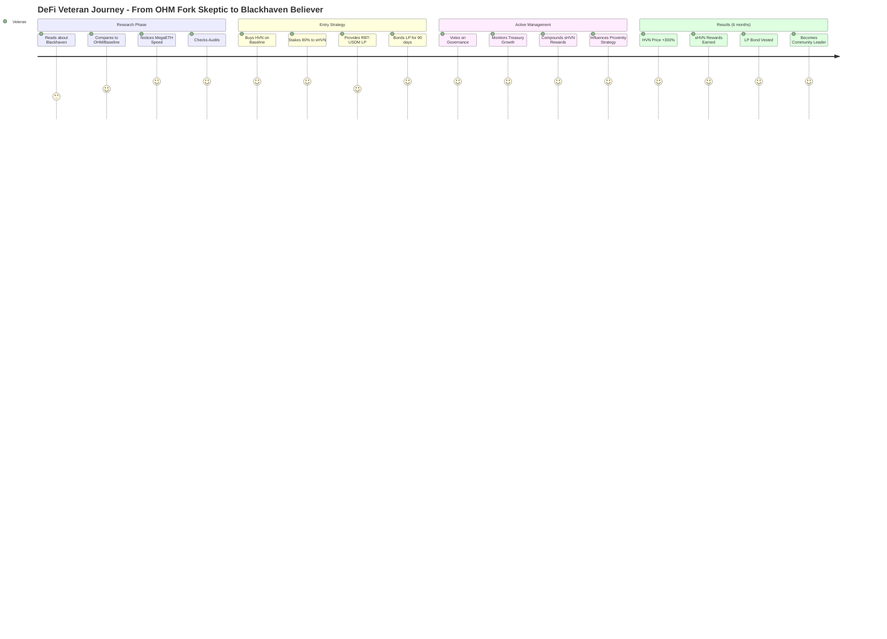
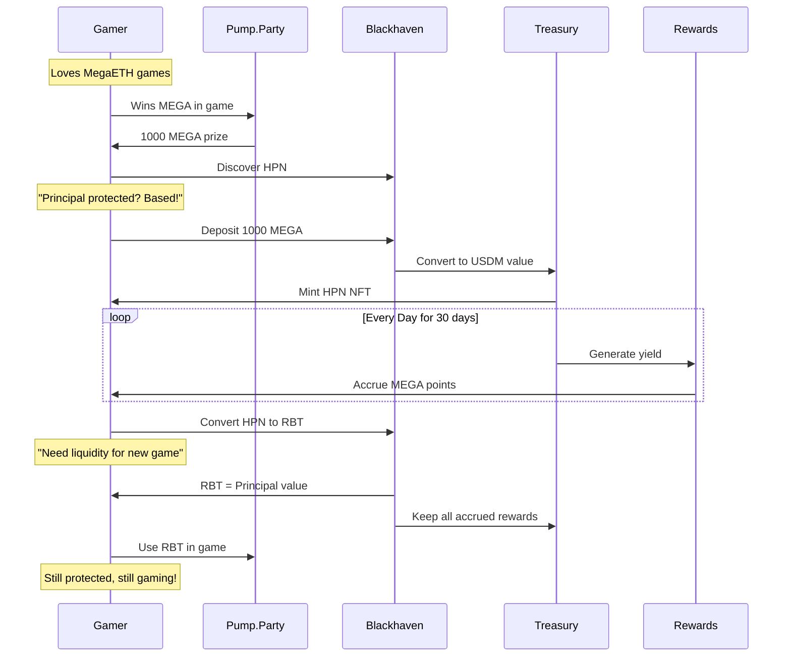
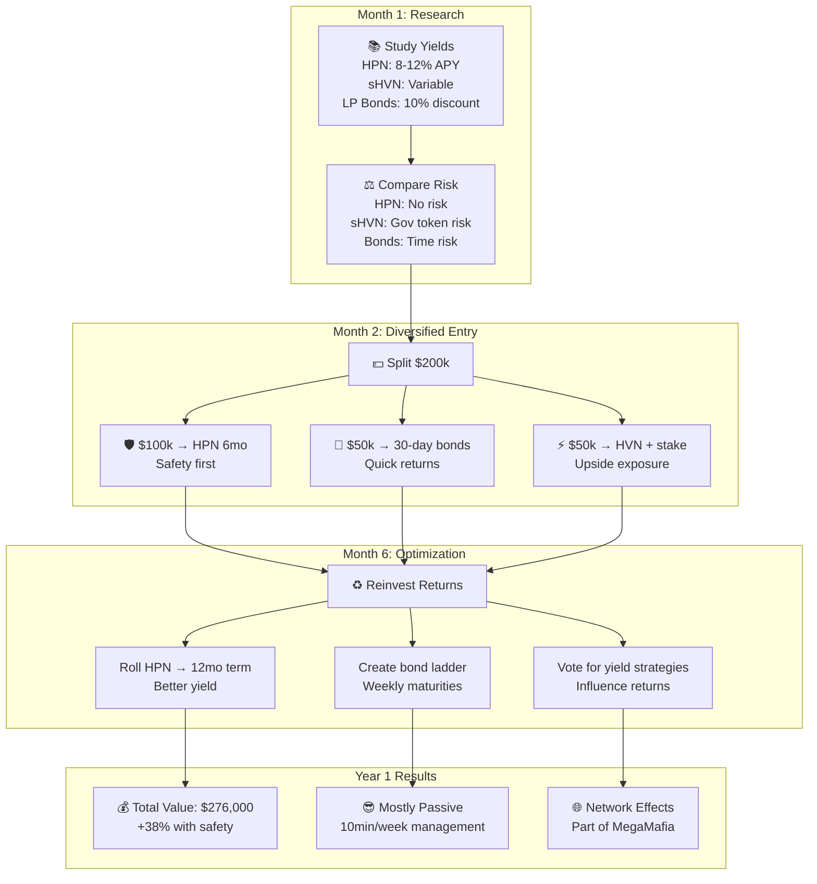
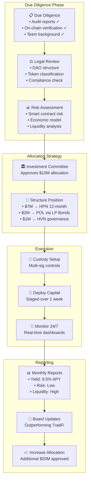
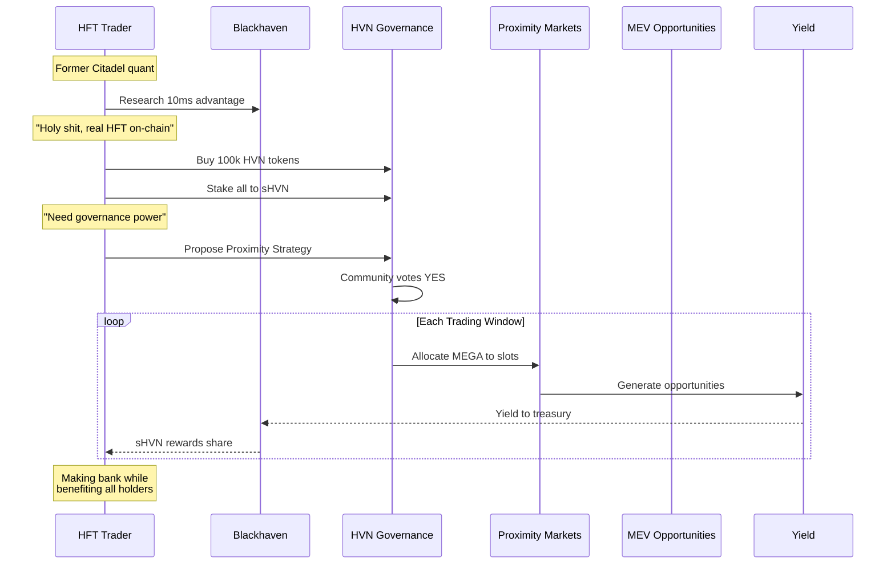
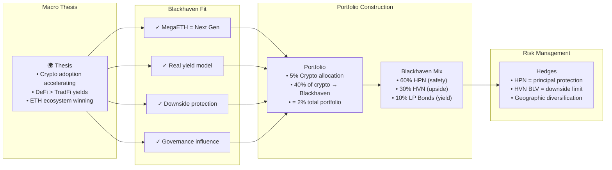
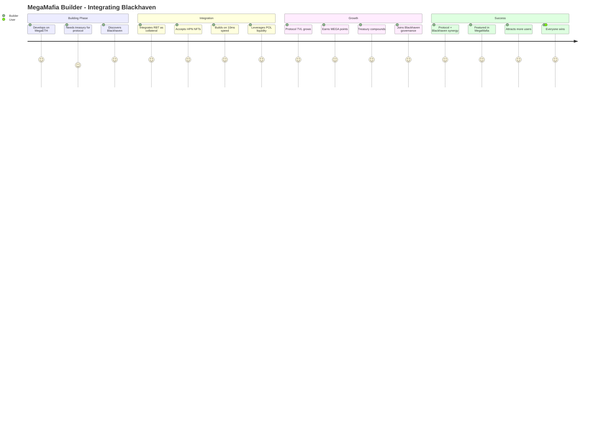
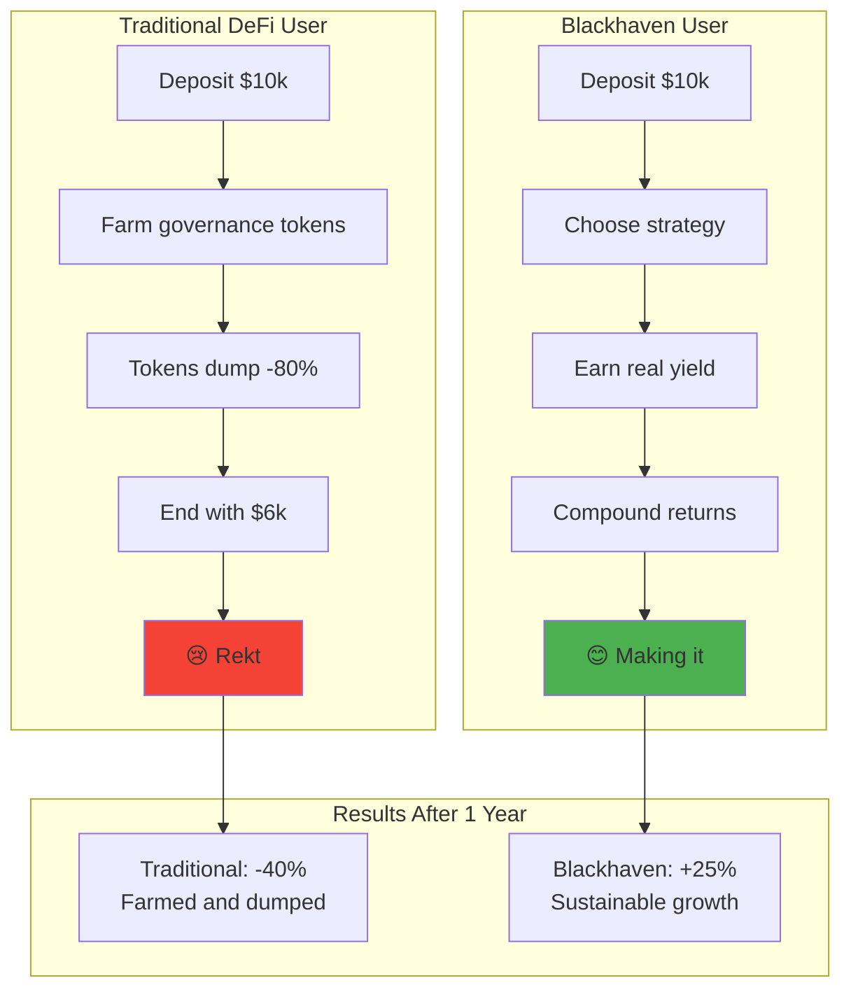

# Blackhaven User Scenarios & Interactive Flows

## 🚀 Scenario 1: The DeFi Veteran



### Veteran's Strategy Breakdown:
```
Initial Capital: $100,000
├── $40,000 → HVN (80% staked to sHVN)
├── $30,000 → RBT-USDM LP → 90-day Bond
└── $30,000 → HPN 12-month (safety allocation)

After 6 Months:
├── HVN: $160,000 (4x due to BLV + growth)
├── sHVN Rewards: $8,000 (20% APR on treasury growth)
├── LP Bond: $33,000 RBT (10% discount vested)
├── HPN: $30,000 + $1,800 yield + MEGA points
└── Total: $232,800 (+132.8%)
```

## 🎮 Scenario 2: The MegaETH Gamer



## 💰 Scenario 3: The Yield Farmer



## 🏦 Scenario 4: The Institution



## 🎯 Scenario 5: The Proximity Maximizer



## 🌍 Scenario 6: The Global Macro Investor



## 🚀 Scenario 7: The MegaMafia Builder



## 📊 Comparative User Outcomes



## 🎭 The Personas Summary

| Persona | Entry Strategy | Risk Profile | Expected Return | Time Horizon |
|---------|---------------|--------------|-----------------|--------------|
| DeFi Veteran | HVN + sHVN + LP Bonds | High | 100%+ APY | Long-term |
| MegaETH Gamer | HPN + RBT utility | Low | 10-15% APY | Flexible |
| Yield Farmer | Diversified mix | Medium | 25-40% APY | 6-12 months |
| Institution | HPN heavy + governance | Low | 9-12% APY | Long-term |
| HFT Trader | HVN for proximity control | High | Variable/High | Active |
| Macro Investor | Balanced allocation | Medium | 20-30% APY | 2-5 years |
| MegaMafia Builder | Integration + treasury | Medium | Ecosystem growth | Permanent |

---

## 🎯 Key Takeaways

1. **Multiple Valid Strategies** - From safe HPN to aggressive HVN governance plays
2. **Real Yield Focus** - No ponzi mechanics, actual revenue generation
3. **MegaETH Native Benefits** - 10ms execution enables strategies impossible elsewhere
4. **Community Aligned** - Everyone benefits from protocol growth
5. **Risk Spectrum Coverage** - Products for every risk tolerance

---

*Your strategy, your timeline, your success. Welcome to Blackhaven.*
