# notanohmfork Architecture

> Visual breakdown of the system. Clean, simple, complete.

---

## The Big Picture

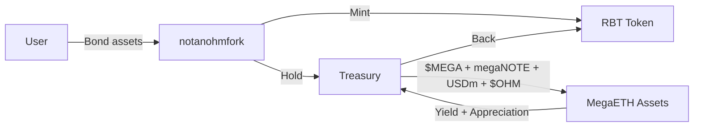

---

## Layer 1: User Actions

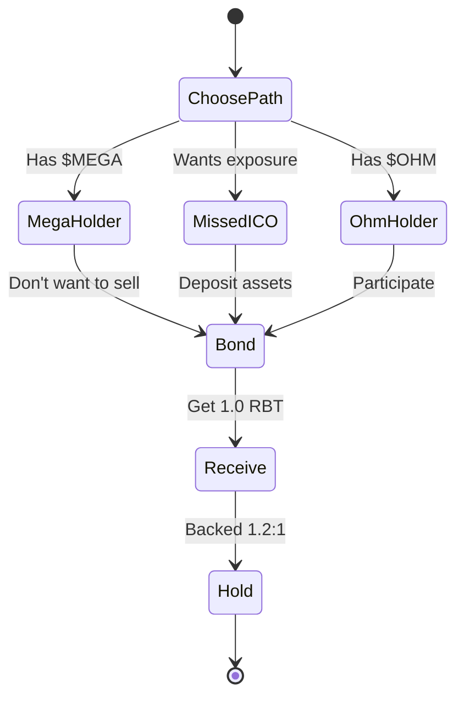

---

## Layer 2: Bonding Math

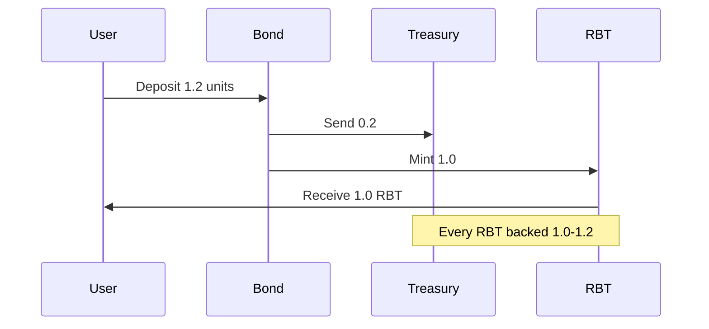

---

## Layer 3: Treasury Composition

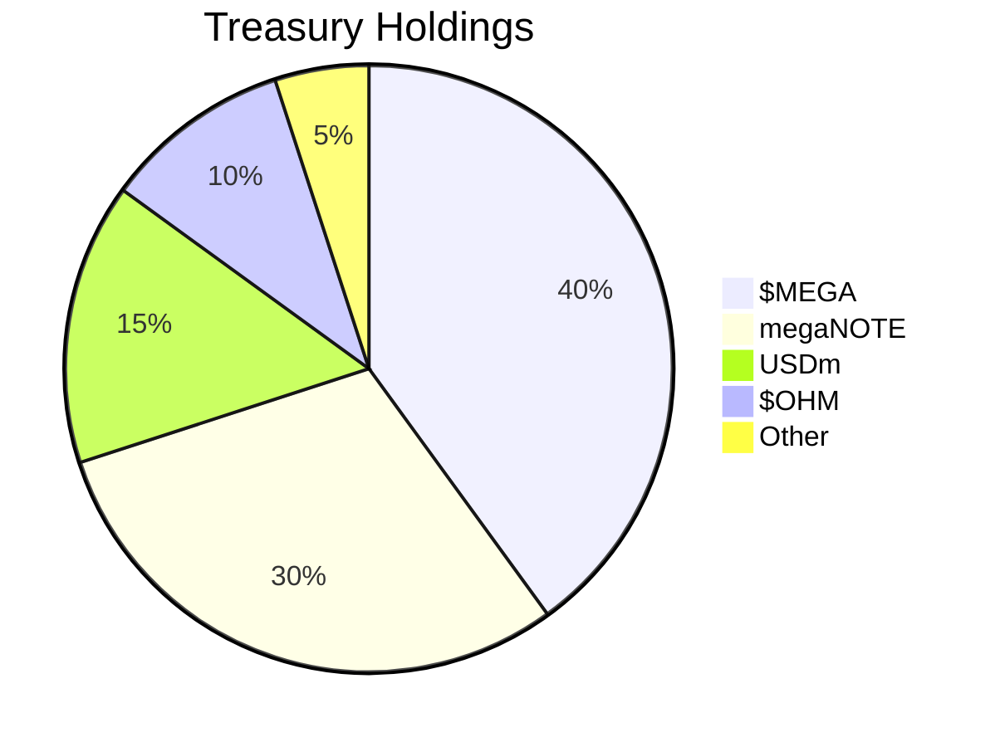

> Note: Exact percentages unknown. Only 10% $OHM confirmed. Priority = MegaETH ecosystem.

---

## Layer 4: Price Mechanism (RBS)

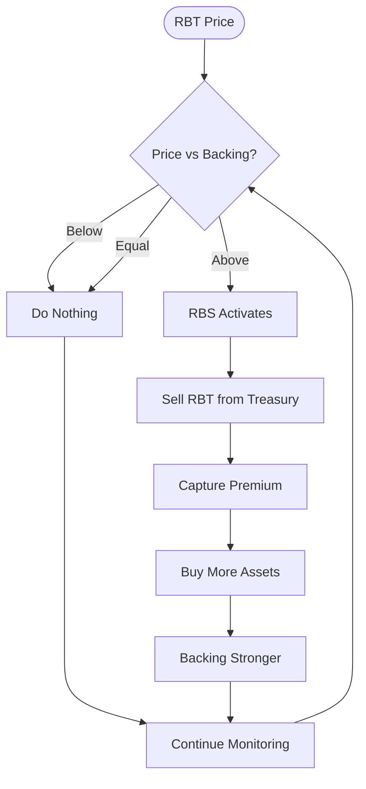

**Key: Upper bound ONLY. No downside action.**

---

## Layer 5: Revenue Streams

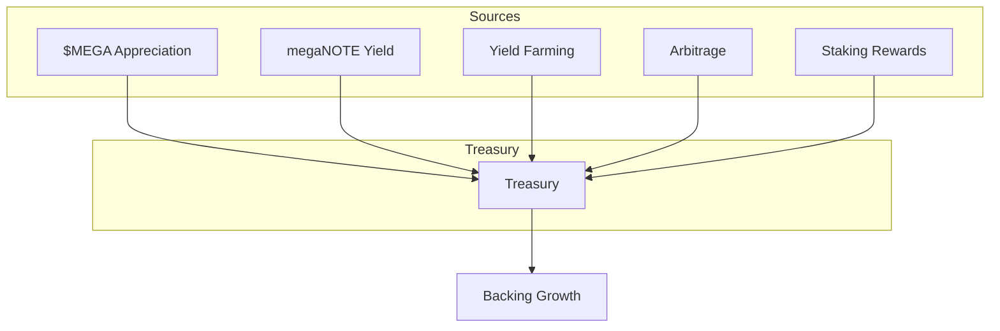

---

## Layer 6: MegaETH Integration

### $MEGA Flow

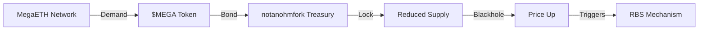

### USDm Flow

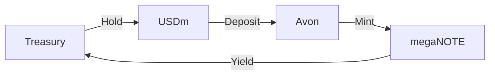

### megaNOTE Mechanics

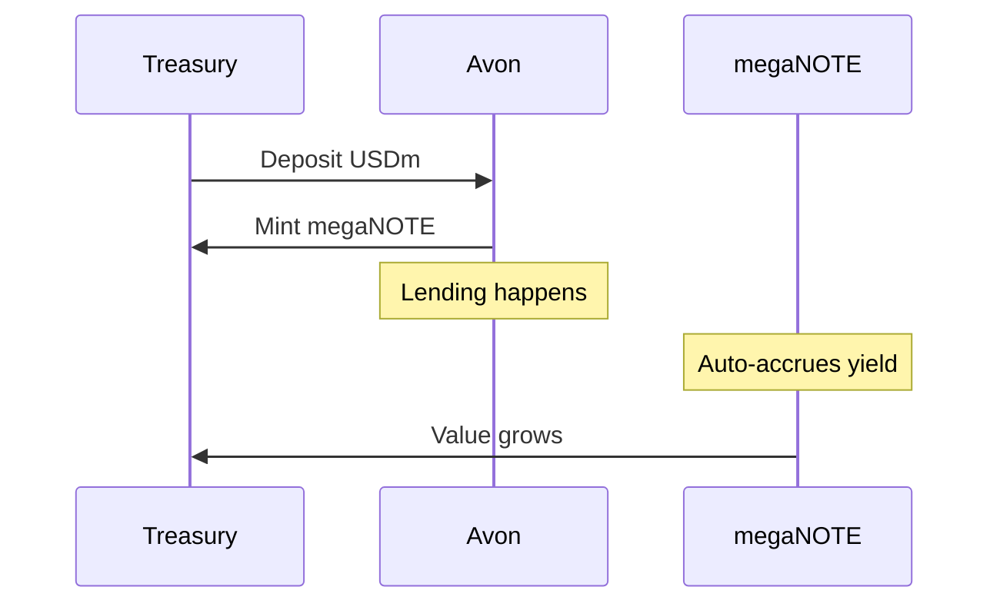

---

## Layer 7: The Flywheel

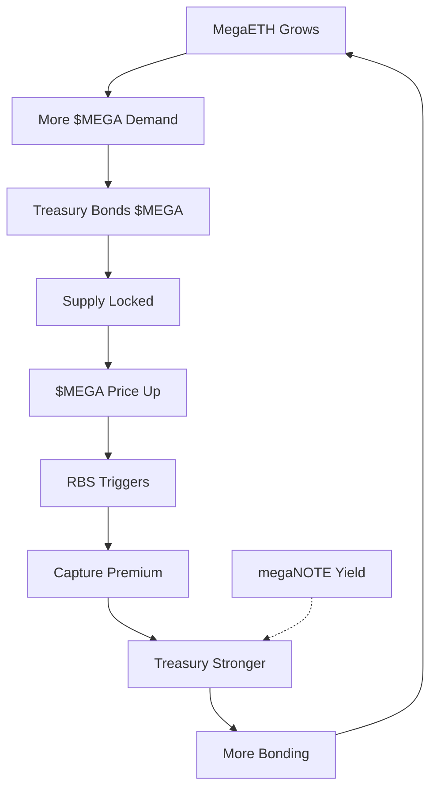

---

## Layer 8: System States

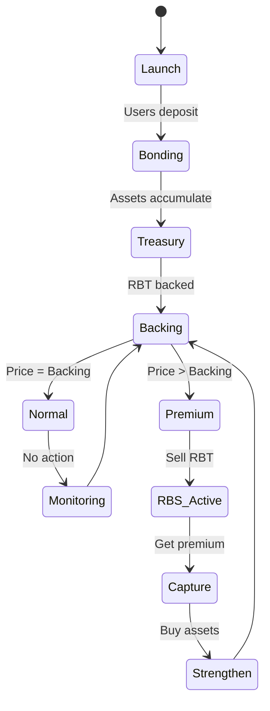

---

## Layer 9: Comparison Matrix

| Feature | Traditional OHM | notanohmfork |
|---------|----------------|--------------|
| **RBS Direction** | Both (buy + sell) | Upper bound only |
| **Consolidation** | Can create sell pressure | No action |
| **Focus** | General reserve | MegaETH ecosystem |
| **Primary Assets** | Diversified | $MEGA, megaNOTE, USDm |
| **Mechanism** | Expand/contract supply | Capture upside only |

---

## Layer 10: Three Key Flows

### Flow A: User → RBT

```
User has assets → Bond to protocol (1.2 ratio)
                        ↓
                  Receive 1.0 RBT
                        ↓
                  Backed by treasury
                        ↓
                  Exposure to MegaETH
```

### Flow B: Treasury → Yield

```
Treasury holds USDm → Deposit to Avon → Mint megaNOTE
                                              ↓
                                        Auto-accrues yield
                                              ↓
                                        Treasury grows
                                              ↓
                                        RBT backing stronger
```

### Flow C: $MEGA → Blackhole

```
MegaETH network → $MEGA demand → notanohmfork bonds $MEGA
                                         ↓
                                   Locks in treasury
                                         ↓
                                   Supply reduces
                                         ↓
                                   Price appreciates
                                         ↓
                                   RBS captures upside
```

---

## The Three Pillars

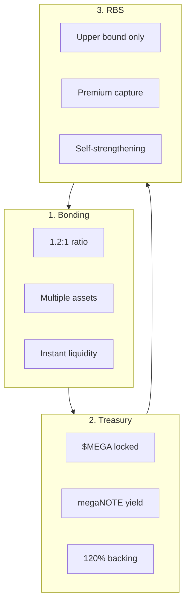

---

## Timeline View

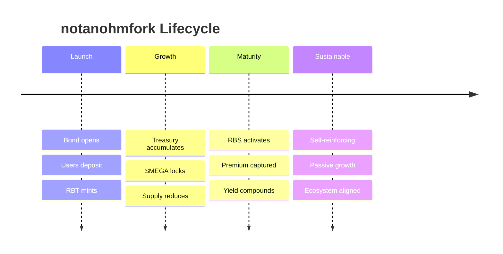

---

## What Makes It Different

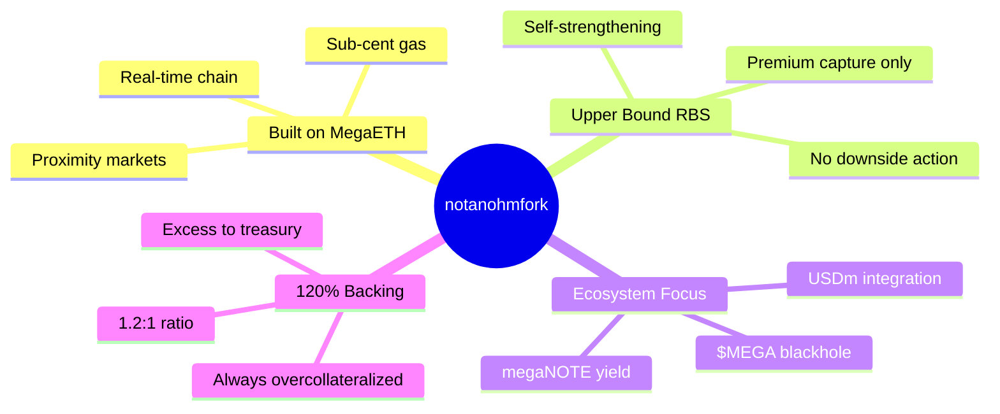

---

## Quick Reference

### Ratios
- **Deposit:** 1.2 units
- **Receive:** 1.0 RBT
- **Treasury gets:** 0.2 excess
- **Backing:** Always 1.0 - 1.2

### Assets (Priority Order)
1. $MEGA (blackhole)
2. megaNOTE (passive yield)
3. USDm (stable backing)
4. $OHM (10% allocation)
5. Others (diversification)

### Mechanisms
- **Bonding:** Instant, 1.2:1 ratio
- **RBS:** Upper bound only, activates when price > backing
- **Yield:** Passive, from megaNOTE auto-compounding

### Integrations
- **$MEGA:** Bond & lock → reduce supply
- **USDm:** Hold & deposit → get megaNOTE
- **Avon:** Deposit USDm → mint megaNOTE → yield accrues
- **$OHM:** 10% allocation → ohmies participate

---

## Facts vs Unknown

### ✅ Confirmed
- 1.2:1 backing ratio
- Upper bound RBS only
- 10% $OHM allocation
- MegaETH ecosystem priority
- megaNOTE = Avon yield vault
- $MEGA blackhole mechanism

### ❓ Unknown
- Exact asset allocations (except $OHM)
- Specific yield rates
- Launch date
- RBS technical parameters
- Governance structure

---

**Simple. Clean. Complete.**

