# notanohmfork - Core Diagrams

> 4 essential diagrams that explain everything.

---

## 1. Complete System - Everything In One


**Key Points:**
- Users deposit 1.2, get 1.0 RBT, treasury gets 0.2 excess
- Treasury holds $MEGA (blackhole), megaNOTE (yield), USDm (stable), $OHM (10%), others
- RBS only activates when price > backing (upper bound only)
- Revenue from 6 sources: appreciation, yield, staking, farming, arbitrage, RBS
- MegaETH network growth → more $MEGA demand → treasury locks supply → price up

---

## 2. RBS - Upper Bound Only Mechanism


**Real Example:**

```
Initial State:
- 1000 RBT circulating
- Treasury has $12,000 backing ($12 per RBT)
- RBT trading at $10 on market

❌ RBS Inactive (price below backing)

---

Market Heats Up:
- MegaETH grows, $MEGA appreciates
- More users want RBT exposure
- RBT price rises to $18

✅ RBS Activates (price > backing)

Actions:
1. Sell 100 RBT from treasury at $18 = $1,800 received
2. Backing only needed: 100 × $12 = $1,200
3. Premium captured: $1,800 - $1,200 = $600
4. Use $600 to buy more $MEGA, megaNOTE, etc
5. Treasury now: $12,600 backing 900 RBT
6. New backing ratio: $12,600 / 900 = $14 per RBT

Result: Backing improved from $12 to $14 per RBT
```

---

## 3. Treasury Revenue Streams


**Revenue Breakdown:**

| Stream | Source | Type | Frequency |
|--------|--------|------|-----------|
| **$MEGA Appreciation** | Network growth → demand → locked supply | Passive | Continuous |
| **megaNOTE Yield** | Avon lending interest | Passive | Continuous |
| **$MEGA Staking** | Ecosystem rewards | Active | Periodic |
| **Yield Farming** | DeFi protocols on MegaETH | Active | Continuous |
| **Arbitrage** | Bond deposits, market inefficiencies | Active | Opportunistic |
| **RBS Premium** | Price > backing | Automatic | When triggered |

**Example Numbers (Hypothetical):**

```
Treasury: $10M
├─ $MEGA ($4M) → Appreciates 50% → +$2M
├─ megaNOTE ($3M) → 15% APY → +$450K/year
├─ $MEGA Staking → 5% rewards → +$200K/year
├─ Yield Farming → 10% APY → +$500K/year
├─ Arbitrage → Opportunistic → +$100K/year
└─ RBS Premium → When active → +$300K/event

Total: $3.55M+ annual growth (35%+ on $10M)
```

---

## 4. Avon Integration Example

```mermaid
sequenceDiagram
    participant Treasury as Treasury
    participant Avon as Avon
    participant Vault as Vault
    participant OrderBook as Order Book
    participant Borrower as Borrower
    
    Note over Treasury: Has $100K USDm
    
    Treasury->>Avon: Deposit $100K USDm
    activate Avon
    
    Avon->>Vault: Route to megaNOTE vault
    activate Vault
    
    Vault->>Treasury: Mint 100K megaNOTE (receipt token)
    Note over Treasury: megaNOTE = claim on vault<br/>Initially 1:1 with USDm
    
    deactivate Vault
    
    Avon->>OrderBook: Deploy capital to lending
    activate OrderBook
    
    Note over OrderBook: Quote rates based on<br/>Interest Rate Curve
    
    Borrower->>OrderBook: Borrow $50K (deposits collateral)
    
    OrderBook->>Borrower: Match at market rate
    
    Note over OrderBook: Utilization: 50%<br/>($50K borrowed / $100K total)
    
    loop Interest Accrues
        Borrower->>OrderBook: Pay interest on $50K
        OrderBook->>Vault: Distribute interest to lenders
    end
    
    deactivate OrderBook
    
    Note over Vault: Interest accrues to megaNOTE<br/>Value grows automatically
    
    Vault->>Vault: megaNOTE appreciates
    Note over Vault: Was: 1 megaNOTE = $1.00<br/>Now: 1 megaNOTE = $1.0X
    
    activate Vault
    Note over Treasury: Treasury has 100K megaNOTE<br/>Worth: $10X,XXX<br/>Profit: Passive yield gain
    deactivate Vault
    
    deactivate Avon
    
    rect rgb(245, 245, 245)
        Note over Treasury: Options:<br/>• Hold (yield compounds)<br/>• Redeem (get USDm + profit)<br/>• Use as collateral
    end
    
    Note over Treasury: Result: +$12K backing<br/>Passive (no action)<br/>RBT stronger
```



**Detailed Flow:**

### Phase 1: Deposit
```
Treasury: "I have $100K USDm, want yield"
         ↓
Avon: "Deposit to megaNOTE vault"
         ↓
Vault: "Here's 100K megaNOTE tokens"
         ↓
Treasury: "Got megaNOTE, it's yield-bearing"
```

### Phase 2: Lending
```
Vault: "I'll deploy this $100K to lending markets"
         ↓
Order Book: "Quoting rates based on utilization"
         ↓
Borrower: "I need $50K, here's my collateral"
         ↓
Order Book: "Matched at 12% APY interest rate"
         ↓
Borrower: "Paying interest over time"
```

### Phase 3: Yield Accrual
```
Time passes...
         ↓
Interest accumulates: $50K × 12% = $6K/year
         ↓
But vault has $100K total, 50% utilized
         ↓
Effective yield to vault: $6K / $100K = 6% APY
         ↓
megaNOTE value increases from $1.00 to $1.06
         ↓
Treasury's 100K megaNOTE now worth $106K
         ↓
Passive gain: $6K (no action needed)
```

### Phase 4: Compounding
```
Year 1: $100K → $106K (6% yield)
Year 2: $106K → $112.36K (6% on $106K)
Year 3: $112.36K → $119.10K (6% on $112.36K)
         ↓
Compounds automatically
         ↓
Treasury backing grows passively
         ↓
RBT becomes more valuable
```

**Why megaNOTE?**
- **Yield-bearing:** Auto-accrues lending returns
- **Liquid:** Can redeem for USDm anytime
- **Standard collateral:** Can use across MegaETH
- **Passive:** No active management needed
- **MegaETH native:** Built for the ecosystem

**Concept:**
- Higher utilization → Higher interest rates for borrowers
- Interest paid by borrowers → Distributed to lenders (megaNOTE holders)
- megaNOTE value increases automatically
- Treasury passively earns yield without any action

**Note:** Specific APY rates depend on Avon's interest rate curve and market demand. Not specified in source materials.

---

**All diagrams fact-based. No speculation.**

