# notanohmfork - Complete System Architecture

> The full picture. How everything works together on MegaETH.

---

## Complete Architecture - All Components & Flows

```mermaid
graph TB
    subgraph USERS["👥 USERS"]
        U1[ICO Participants<br/>Has $MEGA]
        U2[Missed ICO<br/>Wants MegaETH exposure]
        U3[OHM Holders<br/>Wants to participate]
        U4[RBT Holders<br/>Trading/Holding]
    end
    
    subgraph MEGAETH["🌐 MegaETH L2 Network - Real-time Blockchain"]
        
        subgraph NETWORK["Network Infrastructure"]
            SEQ[Sequencer Rotation<br/>Tokyo → Netherlands → Virginia → LA<br/>Follows global economic day]
            PROX[Proximity Markets<br/>Bidding for sequencer-adjacent space<br/>Minimal latency for apps]
            GAS[Gas Pricing<br/>Sub-cent, at-cost<br/>Funded by USDm yield]
        end
        
        subgraph MEGA_TOKEN["$MEGA Token Utility"]
            STAKE[Operators stake $MEGA<br/>to run sequencer]
            LOCK[Apps lock $MEGA<br/>for proximity seats]
            DEMAND[Network Growth<br/>= More $MEGA demand]
        end
        
        subgraph USDM_SYSTEM["USDm - Native Stablecoin"]
            USDM[USDm Token<br/>MegaETH native stablecoin]
            BUIDL[Reserves in BUIDL<br/>BlackRock tokenized treasuries<br/>via Securitize + Ethena]
            YIELD_RESERVE[Reserve Yield<br/>Programmatically funds<br/>sequencer OPEX]
            REDEMPTION[Liquid stables<br/>for redemptions]
        end
        
        subgraph AVON_SYSTEM["Avon - Order Book Lending"]
            AVON_OB[Order Book<br/>Multi-dimensional matching<br/>LTV × Interest Rate]
            AVON_POOL[Lending Pools<br/>Passive lenders quote on book<br/>Parameterized strategies]
            AVON_VAULT[megaNOTE Vault<br/>Deposit USDm → mint megaNOTE<br/>Auto-accrues lending yield]
            AVON_BORROW[Borrowers<br/>Market borrow at best rates<br/>Aggregated liquidity]
        end
        
        subgraph NOTANOHMFORK["🎯 notanohmfork - Liquidity Engine"]
            
            subgraph CORE["Core Protocol"]
                BOND[Bond Depository<br/>Accept: $MEGA, $OHM, stables, etc<br/>Ratio: 1.2 deposited → 1.0 minted]
                RBT[RBT Token<br/>Reserve-Backed Token<br/>Backed 1.2:1 by Treasury]
                TREAS[Treasury<br/>120% backing minimum<br/>Holds diversified basket]
                RBS[RBS Mechanism<br/>UPPER BOUND ONLY<br/>Activates when price > backing]
            end
            
            subgraph TREASURY_HOLDINGS["Treasury Assets - Priority: MegaETH"]
                MEGA_HOLD[$MEGA Holdings<br/>Locked from circulation<br/>Blackhole effect]
                MNOTE_HOLD[megaNOTE Holdings<br/>Yield-bearing vault tokens<br/>Passive growth]
                USDM_HOLD[USDm Holdings<br/>Stable backing component<br/>Can deposit to Avon]
                OHM_HOLD[$OHM Holdings<br/>10% allocation<br/>Diversification]
                OTHER[Other Assets<br/>Stable + volatile basket<br/>Yield farming, staking]
            end
            
            subgraph MECHANISMS["Protocol Mechanisms"]
                BONDING[Bonding Process<br/>1. User deposits 1.2 units<br/>2. Mint 1.0 RBT to user<br/>3. Send 0.2 to treasury<br/>4. Backing strengthens]
                
                RBS_TRIGGER[RBS Activation<br/>IF: RBT price > backing<br/>THEN: Sell RBT from treasury<br/>RESULT: Capture premium → strengthen]
                
                PASSIVE_YIELD[Passive Yield<br/>megaNOTE auto-accrues<br/>from Avon lending<br/>No action needed]
                
                REVENUE[Revenue Flows<br/>• $MEGA appreciation → RBS<br/>• megaNOTE yield → compounds<br/>• Arbitrage, farming, staking]
            end
        end
    end
    
    subgraph EXTERNAL["🔗 External Protocols"]
        OHM[$OHM - OlympusDAO<br/>10% treasury allocation<br/>Ohmies can participate]
        ETH[Ethereum Mainnet<br/>Base layer security<br/>Bridge assets]
    end
    
    %% User Flows
    U1 -->|Has $MEGA, doesn't want to sell| BOND
    U2 -->|Deposit stables/assets| BOND
    U3 -->|Bond $OHM| BOND
    U4 -.->|Trade| RBT
    
    %% Network Infrastructure
    SEQ -->|Requires| STAKE
    PROX -->|Requires| LOCK
    STAKE --> DEMAND
    LOCK --> DEMAND
    
    %% USDm System
    USDM --> BUIDL
    BUIDL --> YIELD_RESERVE
    YIELD_RESERVE --> GAS
    USDM --> REDEMPTION
    
    %% Avon System
    USDM -->|Deposit| AVON_VAULT
    AVON_VAULT -->|Mint| MNOTE_HOLD
    AVON_POOL -->|Quotes on| AVON_OB
    AVON_BORROW -->|Borrows from| AVON_OB
    AVON_VAULT -.->|Yield accrues| MNOTE_HOLD
    
    %% Bonding Flow
    BOND -->|Mint 1.0 RBT| RBT
    RBT -->|To user| U4
    BOND -->|0.2 excess| TREAS
    
    %% Treasury Holdings
    TREAS -->|Allocates| MEGA_HOLD
    TREAS -->|Allocates| MNOTE_HOLD
    TREAS -->|Allocates| USDM_HOLD
    TREAS -->|Allocates 10%| OHM_HOLD
    TREAS -->|Allocates| OTHER
    
    %% Treasury backs RBT
    TREAS -.->|Backs 1.2:1| RBT
    
    %% Blackhole Effect
    MEGA_HOLD -.->|Locks supply| DEMAND
    DEMAND -->|Appreciation| MEGA_HOLD
    
    %% RBS Mechanism
    MEGA_HOLD -->|If appreciates| RBS_TRIGGER
    RBS_TRIGGER -->|Price > backing?| RBS
    RBS -->|Sell RBT| TREAS
    
    %% Passive Yield
    MNOTE_HOLD -.->|Auto-compounds| PASSIVE_YIELD
    PASSIVE_YIELD -.->|Grows| TREAS
    
    %% Revenue Cycle
    REVENUE -.->|Strengthens| TREAS
    
    %% USDm Treasury Flow
    USDM_HOLD -->|Deposits to Avon| AVON_VAULT
    
    %% External
    OHM -->|Bridge to MegaETH| BOND
    ETH -.->|Security layer| MEGAETH
    
    %% Key Quote
    QUOTE["💬 'Obviously, this requires the MegaETH<br/>ecosystem to work together to create a<br/>blackhole-style liquidity capture mechanism<br/>that feeds the treasury while reducing<br/>the circulating supply of $MEGA.'<br/>- jawz"]
    
    MEGA_HOLD -.-> QUOTE
```



---

## System Flow Breakdown

### 1️⃣ **User Entry Points**

**Scenario A: $MEGA Holder**
```
Has $MEGA → Doesn't want to sell → Bond $MEGA to notanohmfork
→ Receive RBT (1.2:1 backing) → Get MegaETH ecosystem exposure
→ Treasury locks $MEGA (blackhole effect)
```

**Scenario B: Missed ICO**
```
Wants MegaETH exposure → Bond stables/other assets
→ Receive RBT → Exposure to entire MegaETH ecosystem
→ Backed by $MEGA + megaNOTE + USDm + $OHM
```

**Scenario C: OHM Holder**
```
Has $OHM → Bond to notanohmfork (10% allocation)
→ Receive RBT → Participate in MegaETH growth
→ "All roads lead back hohm"
```

---

### 2️⃣ **MegaETH Network Layer**

**$MEGA Token Demand Drivers:**
```
Sequencer Rotation → Operators stake $MEGA
Proximity Markets → Apps lock $MEGA for low latency
Network Growth → More demand for $MEGA
notanohmfork → Locks $MEGA in treasury (blackhole)
→ RESULT: Reduced circulating supply + price appreciation
```

**USDm Economics:**
```
USDm reserves → BUIDL (BlackRock treasuries)
BUIDL yield → Funds sequencer operations
→ RESULT: Gas priced at-cost (sub-cent)
→ RESULT: Users pay less, network still profitable
```

**Avon Lending:**
```
Order Book matches lenders × borrowers
Lending Pools quote parameterized strategies
USDm deposits → mint megaNOTE (yield-bearing)
→ RESULT: Competitive rates, aggregated liquidity
```

---

### 3️⃣ **notanohmfork Protocol**

**Bonding Mechanism (1.2:1):**
```
1. User deposits 1.2 units of accepted asset ($MEGA, $OHM, stables, etc)
2. Protocol mints 1.0 RBT to user
3. Protocol sends 0.2 excess to treasury
4. Treasury backing strengthens (always 1.0 - 1.2 per RBT)
```

**Treasury Composition:**
```
Priority: MegaETH Ecosystem
├─ $MEGA (blackhole mechanism, locks supply)
├─ megaNOTE (passive yield from Avon, auto-compounds)
├─ USDm (stable backing, can deposit to Avon)
├─ $OHM (10% allocation, diversification)
└─ Other assets (stable + volatile basket, yield farming)
```

**RBS - Upper Bound ONLY:**
```
Monitor: RBT market price vs backing value

IF price < backing → DO NOTHING (no sell pressure)
IF price = backing → DO NOTHING
IF price > backing → ACTIVATE RBS

RBS Activation:
1. Sell RBT from treasury on market
2. Capture premium (difference between price & backing)
3. Use proceeds to buy more backing assets
4. Backing strengthens further
5. Continue if still at premium
```

**Passive Yield Generation:**
```
Treasury holds USDm → Deposit to Avon → Mint megaNOTE
megaNOTE auto-accrues yield from lending markets
NO action needed from protocol
Yield compounds back into treasury
→ RESULT: Backing grows passively over time
```

---

### 4️⃣ **Flywheel Effect**

```
MegaETH grows → More sequencer demand → More $MEGA staking
                 ↓
            More apps need proximity → More $MEGA locked
                 ↓
            $MEGA demand increases → Price appreciates
                 ↓
            notanohmfork holds $MEGA → Blackhole effect (supply locked)
                 ↓
            Supply reduction → Price appreciates more
                 ↓
            RBT price > backing → RBS activates
                 ↓
            Sell RBT, capture premium → Buy more $MEGA
                 ↓
            Lock more supply → Cycle continues
                 ↓
            megaNOTE yields compound → Treasury grows
                 ↓
            RBT backing strengthens → More sustainable
                 ↓
            Attracts more users → More bonding → Cycle amplifies
```

---

### 5️⃣ **Key Differentiators vs Traditional OHM**

| Traditional OHM | notanohmfork |
|----------------|--------------|
| RBS both directions (buy + sell) | **Upper bound ONLY** (sell only when premium) |
| Can create sell pressure during consolidation | **No sell pressure** when price = backing |
| Expands supply dynamically | **Only captures upside**, no downside action |
| General treasury assets | **Priority to MegaETH ecosystem** ($MEGA, megaNOTE, USDm) |
| General purpose reserve currency | **Liquidity engine for MegaETH** (ecosystem-specific) |

---

### 6️⃣ **Integration Points**

**With $MEGA:**
- Treasury bonds & locks $MEGA (reduces circulating supply)
- Creates blackhole effect (demand grows, supply shrinks)
- Appreciation triggers RBS → more revenue

**With USDm:**
- Treasury holds USDm for stable backing
- Can deposit to Avon for megaNOTE
- Benefits from at-cost gas (cheaper operations)

**With Avon:**
- Deposit USDm → mint megaNOTE
- megaNOTE auto-accrues yield from lending
- Passive income stream for treasury

**With $OHM:**
- 10% allocation for ohmies to participate
- Diversification outside MegaETH
- Cultural bridge to OlympusDAO community

---

## Key Facts (Source-Based)

✅ **Confirmed:**
- 1.2:1 backing ratio (user deposits 1.2, receives 1.0, treasury gets 0.2)
- Upper bound RBS only (activates only at premium)
- 10% allocation for $OHM
- Priority to MegaETH ecosystem assets
- megaNOTE is Avon's yield-bearing vault token
- USDm backed by BUIDL (BlackRock treasuries)
- $MEGA used for Sequencer Rotation & Proximity Markets
- Blackhole-style liquidity capture mechanism

❌ **NOT Known:**
- Exact % allocations (except 10% $OHM)
- Specific yield rates
- Launch date/timeline
- Technical parameters (RBS thresholds, rebase mechanics, etc)
- Governance structure

---

**Built on MegaETH. Powered by the ecosystem. Designed for sustainable growth.**

