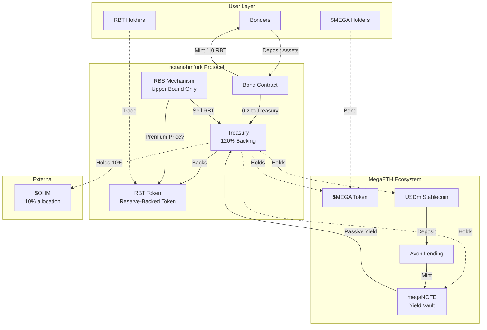
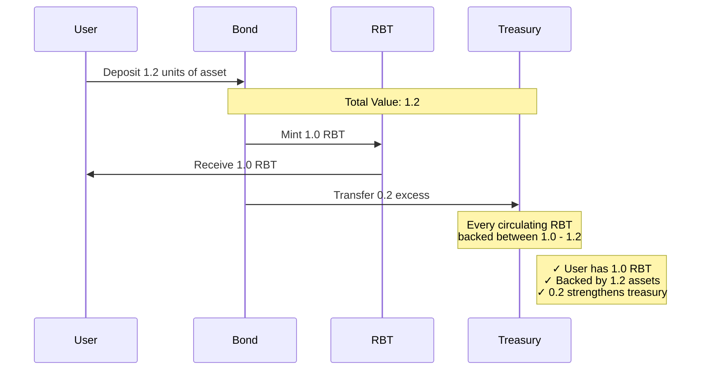
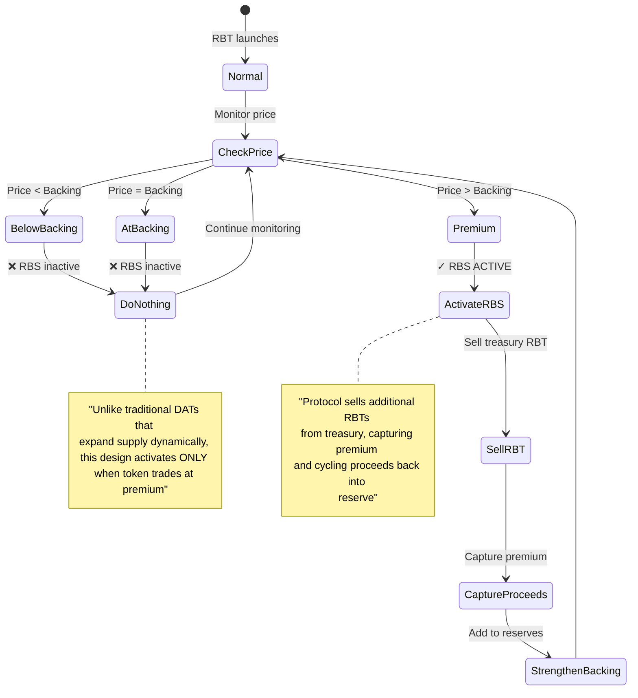
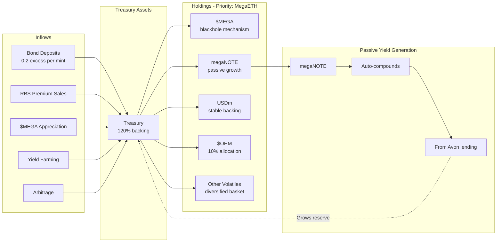
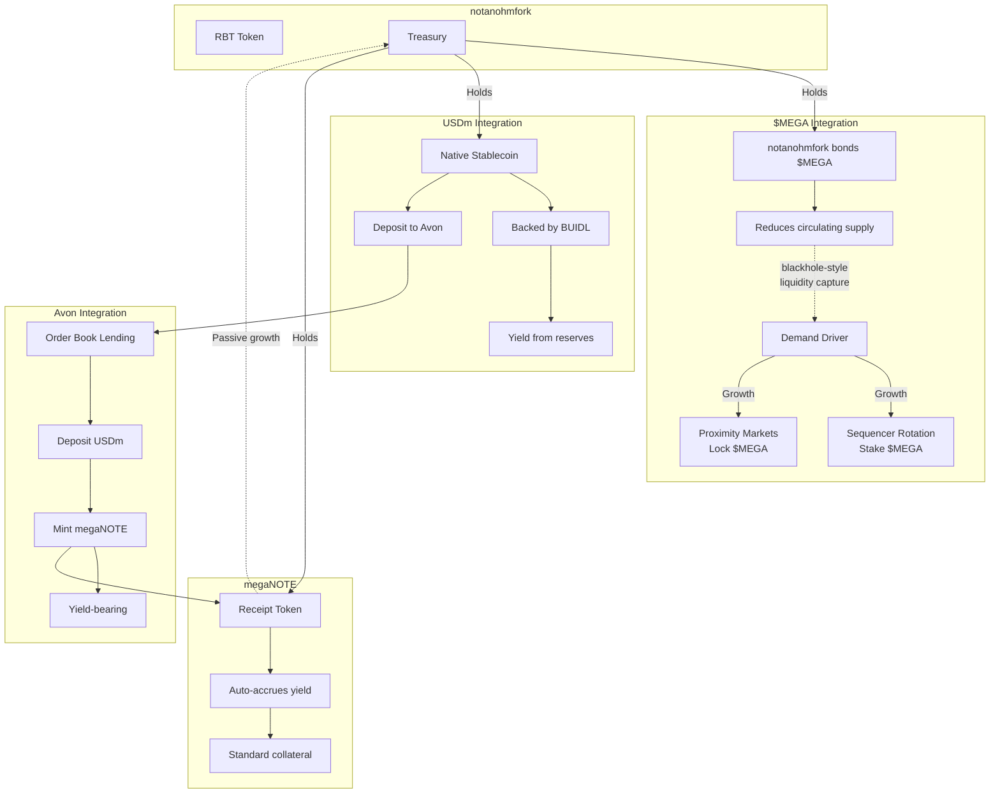
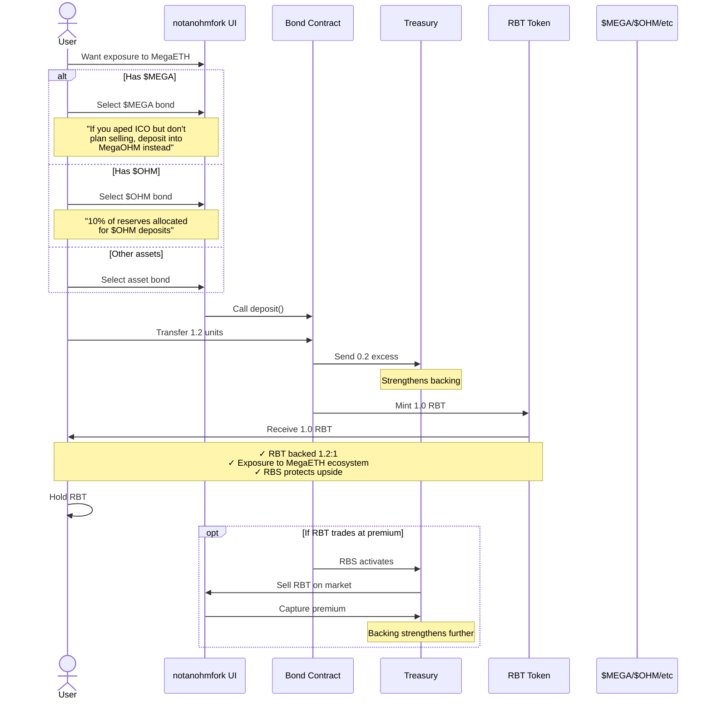
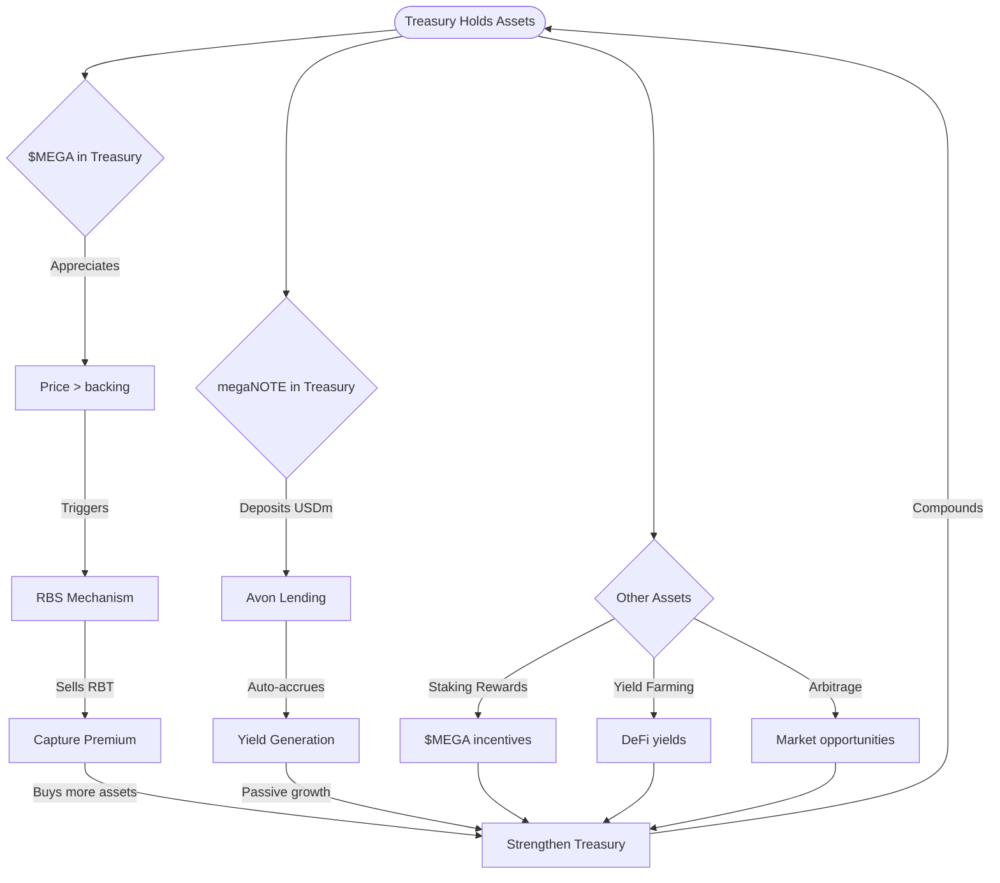
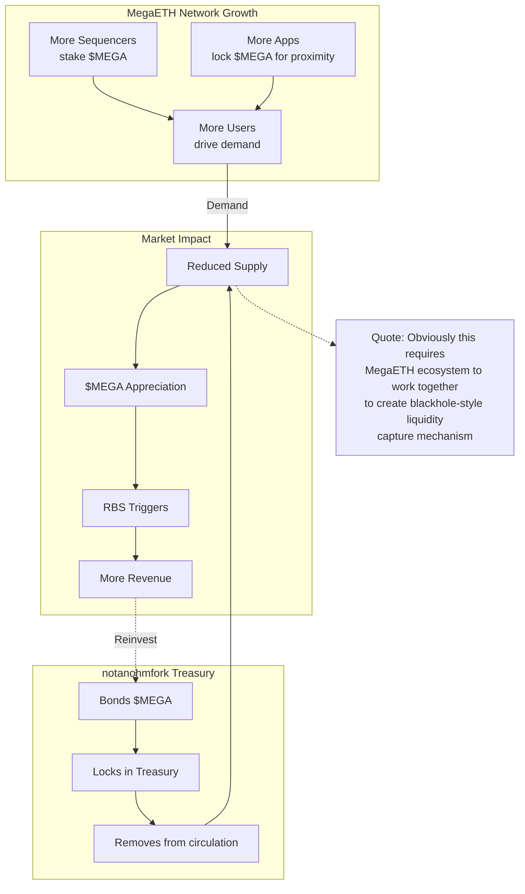
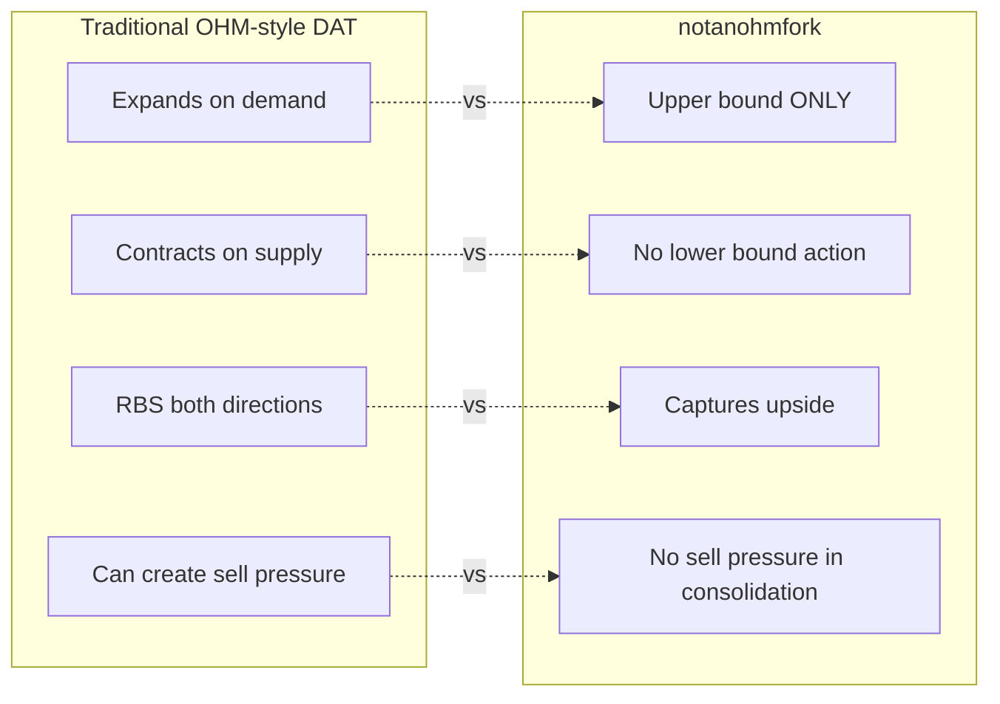
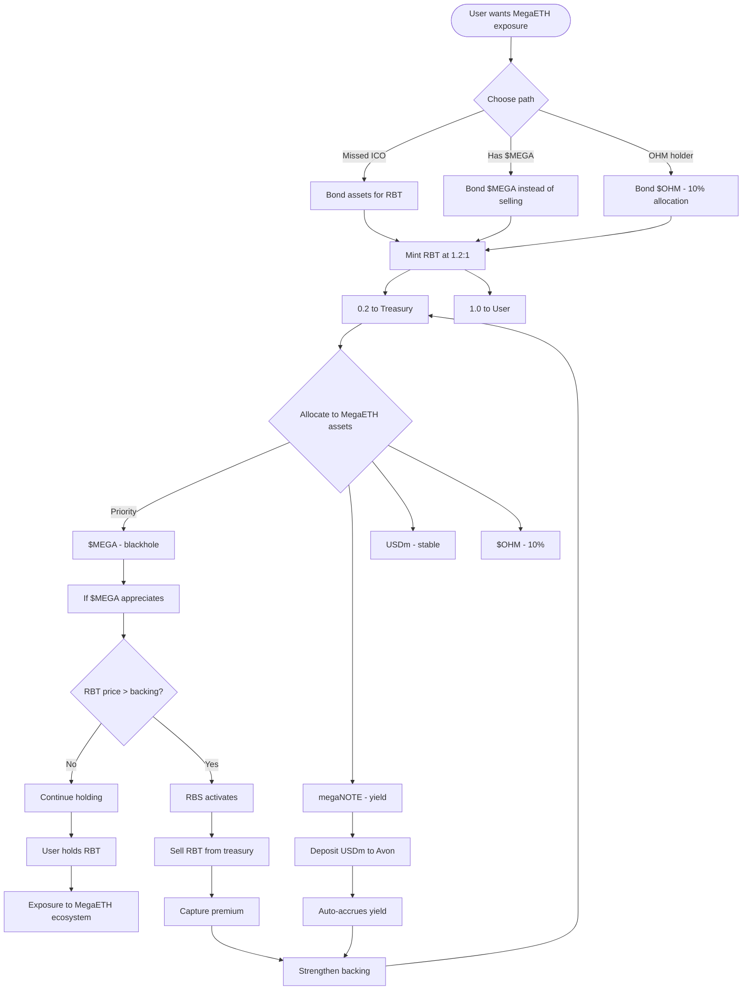

# notanohmfork - Architecture Diagrams

> Based ONLY on facts from source materials. No speculation.

---

## 1. Core System Architecture

---

## 2. RBT Bonding Mechanism (1.2:1 Model)

---

## 3. RBS - Upper Bound ONLY

---

## 4. Treasury Flow & Asset Composition

---

## 5. MegaETH Integration Points

---

## 6. User Workflow - Bonding

---

## 7. Treasury Revenue Cycle

---

## 8. $MEGA "Blackhole" Effect

---

## 9. Comparison: Traditional DAT vs notanohmfork

---

## 10. Complete System Flow

---

## Key Facts Summary

### What RBT IS:
- Reserve-Backed Token
- 1.2:1 backing ratio
- Minted via bond deposits
- 0.2 excess to treasury per mint
- Upper-bound RBS only

### What megaNOTE IS:
- Avon's yield-bearing vault token
- Minted by depositing USDm
- Auto-accrues yield from lending
- Treasury holds for passive growth

### Treasury Composition (KNOWN):
- **10% $OHM** (explicitly stated)
- **Priority to MegaETH ecosystem** (stated)
- **Basket of stable + volatile assets** (stated)
- **megaNOTE for passive yield** (stated)
- **$MEGA for blackhole effect** (stated)
- **USDm for stable backing** (stated)

### Revenue Sources (STATED):
1. $MEGA appreciation triggering RBS
2. Arbitrage from deposits
3. Yield farming
4. Staking rewards from $MEGA ecosystem

### What's NOT Known:
- ❌ Exact % allocations (except 10% OHM)
- ❌ Specific APY numbers
- ❌ Launch timeline
- ❌ Technical parameters (RBS thresholds, etc)
- ❌ Governance model

---

**All diagrams based on source text. No speculation.**

